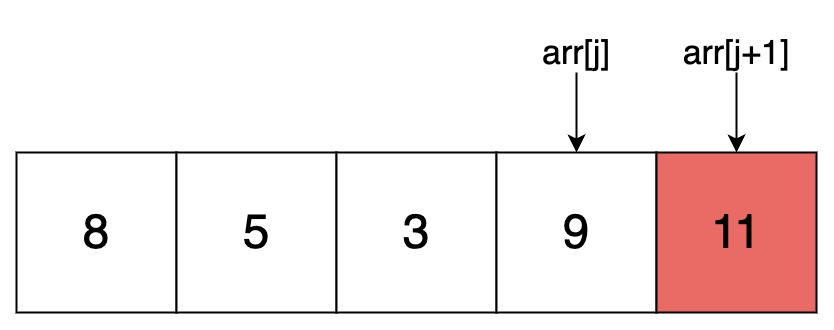
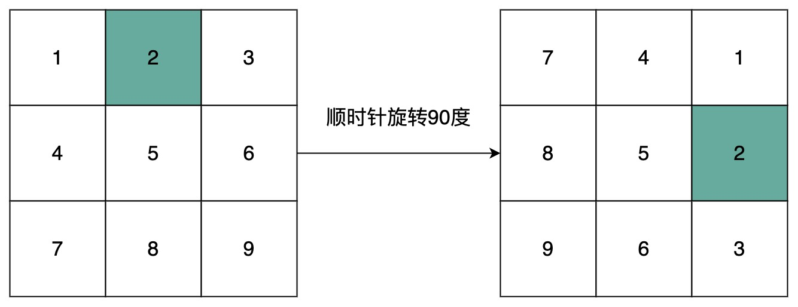
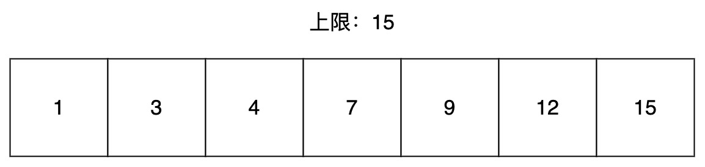
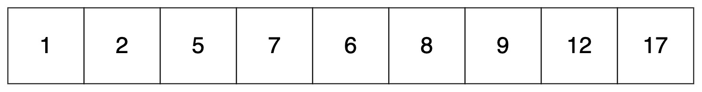
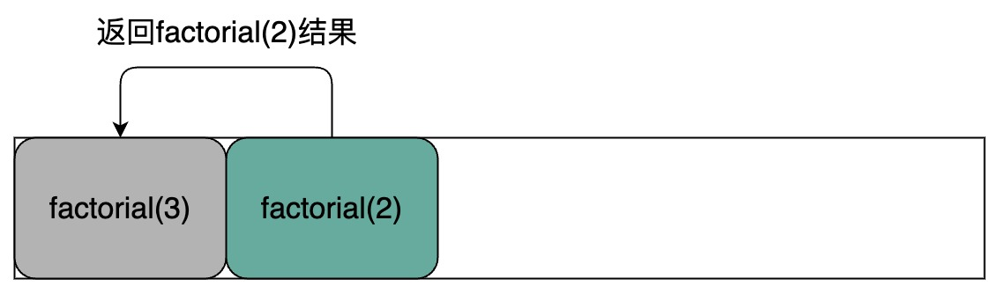
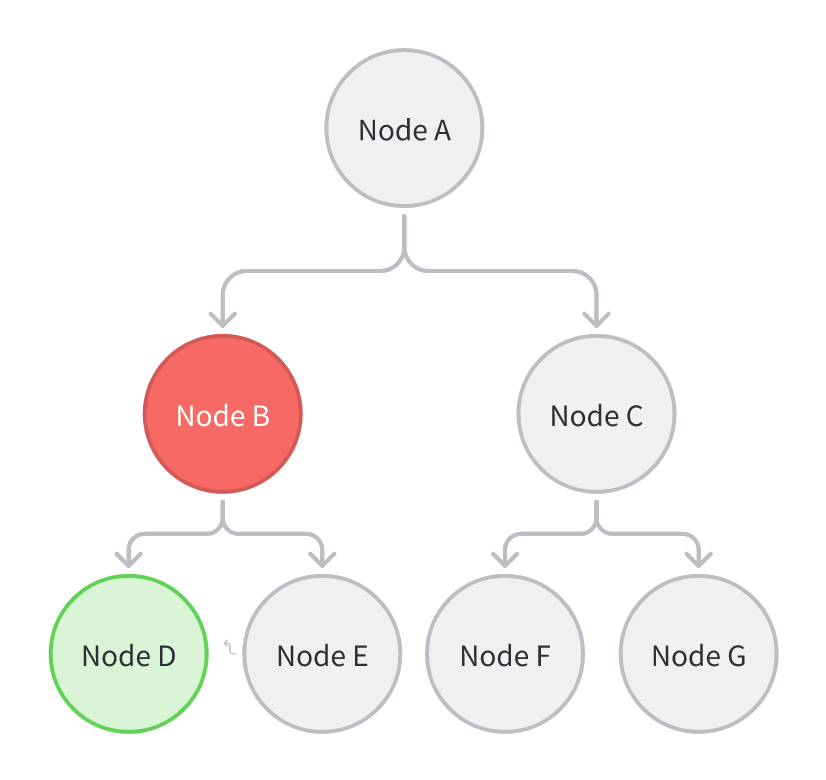

## 作者的话 Author's Voice

这部作品主旨在为初次尝试深入计算机编程的学生提供一个全面且系统性的教学参考材料，通过对基础知识的深入探究，为学生未来的学习之路预先铺平道路。它的目的远不仅仅是编写一本教程，更是对我自身在探寻编程之路上所积累的心血的回馈，犹如一份长期的学习笔记。

虽然我已尽力保证本书的质量，但入目所见的排版和文案可能存在一些不完美之处。我不能保证完全避免所有的错别字或排版错误。因此，我强烈建议读者在阅读过程中发现问题能够积极反馈给我，以力争使这部作品达到更高的完善度。

值得一提的是，这本书的完成还有赖于我的朋友们的无私帮助和建设性建议，她们在我编写本书的过程中给予了我极大的支持和帮助。对于她们那愿意陪伴我走过这条艰难旅程的精神，我感慨万分并深感感激。因此，我将这本书献给那些与我并肩作战的朋友们，希望她们能从中得到一些记忆的回馈。

最后，我仍是一位在竞技编程之路上积极学习的学者，因此在我所描述的知识点中可能存在疏忽或错误，这是我无法避免的。我希望那些能识别出这些问题的人能指出来，以帮助我在未来的学习和教学中更进一步。

Marco Wang 2023年6月15日，宁波

## 学习方法 Learning Methods

计算机科学是一门复杂的学科，需要任何人花费大量的时间和精力去强化自己，巩固自己所学习的知识。互联网学习的路程永无止尽，由于互联网飞快的更新速度，如果不提升自己就意味着被人赶超。因此，每个人都需要找到一个适合自己的计算机学习方法。本书将提供一些编程思维的建议。

一般地，人们可以通过“刷题”的方式来接触不同的应用场景，以此来提升个人的综合程序设计能力以及临场应对能力。通常情况下，每一道题都拥有特定的解题思路或解题技巧，每道题的解题技巧往往是相似的。

常见的题目解题技巧分为五步，分别为分析算法、设计算法、编写程序、调试程序以及运行程序并分析结果。如果结果不符合预期，则重新编写程序并调试程序直到结果符合预期。这五个步骤将贯穿每个人计算机学习的生涯。


## 配套习题 Packaged Exercises

除此之外，本书会有配套洛谷例题的讲解，每个人可以自行登录国内最大的在线代码评测平台(https://luogu.com.cn)输入本书所标注的题号做题。同时也可以在空闲时间做一下洛谷网站中提供的其他题目。本书的每一道例题题都会配备例题的讲解，请确保在查阅每道题的详细讲解之前先尝试独立思考解决问题，而不是一味的追求结果。每个人需要用心去思考解决题目的办法，这样才能提升自己的程序设计能力。同时，部分例题作为挑战型题目（用 * 号标出），对部分读者来说难度会比较高，因此不强求所有人完成该类问题，但有余力的读者可以自行挑战。

对于所有的编程题而言，希望所有同学在完成题目作答后写一个简短的反思，可以自己对这道题的思考过程和见解。有时间的同学强烈建议自己写一篇题解来巩固所学习的知识。

# 第一部分：C++ 的基础 C++ Fundamentals

### 这是一个开始 This is a beginning

C++ 是一种计算机高级程序设计语言，虽说这本质上是一种编程语言，但更确切地说，这是一个标准的程序规范。更多关于 C++ 的简介以及发展历史请参阅百度百科或自行上网搜寻，本文并不会对 C++ 本身背景做出过多的介绍。

以下是一段 C++ 的模版代码，模版就是每一个程序的框架和基本格式，所有的 C++ 程序都需要遵循这个模版。模版可以被当作为一个特定的框架：

```C++
#include <>  // 头文件。
using namespace std;  // 命名空间。

int main(){  // 主函数。

    return 0;  // 主函数的返回值。
}
```

**头文件：**头文件可以被理解为是一个工具包。在 C++ 中，开发者已经预先给定了一些基本的“工具”供其他开发者使用，例如：将文字输出到屏幕上、将一串数字排序、交换两个数字的位置。当开发者要使用这些“工具”时，需要把这些工具引入到代码中，否则就无法使用这些工具。因此引入头文件极其必要。在后续的文章中，会提及这些工具的用法以及它们的头文件该如何引用。

**命名空间：**是许多编程语言使用的一种代码组织的形式，通过命名空间来分类，区别不同的代码功能，避免不同的代码片段同时使用时由于不同代码间变量名相同而造成冲突。一般情况下，直接使用 std 命名空间即可（`using namespace std`），不需要做特别的改变，可以当作固定格式来记。

**主函数**：主函数是程序的入口，计算机在运行 C++ 程序时，会先找到主函数然后执行主函数中的代码片段。一般情况下，一个程序不能没有主函数，否则计算机就无法知道程序的运行入口。在以上代码片段中，主函数就是`int main(){}`以及其中间部分。

**主函数的返回值：**在主函数中，最后一行永远都是`return 0`，意味向系统返回一个整数0，代表程序正常执行完毕。然而，返回其他的数也是被允许的。

**程序的注释：**在以上代码中，所有灰颜色的文字就是代码注释。在 C++ 中，所有的注释以`//`开头。注释意味着该指令语句不会被计算机识别并编译。注释的发明旨在于让开发者在不看懂代码的情况下知道代码的具体意义以及一些注意事项。

以下是代码实现了在控制台中输出`Hello World!`语句，可以尝试在自己的编译器中编译并运行。

```C++
#include <iostream>
using namespace std;

// 主函数。
int main(){
    // 输出文字Hello World。
    cout << "Hello World!";
    return 0;
}
```

**语法注意项：**在以上主函数中，除注释外，每一行都是一条指令语句。指令是一个程序中的最小基本执行单位，计算机会从主函数开始一行一行的执行每一条指令语句，像这种按照顺序执行的语句叫做“顺序结构”。观察主函数中的代码，C++ 的每一句指令语句都会以分号`;`结尾。分号代表着一条指令已经写完，让计算机知道每一条指令从何处开始，何处结束。

### 程序的输入与输出 Input and Output of Program

#### 程序的输出 Program Output

本书上一章已经对 C++ 做出了基本的概述。本章将会着重讲解 C++ 中的输入与输出指令。在 C++ 中，程序的输入和输出被称之为输入流和输出流。在使用输入和输出指令时，必须要引入`iostream`头文件(in-out stream)。

C++ 的输出语句以`cout`开头，以`;`结尾，中间使用`<<`符号来拼接输出内容。具体例子如下：

```C++
#include <iostream> // 引入头文件iostream。
using namespace std;

int main(){
    cout << 2008;  // 输出数字2008。
    cout << 15 << 25; // 输出1525。
    cout << "Hello World!";  // 输出Hello World!。
    cout << 15 << " " << 25; // 输出15 25。
    cout << "Hello Marco Wang" << endl;  // 输出Hello Marco Wang并换行。
    return 0;
}
```

在 C++ 中，若想输出一个数字的话，可以直接输出。若想要输出一段文字的话，需要对文字加上双引号才可以输出文字。与此同时，若想要输出多个东西的话，可以通过`<<`符号对多个东西进行拼接。此外，若想要对输出的文字或数字换行，则需要在输出语句中加上换行标签`endl`，如以上代码所示。

#### 简单数学运算 Simple Math Operation

在 C++ 中，可以直接处理普通数学表达式。例如`cout << 5 + 15 << endl;`程序则会在控制台打印数字15作为输出结果。以下是几道简单的数学题目，请你使用 C++ 的输出语句中输入数学表达式并使程序输出数学题目的答案。

小红有20辆玩具车、40只玩偶娃娃。请你通过程序实现输出小红共有多少玩具车和玩偶娃娃。具体实现代码如下：

```C++
#include <iostream>
using namespace std;

int main(){
    cout << 20 + 40;  // 最终输出答案为60。
    return ;
}
```

小明有4个苹果和3个橘子，苹果的价格是2.5元每个，橘子的价格是5元每个。请你通过程序实现输出小明分别需要缴纳多少钱的苹果费用、橘子费用以及费用总额（用换行符隔开三个输出）。具体实现代码如下：

```C++
#include <iostream>
using namespace std;

int main(){
    cout << 4 * 2.5 << endl;  // 最终输出答案为10。
    cout << 3 * 5 << endl;  // 最终输出答案为15。
    cout << 4 * 2.5 + 3 * 5 << endl;  // 最终输出答案为25。
    return ;
}
```

小蓝原先有50块糖，小红原先有28块糖，小蓝分给了小红18块糖。请你通过程序实现分别输出小蓝和小红的目前的糖果数量（用空格隔开，并以换行符结束输出）。具体实现代码如下：

```C++
#include <iostream>
using namespace std;

int main(){
    cout << 50 - 18 << " " << 28 + 18 << endl;  // 最终输出答案为32 46。
    return ;
}
```

小周有7800毫升的水果饮料，需要平均分给12个小朋友。请你通过程序实现输出每个小朋友可以平均分配到多少毫升的水果饮料（在最后输出单位，并以换行符结束输出）。具体实现代码如下：

```C++
#include <iostream>
using namespace std;

int main(){
    cout << 7800 / 12 << "ml" << endl;  // 最终输出答案为：650ml。
    return ;
}
```

小王有50块饼干以及16位朋友，小王给了他的每一个朋友每人两块饼干。请你通过程序实现输出当小王分完饼干后小王手中的饼干数量（以换行符结束输出）。

```C++
#include <iostream>
using namespace std;

int main(){
    // 可以在表达式中添加括号：
    cout << 50 - (16 * 2) << endl;  // 最终输出答案为：18。
    return ;
}
```

#### 程序的输入 Program Input

在解决实际问题中，往往需要用户手动输入参数以实现更丰富的功能。这些由用户输入的数字或文字可以被称之为**变量**，变量会随着用户的输入或程序的执行而改变，因此称之为变量。与变量对立的则是常量，表示这些数字或文字是固定的且无法被更改的。变量可以被理解为是一个存放数据的容器。于此同时，由于变量存放的数据的不同，变量也会有非常多的类型。例如：当一个变量存放的是数字类型时，这个变量被称之为数字类型变量。在下一章节中，本书会详细讲解数据类型与变量。


程序可以通过变量来接受用户所输入的数字或文字。同时，每一个变量也会有自己的名字，这被称为变量名。在使用变量之前，需要先在程序中**声明变量**。声明变量的模版如下：`变量类型 变量名;`。以下代码展示了如何声明一个名为number，变量类型为整数类型的变量。

```C++
#include <iostream>
using namespace std;

int main(){
    int number;  // 声明一个名为number，变量类型为整数类型的变量。
    return 0;
}
```

将数据存放进变量的动作被称之为**赋值**，意思是将一个值赋给一个变量。赋值方式有很多，常见的变量赋值方式是通过等于符号`=`来对变量进行赋值操作的。在 C++ 中，等于符号不等价于数学中的等于符号。

如果一个变量定义后却没有被赋值，则计算机将会给这个变量随机分配一个数字，因此在未赋值情况下输出变量是不被接受的。

具体赋值操作如下：

```C++
#include <iostream>
using namespace std;

int main(){
    int number;  // 声明一个名为number，变量类型为整数类型的变量。
    // 将数字15赋值给变量number。
    number = 15;  // 这里的等于符号不等价于数学中的等于符号。
    return 0;
}
```

与此同时，开发者可以在声明变量时直接对变量进行赋值操作：

```C++
#include <iostream>
using namespace std;

int main(){
    // 在声明变量number时直接对其进行赋值操作。
    int number = 15;
    return 0;
}
```

在声明变量时，可以将变量声明在main函数内部也可以将变量声明到main函数外部。在main函数里面的变量被称为**局部变量**，在main函数之外的变量被称之为**全局变量**。对于全局变量而言，如果不在变量声明的时候进行初始化操作，系统将会自动将全局变量赋值为0。全局变量和本地变量最大的区别就是其作用域不同，本书的后半部分将会提及变量的作用域。

``` c++
#include <iostream>
using namespace std;

// 声明一个全局变量。
int global_variable;

int main(){
    // 声明一个局部变量。
    int number = 15;
    cout << global_variable << endl;  // 输出结果为0。
    cout << number << endl;  // 输出结果为15。
    return 0;
}
```

对于任意一个**已经被赋值过**的变量，可以通过直接打印变量名将变量中所存放的数据输出。这就是为什么在 C++ 当中，输出任何文字的时候都需要通过双引号对文字进行标记，这可以有效的防止计算机混淆变量和文字。

```C++
#include <iostream>
using namespace std;

int main(){
    // 在声明变量number时直接对其进行赋值操作。
    int number = 15;
    cout << number << endl;  // 最终输出答案为：15。
    return 0;
}
```

在 C++ 中，`cin >> 变量名;`语句可以可以接受用户输入的数字或文字并将接收到的信息直接赋值给变量。若想要输入并赋值多个变量的话，可以通过`>>`符号对多个变量名进行拼接。以下代码展示了接受用户输入的两个数字并分别打印出这两个数字以及这两个数字的和。具体代码如下：

```C++
#include <iostream>
using namespace std;

int main(){
    // 定义两个变量名为number1和number2。
    int number1;
    int number2;
    // 获取用户输入的两个数字，用户需要通过空格隔开输入的两个数字。
    cin >> number1 >> number2;
    // 将用户输入进程序的数字再次打印出来，用空格分隔。
    cout << number1 << " " << number2 << endl;
    // 输出number1和number2两个数的和。
    cout << number1 + number2 << endl;
    return 0;
}
```

例如以上代码，当用户输入数字`25 31`，则程序将会输出`25 31`以及数字56。

**[P5703 苹果采购](https://www.luogu.com.cn/problem/P5703)**

题目大意：现在需要采购一些苹果，每名同学都可以分到固定数量的苹果，并且已经知道了同学的数量，求共需要采购苹果的数量。在看完题目后，可以分析出来`总共需要采购的苹果数量=同学的数量*每个人固定分配到的苹果数量`，因此对于本题来说，读入两个变量$n, m$，分别表示每名同学都可以分到固定数量的苹果以及同学的数量并输出这两个变量的积即可。具体实现代码如下：

```C++
#include <iostream>
using namespace std;

int main(){
    int n;
    int m;
    cin >> n >> m;
    cout << n * m << endl;
    return 0;
}
```

**[P3954 成绩](https://www.luogu.com.cn/problem/P3954)**

题目大意：牛牛最近学习了 C++ 入门课程，这门课程的总成绩计算方法是：`总成绩=作业成绩×20%+小测成绩×30%+期末考试成绩×50%`。牛牛想知道，这门课程自己最终能得到多少分。对于这道题来说，直接读入牛牛的作业成绩、小测成绩以及期末考试成绩最后根据表达式要求输出结果即可。具体实现代码如下：

```C++
#include <iostream>
using namespace std;

int main(){
    int a;
    int b;
    int c;
    cin >> a >> b >> c;
    cout << a * 0.2 + b * 0.3 + c * 0.5 << endl;
    return 0;
}
```

此外，可以一次声明多个变量，用逗号隔开。这可以减少代码的行数以及避免代码过于冗余。使用方法如下：

```C++
#include <iostream>
using namespace std;

int main(){
    // 一次声明三个变量。
    int a, b, c;
    cin >> a >> b >> c;
    cout << a * 0.2 + b * 0.3 + c * 0.5 << endl;
    return 0;
}
```

### 变量与数据类型 Variables and Data Types

在前一章节中，本书已经对变量和数据类型做了介绍。本章节会详细讲述 C++ 变量以及常用数据类型。

**变量：**变量的本质是计算机内存中的一块区域，用于存放特定类型的数据。在计算机中，内存起着存储临时数据的作用。声明变量的本质就是在计算机内存当中开辟一片区域。

**数据类型：**数据类型可以用于区分不同的变量存放的数据是什么类型的。数据类型的发明是帮助人们避免犯错。

#### 常见数据类型与解析 Common Data Types and Explanations

以下是 C++ 中常见的数据类型，对于更多的关于其他数据类型的讲解请参阅互联网。

| **类型**  | **中文名称** | **占用字节数** | **取值范围**                  |
| --------- | ------------ | -------------- | ----------------------------- |
| void      | 无值型       | 0              | 无值                          |
| bool      | 布尔型       | 1              | true, false                   |
| int       | 整型         | 4              | $-(2^{31}) \sim (2^{31}-1)$ |
| long long | 长整型       | 8              | $-(2^{63}) \sim (2^{63}-1)$ |
| float     | 实型         | 4              | $-(10^{38}) \sim 10^{38}$   |
| double    | 双精度浮点型 | 8              | $-(10^{308}) \sim 10^{308}$ |
| char      | 字符型       | 1              | 一个字符                      |
| string    | 字符串型     | 28             | 1 ～ 65400 个字符             |

- **void 类型：**void 类型表示一个变量不存放任何的数据。
- **bool** **类型：**布尔类型变量存放true, false两种状态，分别表示真和假，也可以表示为1或0。例如当输出`cout << 5 >= 3;`时，系统会在控制台输出0，代表该表达式不成立，反之返回1。
- **int 类型：**int 类型是整数类型，用于存放一般的整数数值。int类型取值范围为$-(2^{31}) \sim (2^{31}-1)$。int类型不存放任何的小数数字，若强行将小数赋值给int类型，则系统会默认将小数向下取整。
- **long long 类型**：long long类型是长整形，也用于存放整数。long long类型的取值范围为$-(2^{63}) \sim (2^{63}-1)$。与int类型一样，long long类型不存放小数，会默认将小数向下取整。
- **float** **类型：**float类型用于存放一般的实数。float类型取值范围为$-(10^{38}) \sim 10^{38}$。当float类型与int类型相加时，系统会默认将结果视为float类型的数据。
- **double 类型：**double类型也用于存放实数，但double类型的精度比float类型更高，用于存放更精密的实数。double类型的取值范围为$-(10^{308}) \sim 10^{308}$。当double类型与int或float类型相加时，系统会默认将结果视为double类型的数据。
- **char 类型：**char类型用于存放单个字符。在对char类型数据赋值时，不使用双引号而是使用单引号。char类型可以进行相加运算，具体将在本章后半部分讲解。
- **string 类型**：string类型也称字符串类型，用于存放一个或多个字符。在对string类型数据赋值时，不使用单引号而是使用双引号。在对两个string类型的数据相加时，系统会将返回两个字符串相拼接的结果。string类型不得与非string类型外的数据相加。

在定义变量时，需要指定变量的类型来防止程序出错或产生分歧。

#### ASCII 码表 ASCII Code Table

事实上，char类型在存放数据时本质上存放的是一个数字，每一个拉丁文字符都对应着不同的数字编号。ASCII 码表是一套通用的标准用来对照每一个拉丁文字符与数字的对应关系，常见字符以及其对应的ASCII码如右表所示。

如图，每一个字符都有着自己对应的十进制数字编号(Dec)。当对两个字符进行相加时，系统将会对两个字符的ASCII码进行相加，最后会返回这两个字符的ASCII码之和。具体样例如下：

```C++
// 输出结果为：100，即65 + 35 = 100。
cout << 'A' + '#' << endl;
```

若想要返回100这个数所对应的 ASCII码，则需使用char()函数强制将一个数字转换成字符。使用方法如下：

```C++
// 输出结果为：d。
cout << char('A' + '#') << endl;
```


除此之外，字符也可以与数字相加，当字符与数字相加时，本质上也是将该字符所对应的ASCII码与数字相加：

```C++
cout << 'A' + 32 << endl;  // 输出结果为：97。
cout << char('A' + 32) << endl;  // 输出结果为：a。
```

若在实际考试过程中，忘记了一个字符的ASCII码，则可以使用int()函数强制将一个字符转换成数字类型。

``` c++
cout << int('A') << endl;  // 输出结果为97。
```

此外，int()函数也可以做到对任意的小数起到向下取整的作用。

``` c++
cout << int(12345.3333) << endl;  // 输出结果为12345。
```

**[P5704 字母转换](https://www.luogu.com.cn/problem/P5704)**

题目大意：输入一个小写字母，输出其对应的大写字母。例如输入 q[回车] 时，会输出 Q。本题就是考验开发者对ASCII码表的掌握程度。参照ASCII码表，每一个小写字母与其大写形式的ASCII码的差值永远为32。因此可以通过这一特性对数字的ASCII进行减法操作而得到这个小写字母所对应的大写形式。具体代码如下：

```C++
#include <iostream>
using namespace std;

int main(){
    char c;  // 声明一个名为c的字符类型变量。
    cin >> c;  // 读入字符c。
    cout << char(c - 32) << endl;  // 通过规律得出性质。 
    return 0;
}
```

### 常见基础语法讲解 Common Basic Grammar Explanation

#### 变量的赋值操作 Assignment of Variables

在对变量进行赋值后，若想要对变量再次进行赋值，可以直接对该变量进行赋值操作。其中，第二次对变量进行赋值操作时不需要重定义变量，否则会产生报错。

``` c++
int n = 20;
n = 30;  // 不可以使用int n = 30;否则会产生报错。
cout << n << endl;  // 输出结果为30。
```

可以将一个变量所保存的值直接复制给另一个变量。

``` c++
int n = 20;
int m = 30;
n = m;
cout << n << endl;  // 输出结果为30。
n = m + 30;
cout << n << endl;  // 输出结果为60。
```

若想要在变量原本的基础上进行加减乘除等操作，可以对该直接赋值运算。
例如，将变量i的存放的数+5，可以直接通过赋值运算实现：

``` c++
int n = 20;
n = n + 50;
cout << n << endl;  // 输出结果为70。
n = n * 5;
cout << n << endl;  // 输出结果为350。
```

但为了简便运算，可以直接将表达式`n = n + 50`写为`n += 50`，这两个表达式的效果是一样的，加减乘除等基本的运算符号也适用于此规则：

``` c++
int n = 20;
n += 50;
cout << n << endl;  // 输出结果为70。
n *= 5;
cout << n << endl;  // 输出结果为350。
```

同时，若想要对一个元素自增或自减数字一，可以直接对变量进行自增或自减操作：

``` c++
int n = 20;
n = n + 1;
cout << n << endl;  // 输出结果为21。
n += 1;
cout << n << endl;  // 输出结果为22。
// 自增快捷方式。
n++;
cout << n << endl;  // 输出结果为23。
// 自减快捷方式。
n--;
cout << n << endl;  // 输出结果为22。
```

#### 运算操作 Arithmetic Operations

若想要比较两个元素是否相等，需要使用双等于符号`==`来实现，而不是使用单个的等于符号。单个的等于符号表示的是赋值操作。

``` c++
int n = 50;
int m = 50;
int k = 60;
cout << n = m << endl;  // 报错，无法在输出的同时对变量进行赋值操作。
cout << n == m << endl;  // 输出结果为1，表示表达式成立。
cout << n == k << endl;  // 输出结果为0，表示表达式不成立。
```

在 C++ 中，大于等于或小于等于符号需要通过先打`>`或`<`符号，再打`=`符号来实现。同时，不等于符号需要通过先打`!`符号，再打`=`符号来实现。

``` c++
cout << 15 >= 5 << endl;  // 输出结果为1。
cout << 15 <= 5 << endl;  // 输出结果为0。
cout << 15 != 5 << endl;  // 输出结果为1。
```

在 C++ 中，若想要对一个数字进行取余操作，则可以使用`%`符号来实现。

``` c++
cout << 15 % 5 << endl;  // 输出结果为0。
cout << 15 % 4 << endl;  // 输出结果为3。
cout << 15 % 30 << endl;  // 输出结果为15。
```

在 C++ 中，单独的常量（除0以外），其布尔类型的值为真。0的布尔类型的值为假。
### 运算符的优先级 Priority of Operators

在 C++ 中，运算符主要分为六大类，分别是：算数运算符、比较运算符、逻辑运算符、赋值运算符、位运算符（目前暂不讲解）、三元运算符（目前暂不讲解）

- **算数运算符：**一般来说，可以对数字进行计算操作的运算符被统称为算数运算符。常见的算数运算符的例子有：`+, -, *, /, %`，分别表示加减乘除以及取余运算。
- **比较运算符：**通过比较运算符连接的表达式返回的是一个布尔类型的数据。常见的比较运算符的例子有：`==, >, <, >=, <=, !=`。
- **逻辑运算符：**逻辑运算符往往与算数运算符和比较运算符优先使用，表示的是对一个表达式进行逻辑的判断。常见的逻辑运算符的例子有：`&&, ||`。在 C++ 中，逻辑运算符可以讲多个表达式关联起来。
    1. 当两个表达式用`&&`符号连接时，如果两边的表达式结果都为真，则返回真，如果`&&`符号两边的表达式有一个不为真，即返回假。
    2. 当两个表达式用`||`符号连接时，如果两边的表达式有一个为真，则返回真。若`||`符号两边的表达式都为不为真，则返回假。

``` c++
cout << 5 > 1 && 7 > 1 << endl;  // 答案结果为1。
cout << 5 > 10 && 7 > 10 << endl;  // 答案结果为0。
cout << 5 > 10 && 7 > 1 << endl;  // 答案结果为0。

cout << 5 > 1 || 7 > 1 << endl;  // 答案结果为1。
cout << 5 > 10 || 7 > 10 << endl;  // 答案结果为0。
cout << 5 > 10 || 7 > 1 << endl;  // 答案结果为1。
```

除此之外，`&&`符号的优先级要大于`||`符号，因此当有超过两个表达式在一起时，计算机会先判断`&&`符号两侧的表达式结果再判断`||`符号两侧的表达式结果。若需要手动控制表达式判断的优先级，则需要通过括号来增加符号的优先级。具体操作如下：

``` c++
cout << 5 && -1 || 7 && 8 << endl;  // 答案结果为1。
cout << 0 || 0 > -10 && 9 > 1;  // 答案结果为1。
cout << (0 || 0) && 9 > 1;  // 答案结果为0。
```

- **赋值运算符：**赋值运算符即等于符号，表示对一个变量进行赋值操作。

### 条件判断与分支语句 Conditional Judgments and Branching Statements

#### 条件判断语句 Conditional Judgment Statements

在现实生活中，人们往往会根据实际情况来调整他们的决策，计算机也如此。在 C++ 中，可以通过条件判断语句来根据当前的状态指定执行某一部分的代码以达到解决问题的目的。

本书在上一章节已经对布尔类型与数学表达式做出过讲解。当一个表达式成立时，该表达式返回布尔类型“真”，反之返回“假”。在进行条件判断时，计算机会根据一段表达式返回的布尔类型结果来判断是否执行某一部分代码。

`if (表达式){}`就是最基础的条件判断语句，当if语句中的表达式返回结果为真，计算机则执行大括号内的语句，反之则不执行。


以下代码展示了用户输入一个数字，如果数字大于15则输出"YES"。

``` c++
#include <iostream>
using namespace std;

int main(){
	int n;
	cin >> n;
	if (n >= 15){
		cout << "YES" << endl;
	}
	return 0;
}
```

#### 分支语句 Branching Statements 

`else{}`语句一般用于if语句之后，表示当if语句中的判断条件不成立时，则执行else语句中大括号内的指令。


以下代码展示了用户输入一个数字，如果数字大于15则输出"YES"否则输出"NO"。

``` c++
#include <iostream>
using namespace std;

int main(){
	int n;
	cin >> n;
	if (n >= 15){
		cout << "YES" << endl;
	} else {
		cout << "NO" << endl;
	}
	return 0;
}
```

往往开发者不满足于此，开发者认为需要创建出多条件判断语句来处理更复杂的任务。多条件判断语句即对于一个表达式而言，需要对其不同状的态作出超过2个的决策。例如，小明今天考试考了n分，如果小明考了100分，则输出`Happy`，否则如果小明考了90分以上，则输出`Oh!`，否则如果小明考了80分以上，输出`Oh My God!`，否则输出`Sad`。

对于上述样例而言，可以使用多重if语句和else语句嵌套的方式来解决：

``` c++
#include <iostream>
using namespace std;

int main(){
	int n;
	cin >> n;
	if (n == 100){
		cout << "Happy" << endl;
	} else {
		if (n >= 90){
			cout << "Oh!" << endl;
		} else {
			if (n >= 80){
				cout << "Oh My God!" << endl;
			} else {
				cout << "Sad" << endl;
			}
		}
	}
	return 0;
}
```

为了节约内存空间、提高代码的可读性，可以将以上代码中else语句进行化简操作，直接将“否则如果”写为`else if(表达式){}`，表示否则如果满足表达式内的条件则执行大括号内的代码，反之不执行。具体优化后的代码如下：

``` c++
#include <iostream>
using namespace std;

int main(){
	int n;
	cin >> n;
	if (n == 100){
		cout << "Happy" << endl;
	} else if (n >= 90){
		cout << "Oh!" << endl;
	} else if (n >= 80){
		cout << "Oh My God!" << endl;
	} else {
		cout << "Sad" << endl;
	}
	return 0;
}
```

一般情况下，如果一个分支语句的大括号内只有一行代码，则可以通过省略大括号的形式简写代码，提高代码的可读性。因此对于以上代码而言，可以将其改为：

``` c++
#include <iostream>
using namespace std;

int main(){
	int n;
	cin >> n;
	if (n == 100) cout << "Happy" << endl;
	else if (n >= 90) cout << "Oh!" << endl;
	else if (n >= 80) cout << "Oh My God!" << endl;
	else cout << "Sad" << endl;
	return 0;
}
```

#### 常见习题 Common Exercieses

**判断一个年份是否是闰年（俗话说得好，四年一润，百年不润，四百年再润）：**
对于本题而言，判断闰年可以被粗略的看为输入的年份是否是4的倍数，不是100的倍数，但是却是400的倍数。对于这类题而言，可以通过条件判断叠加以及添加括号的方法来实现。分析题目后，判断闰年首先一定要满足的条件是该年份是4的倍数，其次再判断年份是否是400的倍数，如果这个年份是400的倍数，则一定是闰年。如果这个年份不是400的倍数，但是100的倍数的，该年份依然不是闰年，因此判断闰年的代码如下：

``` c++
int year;
cin >> year;
// 比要满足的条件即该年份必须是4的倍数，且该年份必须满足是100的倍数或不是100的倍数。
if (year % 4 == 0 && (year % 400 == 0 || year % 100 != 0)){
	cout << "该年份是闰年" << endl;
} else{
	cout << "该年份不是闰年" << endl;
}
```

### 循环与遍历 Loop and Traverse

循环和遍历是两个非常重要的技能，在整一个 C++ 算法学习的过程中，循环和遍历一直起着重大的作用。循环的大意是重复执行同一个语句多次。而**遍历可**以被理解为以此访问每一个**节点**。

**节点：**节点可以被看作为是一个“公交站台”。对于一个数组而言，数组中的每一个节点即为数组中每一个索引所对应的值。具体的概念将在本文后续所提及。

#### 无限循环 Infinite Loop

在 C++ 中，无限循环意味着无限重复执行某一个语句。一般情况下，无限循环可以使用`while`表达式来实现。`while`表达式的语法如下：

``` c++
while (条件){
	需要重复执行的语句;
}
```

在如上while循环中，当while循环的括号中的表达式成立即布尔类型结果为真，则重复执行大括号内的语句，否则跳出循环。以下例子展示了重复执行在控制台输出`Hello World!`的样例：

``` c++
#include <iostream>
using namespace std;

int main(){
	while(true){
		cout << "Hello World!" << endl;
	}
	return 0;
}
```

在本样例中，括号中的表达式结果永远为真，即该循环将永远执行下去。若括号中表达式的结果一开始为假，则while语句中所有的指令一次也不会被执行：

``` c++
#include <iostream>
using namespace std;

int main(){
	while(false){
		cout << "Hello World!" << endl;
	}
	return 0;
}
```

在while循环中，可以通过`break`语句来结束循环。以下代码展示出了通过`break`语句当达到条件时结束循环：

``` c++
#include <iostream>
using namespace std;

int main(){
	int cnt = 0;
	while(true){
		cout << "Hello World!" << endl;
		cnt = cnt + 1;
		// 当cnt的值累加到10的时候，程序循环就会被终止掉。
		if (cnt == 10){
			break;
		}
	}
	return 0;
}
```

同时，也可以直接将条件判断语句写入while()语句中即可。当满足while()语句中的条件时，计算机执行函数内的指令。

``` c++
#include <iostream>
using namespace std;

int main(){
	int cnt = 0;
	// 将条件判断语句直接写入while()语句中即可。
	while(cnt < 10){
		cout << "Hello World!" << endl;
		cnt = cnt + 1;
	}
	return 0;
}
```

在while循环中，可以通过`continue`语句来跳出本次循环。跳出本次循环指的是在本轮循环中不执行continue语句以下代码的而不终止循环。continue语句的具体使用方法如下：

``` c++
#include <iostream>
using namespace std;

int main(){
	int cnt = 0;
	while(cnt < 10){
		cout << "Hello World!" << endl;
		continue;
		cnt = cnt + 1;
	}
	return 0;
}
```

如以上代码，由于continue语句的存在`cnt = cnt + 1`这一条语句永远不会被执行到，因此以上代码的效果等同于无限循环，即无限循环输出`Hello World`。一般情况下，continue语句if条件判断语句共同使用，用来对不同的情况作出特定的判断。以下代码展示了输出1-100除10的倍数以外的所有正整数：

``` c++
#include <iostream>
using namespace std;

int main(){
	int cnt = 0;
	while(cnt < 100){
		cnt += 1;
		// 如果当前数字除以10的余数等于0，则可以说这个数是10的倍数。 
		if (cnt % 10 == 0) {
			// 通过continue语句排除输出。
			continue;
		}
		cout << cnt << endl;
	}
	return 0;
}
```

#### 有限循环 Finite Loop

C++ 中，不但可以通过while()循环语句了来实行有限循环，还可以通过`for`语句来实现。for循环语句也被广泛的应用在解决实际问题操作中。其中，for循环语句的具体语法如下：

``` c++
for (初始化操作; 条件判断语句; 结束操作){
	循环体：内部执行的指令。
}
```

其中，初始化操作只会在执行for循环语句之前执行，而条件判断语句则控制了是否结束循环，当条件判断语句中的表达式返回真时，则执行循环体内的指令。计算机会在每次循环之前判断条件判断语句是否成立。结束操作即当一轮循环语句结束后，程序会执行结束操作内的指令。

以下样例使用for循环实现输出10次`Hello World!`：

``` c++
for (int i=1; i<=10; i++){
	cout << "Hello World!" << endl;
}
```

例如以上代码：
1. 初始化操作：该for循环在一开始定义了一个变量i，i的初始值为1。
2. 条件判断语句：当i<=10的时候，程序将会执行循环体内的代码。
3. 结束操作语句：程序每次执行完循环体内的所有代码后，执行结束操作语句中的代码。

分析：以上for循环代码定义了一个变量i，系统重复执行for循环循环体内的代码，每次执行完一遍for循环的代码，i都会自增，当i>10的时候，循环结束。

以下样例使用for魂环实现输出1-10中所有的整数：

``` c++
for (int i=1; i<=10; i++){
	cout << i << endl;
}
```

在计算机中，像这样的循环可以被统称为遍历，即以此访问每一个节点。在本样例中，该代码所遍历的节点即为每一个正整数，这一个代码的效果可以被称之为遍历输出数字1-10中的所有正整数。

与此同时与条件分支语句相同，如果一个for循环语句的循环体内只有一行代码，则可以通过省略大括号的形式来简写代码，提高代码的可读性。对于以上代码而言，可以将其改为：

``` c++
for (int i=1; i<=10; i++) cout << i << endl;
```

此外，对于任意一个for循环而言，可以定义多个初始化操作以及结束操作，也可以通过逻辑符号将多个条件判断表达式连在一起从而实现更复杂的效果：

``` c++
// 初始化定义多个变量，结束操作对多个变量进行自增操作。
for (int i=1, j=10; i<=10 && j <= 20; i++, j++){
	cout << i << " " << endl;
}
```

对于for循环而言，也可以使用continue语句或break语句，这两个语句在for循环和while循环中的作用都是一样的，分别为跳出本轮循环以及结束循环。具体例子如下：

通过continue语句跳出本轮循环，实现输出1-100中所有不是10的倍数的整数。

``` c++
for (int i=1; i<=100; i++){
	if (i % 10 == 0){
		continue;
	}
}
```

通过break语句结束循环，实现输出1-10中所有的正整数。

``` c++
for (int i=1; true; i++){
	if (i == 11){
		break;
	}
}
```

### 循环的嵌套 Nesting of Loops

#### 循环的嵌套 Nesting of Loops

在循环语句的循环体中还可以写入循环体，当外层循环执行一次时，内层循环则会被完整的执行下来。以下展示了for循环和while循环互相嵌套的例子：

输出10遍1-10中所有的整数：

``` c++
for (int i=1; i<=10; i++){
	for (int j=1; j<=10; j++){
		cout << j << endl;
	}
}
```

输出n遍1-10中所有的整数：

``` c++
int n;
cin >> n;
while(n != 0){
	n -= 1;
	for (int i=1; i<=10; i++){
		cout << i << endl;
	}
}
```

重复执行三次输出1-n之中所有的偶数：

``` c++
int n;
cin >> n;
for (int i=1; i<=3; i++){
	for (int j=1; j<=n; j++){
		if (j % 2 == 0){
			cout << j << endl;
		}
	}
}
```

#### 常见循环习题 Common Loop Exercises 

遍历输出2000年至2090年中所有的闰年。
在本书前一章已经对闰年的判断做过详细讲解，因此本题只考察选手对有限循环for循环的掌握程度如何。对于本题而言，可以直接通过for循环遍历2000至2090年的每一个数字，并对每一个数字判断是否是闰年即可。

``` c++
for (int year = 2000; year <= 2090; year++){
	if (year % 4 == 0 && (year % 100 != 0 || year % 400 == 0)){
		cout << year << endl;
	}
}
```

### 一维数组与二维数组 Arrays

在 C++ 中，普通的变量则不能满足现实生活中的需求。若某一个程序要输入100个参数的话，显然创建100个变量是不可取的，这非常的浪费时间和精力，同时也会对代码的后续维护造成困扰。因此数组应运而生。

#### 一维数组 One-dimensional Arrays

数组可以被看作为是一个大型的柜子，柜子里有很多个格子，每个格子里可以存放数据。


定义数组的方式如下：

``` c++
int arr[100] = {};
```

以上代码定义了一个全部存放int类型数据的“柜子”，柜子一开始是空着的，可以通过**索引**来定义或访问数组中的任意元素。数组的索引可以被看作为每一个柜子的编号，柜子的编号从0开始依次递增至数组的总长度。对于以上例子来说，索引的范围即`0-99`。与此同时，数组的大小是在定义是就被确定的，数组的大小不可以在运行时被更改。

在定义数组后，数组中所有的元素都会被初始化为0。此外，定义数组中任意索引的元素的方法如下，以下代码展示了将数字100赋值给数组中索引为0的“格子”。

``` c++
int arr[100] = {};
arr[0] = 100;
```

此时若打印数组中的第0个元素，打印结果应为100:

``` c++
int arr[100] = {};
arr[0] = 100;
cout << arr[0] << endl;  // 输出结果为100。
cout << arr[1] << endl;  // 输出结果为0。
```

同时，在声明数组的同时可以直接对数组中的元素进行赋值操作。以下代码展示了在定义数组arr时将数组中前五个元素的值分别赋值为`1, 2, 3, 4, 5`。

``` c++
int arr[100] = {1, 2, 3, 4, 5};
// 输出结果应为：1, 2, 3, 4, 5并以换行符隔开。
cout << arr[0] << endl;
cout << arr[1] << endl;
cout << arr[2] << endl;
cout << arr[3] << endl;
cout << arr[4] << endl;
```


在学习了for循环遍历之后，可以通过遍历的方式输出数组中的每一个元素。因此在本例中，for循环遍历的节点为每一个元素的索引。可以看到，for循环极大的省略了许多重复性工作，节省了大量人力资源并且降低了后期维护的成本。

``` c++
int arr[100] = {1, 2, 3, 4, 5};
// 输出结果应为：1, 2, 3, 4, 5并以换行符隔开。
for (int i=0; i<5; i++){
	cout << arr[i] << endl;
}
```

除此之外，也可以通过cin的方式快速地将用户输入的内容保存到数组之中，而不是使用更复杂的方法。以下代码展示了通过设定临时变量t来存放用户输入的数字，并将用户输入的方式存放进数组当中。

``` c++
int arr[1005] = {};
for (int i=1; i<=100; i++){
	int t = 0;
	cin >> t;
	arr[i] = t;
}
```

对于以上代码来说，可以作出以下修改，提升代码的可读性：

``` c++
int arr[1005] = {};
for (int i=1; i<=100; i++) cin >> arr[t];
```

#### 二维数组 Two-dimensional Arrays

本章前半部的知识点讲解都是围绕着一维数组，一维数组可以被看作为横向的长柜子，柜子中有许多个格子。二维数组可以被看作为是有n行m列的大柜子，柜子中的每一个格子也可以存放数据。二维数组的本质就是由n个长度为m的一维数组所拼接而成的。


二维数组的定义方式与一维数组类似，以下代码展示了如何定义一个高度为50，宽度为100的二维数组。

``` c++
int arr[50][100] = {};
```

二维数组在定义后其中的所有也会被初始化为0。二维数组对元素的赋值方法和访问方法也与一维数组类似，但相比一维数组的索引来说，二维数组的的访问和赋值需要两个索引，分别是行索引和列索引，表示访问二维数组的第n行第m列的元素。


``` c++
int arr[50][100] = {};
arr[15][15] = 50;
cout << arr[15][15] << endl;  // 输出结果为50。
cout << arr[15][20] << endl;  // 输出结果为0。
```

二维数组的遍历方法需要应用到for循环的循环嵌套，以下代码展示了将二维数组的每一行每一列都赋值数字5：

``` c++
int arr[50][100] = {};
for (int i=0; i<50; i++){
	for (int j=0; j<100; j++){
		arr[i][j] = 5;
	}
}
```

对于二维数组来说，也可以通过双层for循环的方式实现用户数据的读入：

``` c++
int arr[50][50] = {};
for (int i=0; i<50; i++){
	for (int j=0; j<50; j++){
		cin >> arr[i][j];
	}
}
```

需要注意的是，由于二维数组的本质是由一维数组组合而成的，因此可以通过定义一维数组的方式来定义二维数组。对于以下代码而言，系统将会将三个数字分为一组当成一个一维数组对二维数组进行赋值。

``` c++
int arr[5][3] = {1, 2, 3, 4, 5, 6, 7, 8, 9};
// 以上代码等同于以下代码。
int arr[5][3] = {{1, 2, 3}, {4, 5, 6}, {7, 8, 9}};
```

因此访问数组中的第2行，第1个元素时，结果为8。

#### 多维数组 Multi-dimensional Arrays

事实上，数组的维度是没有上限的，可以声明一个三维或更高维度的数组。声明多维数组的方式与声明二维数组的方式相同，具体实现代码如下：

``` c++
int arr1[5] = {};
int arr2[5][5] = {};
int arr3[5][5][5] = {};
int arr4[5][5][5][5] = {};
```

多维数组在程序设计中起到了存储更复杂数据或有相同关联性数据的作用。由于数组中一个索引对应的值是唯一的，所以可以通过多维数组来将一组有关联性的数据保存起来。更多关于多维数组的应用请参见本文的第二部分 - 数据结构与算法。

### 函数的定义与应用 Definition and Application of Functions

#### 函数的定义 Definition of Functions

本书在第一部分的开始就提到过“主函数”这个概念，主函数就是程序的入口，当程序被运行时，计算机会先执行主函数内的代码。计算机的函数可以被理解为是一个固定的程序段，函数可以解决一种特定的问题。通过函数，可以将一个大问题分解成若干易于理解的小问题来解决。在计算机领域中，函数的定义与数学中类似，函数有一个输入端和一个输出端，一个输入有且对应着一种输出。

C++ 已经为一般的开发者封装了一些函数，可以直接供开发者进行使用。这些函数被称之为**应用程序接口**，也被称之为API。通俗来说，若想要实现某些复杂功能时，可以直接使用 C++ 自带的API而不是自己重新写一个段新的代码片段。本文在后续的部分将会提及一些基础的函数，例如：向上取整、向下取整、取最大值、取最小值等。

举例而言，若想要通过程序实现求出一个矩形的面积，则需要用到矩形的长和宽这两个参数。可以通过程序来获取用户输入的长和宽并计算出正方形的面积：


``` c++
int main(){
	int width, length;
	cin >> width >> length:
	cout << width * length << endl;
}
```

若在一个程序中，需要频繁使用到计算任意一个矩形的面积这个功能时，如果通过多次复写计算矩形面积的代码会造成程序的冗余和提高代码的维护成本。因此，可以通过将计算矩形面积的表达式封装成函数，提高代码的可读性。假设计算矩形的函数已经被分装好，名为area，可以直接供开发者调用。

当开发者想要计算矩形的长和宽时，开发者可以直接调用area函数，将矩形的长宽作为参数带入。该函数将会自动把结果返回。具体的样例如下：

``` c++
int main(){
	cout << area(5, 7) << endl;  // 输出结果为35。
	return 0;
}
```

在程序中运用函数的一般优点如下：

1. 减少代码的冗余性
2. 提高代码的可读性。
3. 提高代码的复用性。
4. 提升代码的可维护性。

以上旨在介绍函数的基本功能，具体有关函数的定义请参照本书下一章。

#### 函数的声明与调用  Function Declaration and Call

在知道函数的作用和实际意义后，如果需要自己声明一个函数并使用，需要注意设计函数的三个注意事项，统称为构造函数的**三部曲**：

1. **确定函数的参数：**在确定需要构造的函数所需要实现的功能后，需要思考实现该功能需要哪些参数。如果要设计一个计算矩形面积的函数，则需要两个长和宽两个参数。
2. **确定函数的返回值：**在确定需要构造的函数所需要实现的功能后，需要思考在实现功能后需要返回什么给计算机。一般情况下，函数的返回值就是构造的函数所需要实现的效果。如果要设计一个计算矩形面积的函数，则需要返回这个矩形的面积。
3. **确定函数的函数体：**函数的函数体即实现需求的具体代码。如果要设计一个计算矩形面积的函数，则该函数的函数体就是计算面积的具体公式，即长与宽的乘积。

声明函数的模板如下：

``` c++
返回值类型 函数名称(函数参数){
	函数体
	return 结果;  // 返回结果。
}
```

此外，声明函数的语句必须写在main函数之外，不得写在main函数里面。因此对于计算长方形面积的函数的声明代码如下：

``` c++
#include <iostream>
using namespace std;

// 声明函数必须写在main函数之外。
// 声明一个名为area的函数，用于计算一个矩形的面积。
int area(int width, int length){
	int area = width * length;
	return area;
}

int main(){

	return 0;
}
```

可以将以上代码简写，直接return结果：

``` c++
int area(int width, int length){
	return width * length;
}
```

以上代码声明了一个名为area的函数，函数有两个参数，分别是矩形的长和宽。该函数的返回值类型为int类型，表示所返回给计算机的值的是一个整数。

声明一个可以计算两个整数的和的函数：

``` c++
int sum(int num1, int num2){
	return num1 + num2;  // 返回一个正整数。
}
```

声明一个可以计算三角形面积的函数（底*高/2）：

``` c++
double triangle_area(int base, int height){
	double triangle_area =  (base * height) / 2.0;  // 计算三角形面积。
	return triangle_area;  // 返回三角形面积。
}
```

函数的调用方法极其简单，按照函数声明的方式带入每一个参数即可。一般情况下，为了防止参数混淆，函数的参数必须按照顺序所声明的顺序带入。以下代码声明了一个计算一个圆柱体的体积的代码以及参数带入示范：

``` c++
// 计算圆柱体的面积：radius表示底面半径，height表示圆柱体的高。
int cylinder_volume(int radius, int height){
	int base = radius * radius * 3.14;  // 计算圆柱体的底面积。
	int volume = base * height;  // 计算圆柱体体积。
	return volume;  // 返回结果。
}
```

对于以上函数来说，要调用该函数时，必须传入两个参数，分别是圆柱体的底面半径和圆柱体的高。在调用函数时，需要按照声明函数的顺序传入参数。如上，必须要先传入底面半径再传入高，否则会造成参数传入的歧义，导致返回错误的结果：

``` c++
// 以下两段代码是截然不同的结果。
cout << cylinder_volume(5, 8) << endl;  // 输出结果为628。
cout << cylinder_volume(8, 5) << endl;  // 输出结果为1004.8。
```

除此之外，有些函数有可能仅仅只是在控制台输出一些文字而已，并没有实际的返回值需要返回。对于这类情况而言，可以在声明函数时将函数的返回值类型设置成`void`，表示没有返回结果。以下代码展示了一个输入用户名输出欢迎用户语句的函数：

``` c++
// 将函数的返回值类型改为void类型即可。
void welcome(string name){
	cout << "Welcome @" << name << endl;
	return ;  // 不需要返回任何的数值或数据。
}
```

#### 函数中变量的作用域 Scope of Variables in Functions

本书在前半部分已经提及过变量的**作用域**这个概念，以及全局变量和局部变量的主要区别。全局变量和局部变量最大的区别在于其作用域不相同。变量的作用域指的是一个变量可以被使用的范围。
<div align=center></div>

举例而言，如果定义了一个变量v1在主函数中，则只有主函数可以使用这个变量。其余的函数则无法使用这个变量。一个局部变量的作用域只在一个函数内部。

``` c++
#include <iostream>
using namespace std;

void print_v1(){
	// 报错，因为不存在叫做v1的变量。
	cout << v1 << endl;  
	return ;
}

int main(){
	int v1 = 150;
	cout << v1 << endl;  // 输出结果为150。
	return 0;
}
```

若一个变量的是全局变量，则这个变量可以被所有的函数所调用：

``` c++
#include <iostream>
using namespace std;

int v1 = 150;

void print_v1(){
	cout << v1 << endl;  // 输出结果为150。
	return ;
}

int main(){
	cout << v1 << endl;  // 输出结果为150。
	return 0;
}
```

除此之外，两个变量的变量名可以相同，但它们的作用域必须是不同的。同时，若一个局部变量的名称与全局变量的名称相同，在调用变量的时候，计算机会优先考虑**就近原则**，即使用局部变量而不是全局变量，具体代码示例如下：

``` c++
#include <iostream>
using namespace std;

int number = 150;

void print(int number){
	cout << number << endl;  // 输出结果为10。
	return ;
}

int main(){
	print(10);
	return 0;
}
```

``` c++
#include <iostream>
using namespace std;

int number = 150;

void print(){
	int number = 20;
	cout << number << endl;
	return ;
}

int main(){
	print();  // 输出结果为20。
	return 0;
}
```

#### 常见函数练习题 Common Functions Exercises

**[P5735 距离函数](https://www.luogu.com.cn/problem/P5735)**

本题是一道函数练习的模板题目，主要考查的是选手对于函数定义的掌握程度。根据题干要求，本题需要定义一个距离函数，用于求出两点之间的距离。


在 C++ 中，可以使用sqrt函数对一个数进行开根号操作。具体用法如下：

``` c++
#include <iostream>
#include <cmath>  // 需要引入cmath头文件。
using namespace std;

int main(){
	cout << sqrt(4) << endl;  // 输出结果为8。
	cout << sqrt(16) << endl;  // 输出结果为4。
	return 0;
}
```

在知道如何进行开根号操作后，需要声明一个求两点之间距离的函数：

``` c++
double distance(double x1, double y1, double x2, double y2){
	double distance = sqrt((x2-x1)*(x2-x1) + (y2-y1)*(y2-y1));
	return distance;
}
```

本题的完整代码如下：

``` c++
#include <iostream>
#include <cmath>  // 需要引入cmath头文件。
using namespace std;

double distance(double x1, double y1, double x2, double y2){
	double distance = sqrt((x2-x1)*(x2-x1) + (y2-y1)*(y2-y1));
	return distance;
}

double ans;
double x1_, y1_, x2_, y2_, x3_, y3_;

int main(){
	cin >> x1_ >> y1_ >> x2_ >> y2_ >> x3_ >> y3_;
	ans += distance(x1_, y1_, x2_, y2_);
	ans += distance(x2_, y2_, x3_, y3_);
	ans += distance(x3_, y3_, x1_, y1_);
	printf("%.2lf", ans);
	return 0;
}
```

对于本题而言，使用函数可以极大的提高代码的可读性，减少代码量。不需要将重复的功能写好多遍。如果不使用函数，代码的可读性会大大下降，其他开发人员可能无法知道一个语句的具体作用。同时，如果发现一个功能有问题，在使用函数的情况下直接修改函数体内部即可。若不使用函数，则需要修改所有实现该功能的语句。

``` c++
#include <iostream>
#include <cmath>

int main(){
    double a, b, c, d, e, f, circumference=0;
    std::cin >> a >> b >> c >> d >> e >> f;
    circumference += sqrt(pow((c-a),2)+pow((d-b), 2));
    circumference += sqrt(pow((e-c),2)+pow((f-d), 2));
    circumference += sqrt(pow((a-e),2)+pow((b-f), 2));
    printf("%.2f", circumference);
}
```

### 结构体的定义与使用 Definition and Use of Structs

在开发过程中，使用基础的变量往往不能满足实际需求。设想一下，如果在开发过程中，需要存储一个学生的基本信息，如姓名、班级、学号等，往往单一的变量无法将这些数据关联起来。因此结构体变量应运而生。

结构体变量是一种复合变量，即一个结构体变量包含一个或多个不同的信息。结构体本质上就是一个数据类型。对于上述例子，可以通过 C++ 创建一个名为student的学生类型，这个学生类型里面包含三个信息：姓名，班级，学号。

在结构体变量中，结构体中存放的变量被称之为**成员变量**。以下例子展示了如何创建一个包含三个信息的学生结构体类型：

``` c++
struct student{
	string name;
	int class_id;
	int student_id;
};
```

此外，在声明结构体变量时，必须要将结构体变量声明在主函数之外（请注意声明结构体变量需要在最后用分号结尾）：

``` c++
#include <iostream>
using namespace std;

struct student{
	string name;
	int class_id;
	int student_id;
};

int main(){
	
	return 0;
}
```

在创建好结构体对象后，即可通过创建正常变量的方式来创建一个学生。以下代码展示了如何创建一个名为Marco的学生类型变量。

``` c++
#include <iostream>
using namespace std;

struct student{
	string name;
	int class_id;
	int student_id;
};

int main(){
	student Marco;
	return 0;
}
```

对于结构体变量的赋值与普通变量稍有不同，在对结构体变量赋值时，需要通过`.`来指定赋值的成员变量。以下代码展示了为Marco这个学生的变量赋值：

``` c++
#include <iostream>
using namespace std;

struct student{
	string name;
	int class_id;
	int student_id;
};

int main(){
	student Marco;
	Marco.name = "Marco";
	Marco.class_id = 1001;
	Marco.student_id = 700;
	return 0;
}
```

为了方便起见，也可以在创建学生变量的时候对结构体赋值，通过小括号与大括号对的形式对结构体赋值。在对结构体变量进行赋值操作时，与函数传参类似，需要按照结构体内部的成员变量顺序一次对结构体的值赋值。

``` c++
#include <iostream>
using namespace std;

struct student{
	string name;
	int class_id;
	int student_id;
};

int main(){
	student Marco = (student){"Marco", 1001, 700};
	return 0;
}
```

在对结构体变量赋值后，也可以通过`.`的方式来获取每一个结构体变量的某一个成员变量的属性。具体代码展示如下：

``` c++
#include <iostream>
using namespace std;

struct student{
	string name;
	int class_id;
	int student_id;
};

int main(){
	student Marco = (student){"Marco", 1001, 700};
	cout << Marco.name << endl;  // 输出结果为Marco。
	cout << Marco.class_id << endl;  // 输出结果为1001。
	cout << Marco.student_id << endl;  // 输出结果为700。
	Marco.class_id = 1101;  // 重新对class_id进行赋值。
	cout << Marco.class_id << endl;  // 输出结果为1101。
	return 0;
}
```

除此之外，结构体类型也可以作为数组等数据结构的类型。以下代码展示了一个存放学生的数组，数组的类型为student：

``` c++
#include <iostream>
using namespace std;

struct student{
	string name;
	int class_id;
	int student_id;
};

student arr[1005] = {};

int main(){
	arr[1] = (student){"Marco", 1001, 700};
	cout << arr[1].name << endl;  // 输出结果为Marco。
	cout << arr[1].class_id << endl;  // 输出结果为1001。
	cout << arr[1].student_id << endl;  // 输出结果为700。
	return 0;
}
```

与此同时，还可以在声明结构体变量的同时创建数组，以下代码的效果与以上代码完全相同：

``` c++
#include <iostream>
using namespace std;

struct student{
	string name;
	int class_id;
	int student_id;
} arr[1005] = {};

int main(){
	arr[1] = (student){"Marco", 1001, 700};
	cout << arr[1].name << endl;  // 输出结果为Marco。
	cout << arr[1].class_id << endl;  // 输出结果为1001。
	cout << arr[1].student_id << endl;  // 输出结果为700。
	return 0;
}
```

### 综合例题讲解 Comprehensive Example Explanation

在阅读本书第二部分之前，请务必保证自己已经熟练掌握第一章所述的所有知识点以及内容，并能独立完成以下例题。以下例题旨在提升读者的综合计算机程序设计能力以及巩固本书第一部分的知识点。

对于以下题目而言，本书不提供以下题目的完整代码，只展示每道题的核心代码部分。完整的代码需要读者本人自己完成。其中，部分过于简单的题目将不展示任何的代码片段，只讲述完成题目的核心思路。部分题目会有超纲知识点，本书会对超纲知识点做额外的讲解。

#### 顺序结构知识点题目汇总

**[B2002 Hello,World!](https://www.luogu.com.cn/problem/B2002)**

这道题是程序的输出模版题目，不要做其他的特别处理，直接通过cout语句将文字"Hello, World!"输出至控制台即可。本题的完整代码如下：

``` c++
#include <iostream>
using namespace std;

int main(){
	cout << "Hello, World!" << endl;
	return 0;
}
```

**[P1001 A+B Problem](https://www.luogu.com.cn/problem/P1001)**

本道题考察的是选手对程序的输入和输出的基本语法。对于本题而言，按照题意即可做题，获取两个输入的值并将两个数的值打印到屏幕中即可。本题的完整代码如下：

``` c++
#include <iostream>
using namespace std;

int main(){
    int a, b;
    cin >> a >> b;
    cout << a+b << endl;
    return 0;
}
```

**[B2029 大象喝水](https://www.luogu.com.cn/problem/B2029)**

这道题考查的是选手对数据类型double以及基础小学数学知识点的掌握程度。对于本题而言，第一步需要求出水桶的容量，一个圆柱体的容量为圆柱体的底面积与高的乘积，即 $V = base * h = \pi r^2 * h$ 。因此，大象所喝的水桶的数量为总需求（20升）除以水桶体积的商（向上取整）。此外，本题需要额外考虑一个特别条件：大象的总需求水量的单位为升，而水桶所能容纳的水的单位为毫升，因此需要将两个单位进行换算处理。

向上取整的代码实现如下：

``` c++
// 在使用向上取整时，需要额外引入头文件cmath。
#include <iostream>
#include <cmath>
cout << cmath(6.6) << endl;  // 输出结果为7。
```

本题的核心代码实现如下：

``` c++
int h, r;
cin >> h >> r;
int volumn = r*r*3.14 * h;  // 水桶的体积为底面积*高。
int need = 20000;  // 大象所需要的水量为20000毫升，即20升。
cout << ceil(need / volumn) << endl;  // 输出结果即可。
```

**[P1421 小玉买文具](https://www.luogu.com.cn/problem/P1421)**

本题考查的是选手对单位换算的能力。为了方便计算，可以将单位统一为角然后进行计算即可获得答案。同时，需要对所计算出的答案向下取整。

向下取整的代码实现如下：

``` c++
// 在使用下上取整时，需要额外引入头文件cmath。
#include <iostream>
#include <cmath>
cout << floor(6.6) << endl;  // 输出结果为6。
```

本题的核心代码实现如下：

``` c++
int a, b;
cin >> a >> b;
int to_cent = a * 10 + b;  // 单位换算。
cout << floor(to_cent / 19) << endl;  // 输出答案。
```

**[P5708 三角形面积](https://www.luogu.com.cn/problem/P5708)**

对于本题而言，有两个难点，第一个难点是带根号，第二个难点是输出时保留一位小数。

在 C++ 中，可以使用 sqrt 函数对一个实数开根号：

``` c++
// 在开根号时，需要额外引入头文件cmath。
#include <iostream>
#include <cmath>
cout << sqrt(4) << endl;  // 输出结果为2。
```

在 C++ 中，保留小数位数操作极其麻烦，但由于 C++ 是基于 C 语言所开发的高级计算机语言，因此 C++ 也支持 C 语言的一些语法。可以通过 C 语言原生的printf()语句保留特定位数的小数，具体实现操作如下：

``` c++
// 在使用printf语句时，需要引入csdio头文件。
#include <cstdio>
#include <cmath>
// 通过printf("%.Klf", x)语句来输出一个K小数。
printf("%d.1lf", 1.4555);  // 输出结果为1.5。
printf("%d.2lf", 1.4555):  // 输出结果为1.4。
```

本题的完整代码实现如下（需要注意变量的类型为double类型而不是int类型）：

``` c++
#include <iostream>
#include <cmath>
#include <cstdio>
using namespace std;

int main(){
    double a, b, c;
    cin >> a >> b >> c;
    double p = (a+b+c)/2;
    // 计算三角形面积操作。
    double area = sqrt(p*(p-a)*(p-b)*(p-c));
    printf("%.1lf\n", area);  // 保留一位小数操作。
    return 0;
}
```

#### 分支结构知识点题目汇总

**[P5712 Apples](https://www.luogu.com.cn/problem/P5712)**

本题考查的是选手对字符串拼接以及条件分支语句的掌握程度。通过条件分支语句来判断是否需要将apple改成复数形式。本题的核心代码实现如下：

``` c++
int n;
cin >> n;
if (n == 1){
	cout << "Today, I ate 1 apple." << endl;
} else{
	cout << "Today, I ate " << n << " apples.";
}
```

**[P5709 Apples Prologue](https://www.luogu.com.cn/problem/P5709)**

本题考查的是选手对于数字的敏感程度以及对特殊情况的识别能力。对于本题而言，所剩下的苹果数量可以被看作为`原本苹果的数量 - ceil(总时间/吃每个苹果所需要的时间)`。但是当吃每个苹果所需要的时间是0时，因为0不能被当作被除数，因此需要特别判断输出0.。当时间过去了0秒时，所剩下的苹果数量应为m个而不是0个苹果。当苹果被吃完时，则需要输出0而不是输出非0以外的数字。因此本题的完整代码实现如下：

``` c++
#include <iostream>
#include <cmath>
using namespace std;

int main(){
    double m, t, s;
    cin >> m >> t >> s;
    /* return函数可以直接终止当前主函数，
    因此return函数下面的代码就不会被再次执行到了。 */
    if (t==0){
        cout << 0 << endl;
        return 0;
    }
    if (s==0){
        cout << m << endl;
        return 0;
    }
    int result = m - ceil(s/t);
    // 判断苹果还有剩下，苹果的剩余数量不能为负数。
    if (result>0){
        cout << result << endl;
    } else {
        cout << 0 << endl;
    }
    return 0;
}
```

**[P5710 数的性质](https://www.luogu.com.cn/problem/P5710)**

本题考查的是选手对判断语句与不同语句和运算符之间的优先级的掌握程度。本题的解题思路是通过模拟与判断的方式模拟题干要求并输出结果。本书将提供本题的完整代码供参考，请读者不要直接照抄或在没有自己思考的情况下直接看完整代码。本题的完整代码如下：

``` c++
#include <iostream>
using namespace std;

int main(){
    int n;
    cin >> n;
    if (n % 2 == 0 && (n>=4 and n <=12)){
        cout << 1 << " ";
    } else{
        cout << 0 << " ";
    }
    if (n % 2 == 0 || (n>=4 and n <=12)){
        cout << 1 << " ";
    } else{
        cout << 0 << " ";
    }
    if (n % 2 == 0 || (n>=4 and n <=12)){
        if ((n % 2 == 0) && !(n>=4 and n <=12)){
            cout << 1 << " ";
        }
        else if (!(n % 2 == 0) && (n>=4 and n <=12)){
            cout << 1 << " ";
        } else{
            cout << 0 << " ";
        }
    } else{
        cout << 0 << " ";
    }
    if (!(n % 2 == 0 || (n>=4 and n <=12))){
        cout << 1 << " ";
    } else{
        cout << 0 << " ";
    }
}
```

对于本题而言，还可以通过更简单的异或逻辑判断符来解决。对于异或符号而言，当符号左右侧的条件有且仅有一个为真时输出真，否则输出假。若符号两侧的条件相同，即全都是真或全都是假，异或表达式返回假。因此可以通过异或表达式优化以上代码，优化后的代码如下：

``` c++
#include <iostream>
using namespace std;

int main(){
    int n;
    cin >> n;
    if (n % 2 == 0 && (n>=4 and n <=12)){
        cout << 1 << " ";
    } else{
        cout << 0 << " ";
    }
    if (n % 2 == 0 || (n>=4 and n <=12)){
        cout << 1 << " ";
    } else{
        cout << 0 << " ";
    }
    if ((n % 2 == 0) ^ (n>=4 and n <=12)){
        cout << 1 << " ";
    } else{
        cout << 0 << " ";
    }
    if (!(n % 2 == 0 || (n>=4 and n <=12))){
        cout << 1 << " ";
    } else{
        cout << 0 << " ";
    }
}
```

**[P5713 洛谷团队系统](https://www.luogu.com.cn/problem/P5713)**

本题考查的是学生的小学数学基础运算能力以及对判断条件的掌握程度。由于本题过于简单，将不展示题目的完整代码，题目的核心代码如下：

``` c++
int n, local, luogu;
cin >> n;
local = n*5;
luogu = n*3+11;
if (local<=luogu){
	cout << "Local" << endl;
} else{
	cout << "Luogu" << endl;
}
```

**[P5714 肥胖问题](https://www.luogu.com.cn/problem/P5714)**

本题考查的是学生的小学数学基础运算能力以及对判断条件的掌握程度。由于本题过于简单，将不展示题目的完整代码，题目的核心代码如下：

``` c++
double weight, height;
cin >> weight >> height;
double bmi = weight/(height*height);
if (bmi < 18.5){
    cout << "Underweight" << endl;
} else if(bmi >= 18.5 && bmi<24){
    cout << "Normal" << endl;;
} else{
    cout << bmi << endl;
    cout << "Overweight" << endl;
}
```

**[P5715 三位数排序](https://www.luogu.com.cn/problem/P5715)**

本题考查的是学生的小学数学基础运算能力以及对判断条件的掌握程度。由于本的解题思路是判断判断三个数排列的所有可能性并根据每一种不同的排列方式输出其对应的正确排序方式。本书的第二部分会详细讲解更高效切方便的排序算法。

本题的核心代码实现如下：

``` c++
int a, b, c;
cin >> a >> b >> c;
if (a >= b &&b>= c){
    cout << c <<" "<< b <<" "<< a;
    return 0;
}
if(a >= c &&c>=b){
    cout << b <<" "<< c << " "<<a;
    return 0;
}
if(b >= a &&a>=c){
    cout << c <<" "<< a <<" "<<b;
    return 0;
}
if(b >= c &&c>=a){
    cout << a <<" "<< c <<" "<< b;
    return 0;
}
if(c >= a &&a>=b){
    cout << b <<" "<< a <<" "<< c;
    return 0;
}
if(c >= b &&b>=a){
    cout << a <<" "<< b <<" "<<c;
    return 0;
}
```

**[P5716 月份天数](https://www.luogu.com.cn/problem/P5716)**

本题考查的是选手对数组和条件判断语句的掌握程度。对于本题而言，可以通过创建一个大小为13的数组arr来存放每一个月份的天数。arr[i]所存放的值表示的是第i个月的月份天数。除此之外，本题需要通过判断闰年的代码来特别判断二月份的具体天数。（本题不提供核心代码，只提供部分代码片段）

用数组来记录月份的天数：

``` c++
int arr[] = {31, 28, 31, 30, 31, 30, 31, 31, 30, 31, 30, 31};
```

判断闰年的代码如下：

``` c++
bool leapYear = (year%4==0 && year%100 != 0 || year%400 == 0);
```

**[P1422 小玉家的电费](https://www.luogu.com.cn/problem/P1422)**

本题考查的是选手对条件分支语句的掌握程度。由于本题过于简单，将不提供参考答案或核心代码。读者可以通过洛谷题目的官方题解功能来查看完整的代码。

#### 循环结构知识点题目汇总

**[P5722 数列求和](https://www.luogu.com.cn/problem/P5722)**

本题的思路是通过创建一个变量sum用于累加数字，然后通过for循环遍历1-n中所有的数字并将每一个数字都累加到sum中，最后输出sum即可。由于本题比较简单，因此不提供完整代码：

``` c++
int n, sum = 0;
cin >> n;
for (int i=1; i<=n; i++){
	sum += i;
}
cout << num << endl;
```

**[P5718 找最小值](https://www.luogu.com.cn/problem/P5718)**

本题主要考查的是选手对for循环的掌握程度。可以通过变量minimum来记录最小值，如果有一个数的大小比minimum要小，则将minimum更新为这个数字。在初始化minimum的时候，请务必将minimum设定为一个大数，这样才可以在不断比较中找出最小值。此外，这个大数一定需要大于所有需要比较最小值的数的最大值。

在定义一个变量为一个大数时，通常可以将数字定义为2147483647或07f7f7f7f，这两个数非常接近于int的最大上限。一般来说，这个大数是远远大于所有需要比较的数的。

本题的核心代码如下：

``` c++
// 创建一个变量用于记录最小值，初始化为一个大数。
int minimum = 2147483647;
for (int i=0; i<n; i++){
	// 不断通过“打擂台”的方式求得最小值。
	if (arr[i] < minimum){
		minimum = arr[i];
	}
}
```

**[P1046 陶陶摘苹果](https://www.luogu.com.cn/problem/P1046)**

本题与前几题类似，都是通过遍历的方式求的某一个特定要求的数字。本题的核心思路先创建一个累加器变量cnt，用于统计陶陶一共可以摘的苹果数量，一开始初始化为0。再遍历每一个苹果的高度，如果陶陶的身高+臂长比这个水果的高度要高，则将cnt+1。 本题的核心代码如下：

``` c++
int height;
int count = 0;
for (int i=0; i<10; i++){
    cin >> arr[i];
}
cin >> height;
for (int i=0; i<10; i++){
    if (arr[i] <= height+30){
        count++;
    }
}
cout << count;
```

**[P1909 买铅笔](https://www.luogu.com.cn/problem/P1909)**

本题的核心思路是通过遍历三遍的方式，分别对三种不同包装的铅笔计算所需要购买足够量笔的价格，并在三种价格方案中选择一种最便宜方案进行购买。

本题的完整代码实现如下：

``` c++
#include <iostream>
#include <cmath>
using namespace std;

int main(){
    double n;
    cin >> n;
    // 在比较最小的数的时候，需要将最终结果设置为一个大数。
    int mini = 0x7f7f7f;
    for (int i=1; i<=3; i++){
        int m, c, v;
        cin >> m >> c;
		v = c * ceil(n / m);  // 所需要买该类型的笔所画的钱。
		// 通过不断比较的方式来比较出最小值。
        if (v < mini){
            mini = v;
        }
    }
    cout << mini << endl;
    return 0;
}
```

除此之外，min函数可以帮助求出两个数字中较小的那个数并返回，因此可以通过min函数对程序作出进一步的优化。在使用min函数时，需要引入algorithm头文件。优化后的代码如下：

``` c++
#include <iostream>
#include <cmath>
#include <algorithm>
using namespace std;

int main(){
    double n;
    cin >> n;
    // 在比较最小的数的时候，需要将最终结果设置为一个大数。
    int mini = 0x7f7f7f;
    for (int i=1; i<=3; i++){
        int m, c, v;
        cin >> m >> c;
		v = c * ceil(n / m);  // 所需要买该类型的笔所画的钱。
		// 通过不断比较的方式来比较出最小值。
		mini = min(mini, v);
    }
    cout << mini << endl;
    return 0;
}
```

**[P5720 一尺之棰](https://www.luogu.com.cn/problem/P5720)**

本题的思路是可以通过while循环不断的将木棍的长度一分为二，直到木棍的长度为一。由于题目一开始没有给定具体的循环次数，而是让选手求出需要循环的次数，因此考虑使用while循环来解决。其次再创建一个累加器cnt，在while循环过程中，每循环一轮while循环将cnt+1。本题的核心代码如下：

``` c++
int cnt = 0;
while (len != 1){
    count += 1;
    len = len / 2;
}
```

**[P1424 小鱼的航程](https://www.luogu.com.cn/problem/P1424)**

本题的核心思路是遍历n天，通过一个变量day来记录星期，当days为6或7的时候则跳过本轮循环。但对于本题而言，数据的范围明显超过了int类型所能保存的最大数值，因此考虑使用long long类型来解决本问题。本题的核心代码如下：

``` c++
int days, n;
long long sum = 0;
cin >> days >> n;
for (int i=0; i<n; i++){
	if (days == 6){
		days++;
		continue;
	} else if (days == 7){
		days = 1;
		continue;
	}
	days++;
	sum += 250;
}
```

**[P5721 数字直角三角形](https://www.luogu.com.cn/problem/P5721)**

本题考查的是选手对多层循环嵌套的掌握程度。观察题目可以发现每一层的输出都是有特定规律的，随着行数的增加，每一行所输出的数字在随之减少。根据这个规律可以推出，每一行所需要打印的数字的数量即为直角边的长度-当前行数的编号+1。若当前直角边的长度为5，行数为1，则这一行需要打印5-1+1个数字，以此类推。此外，通过创建一个cnt变量来记录当前所打印到的数字。本题的完整代码如下：

``` c++
#include <iostream>
using namespace std;

int main(){
    int n, cnt = 1;
    cin >> n;
    for (int i=1; i<=n; i++){
        for (int j=1; j<=n-i+1; j++){
            if (cnt <= 9){
                cout << 0 << cnt;
            } else{
                cout << cnt;
            }
            cnt += 1;
        }
        cout << endl;
    }
    return 0;
}
```

**[P1980 计数问题](https://www.luogu.com.cn/problem/P1980)**

本题也是一道循环嵌套题目，本题的主要难点是统计一个数字在另一个数字中出现的次数。对于此类问题，可以通过取余的方法来获取每一个数字的最后一位，当一个数的最后一位数字被取到后，则将这个数字整除10，因此可以再次通过取余的方式求得这个数的倒数第二位。

对于数字158而言，通过将158对10取余而得到8，即158的个位数字。再将158整除10，得到15，再将15对10取余得到数字5，即158的十位数字，以此类推，直到数字为0截止。因此对于数位统计，因为无法直接预料循环的次数，固采用while循环的方式来实现。

本题的核心代码如下，即数位统计：

``` c++
int number = 158;
while(number != 0){
	int r = number % 10;
	number = number / 10;
}
```

**[P1035 级数求和](https://www.luogu.com.cn/problem/P1035)**

对于本题而言，需要找出一个最小的n满足表达式条件，因此使用while无限循环来实现本道题目。观察本题，本题每次所累加的量的分子都是不变的，分母是从1开始逐渐递增的，因此通过定义变量sum进行累加并判断是否满足条件即可。注意，本题所需要的数据类型为double类型而非int类型。本题的核心代码如下：

``` c++
double k, sum = 0, cnt = 0;
while(sum <= k){
	cnt += 1;
	sum = sum + (1 / cnt);
}
cout << cnt << endl;
```

**[P2669 金币](https://www.luogu.com.cn/problem/P2669)**

这道题考查的也是选手对循环嵌套的掌握程度，通过外层while循环以及内层for循环实现最终效果。外层while循环遍历金币的数量，内层循环遍历表示需要发放几天相同数量的金币。同时，在每运行一遍内层for循环时，将天数的数量增加，当天数的数量等于n时，结束循环输出最终结果。本题的完整代码如下：

``` c++
#include <iostream>
using namespace std;

// n表示总共的天数，days表示当前的天数，total表示骑士的总工资。
int n, days = 1, total;
// coins表示当前所需要奖励的金币数量。
int coins;

int main(){
    cin >> n;
    while(days <= n){
        coins += 1;
        // 金币数量等于需要奖励的天数。
        for (int i=0; i<coins; i++){
            days += 1;
            total += coins;
            if (days > n){
                break;
            }
        }
    }
    cout << total << endl;
    return 0;
}
```

**[P1089 津津的储蓄计划](https://www.luogu.com.cn/problem/P1089)**

本题的核心思路并不难，直接通过模拟题干要求来做题即可。本题的完整代码如下，具体的代码示意将会在注释中呈现：

``` c++
#include <iostream>
using namespace std;

// current表示津津手中目前的钱数。
int current = 0; 
// mother表示津津妈妈手中的钱数。
int mother = 0;

int main(){
    // 输入十二个月每个月的预计支出。
    for (int i=1; i<=12; i++){
        int flow;
        cin >> flow;
        
        // 津津手中的钱的数量。
        current = current + 300 - flow;

        // 如果负债，则终止程序。
        if (current < 0){
            cout << -1 * (i) << endl;
            return 0;
        }

        // 给存到妈妈那边的钱。
        int give = (current / 100) * 100;
        mother += give;
        current -= give;
    }
    current += mother * 1.2;
    cout << current << endl;
    return 0;
}
```

**[P5726 打分](https://www.luogu.com.cn/problem/P5726)**

本题的核心思路是先通过遍历一遍每个评委所打的分并且将每一位评委所打的分累加起来，找出最高分和最低分，最后通过平均分公式：(总分-最高分-最低分)/评委数量 求得最终的结果。保留两位小数的方法已在前文中提及，请自行查阅。本题的完整代码如下：

``` c++
#include <iostream>
using namespace std;

int main(){
	// maximum记录最高分，minimum记录最低分。
	int n, maximum = 0, minimum = 0x7f7f7f7f;
	double sum = 0;
	cin >> n;
	for (int i=1; i<=n; i++){
		int t;
		cin >> t;
		minimum = min(t, minimum);
		maximum = max(t, maximum);
		sum += t;
	}
	double ans = (sum-minimum-maximum)/(n-2);
	printf("%.2lf",ans);
    return 0;
}
```

#### 函数知识点题目汇总

**[P5723 质数口袋](https://www.luogu.com.cn/problem/P5723)**

本题的思路不难发现，将所有的质数做一个累加，当质数累加大于口袋的容量时，结束循环。本题的一大难点是判断质数。一个数字若没有除数字一和自己本身之外所有的因数时，则可以将这个数称之为质数。因此可以通过循环遍历的方式一次遍历所有小于自己的大于一的正整数，如果没有发现任何的因子，则可以判定这个数为质数。

判断质数的具体代码如下：

``` c++
bool isPrime(int num){
	if (num <= 1){
		// 所有小于等于1的数字都不是质数。
		return false;
	}
	if (num == 2){
		// 二是特殊的质数。
		return true;
	}
	for (int i=2; i<num; i++){
		if (num % i == 0){
			// 有因数，则判定这个数肯定不是质数。
			return false;
		}
	}
	// 当这个数没有任何的因数时，则返回真。
	return true;
}
```

对于本题而言，其实有更优的解决办法。更详细的质数判断方法以及“质数筛”算法将会被本书后半部分讲解。本题完整的代码如下：

``` c++
#include <iostream>
using namespace std;

int n;  // n表示口袋的容量。
int count_p = 0;  // count_p表示口袋所能装的质数的数量。
int sum = 0;  // sum表示目前口袋所消耗的容量。

bool isPrime(int num){
	if (num <= 1){
		// 所有小于等于1的数字都不是质数。
		return false;
	}
	if (num == 2){
		// 二是特殊的质数。
		return true;
	}
	for (int i=2; i<num; i++){
		if (num % i == 0){
			// 有因数，则判定这个数肯定不是质数。
			return false;
		}
	}
	// 当这个数没有任何的因数时，则返回真。
	return true;
}

int main(){
    cin >> n;
    for (int i=2; sum + i <= n; i++){
        if (isPrime(i)){
            sum += i;
            count_p += 1;
            cout << i << endl;
        }
    }
    cout << count_p << endl;
    return 0;
}
```

**[B2137 判决素数个数](https://www.luogu.com.cn/problem/B2137)**

本题的本质是考查选手对判断质数函数的掌握程度。本题有两个注意点：

**注意点一：**本题题干并没有告知变量X与Y的大小关系，有可能会出现X比Y大的情况，这会导致无法通过for循环来实现判断素数，因此在循环前先比较X和Y的大小。

``` c++
cin >> n >> m;
int begin = min(n, m);
int end = max(n, m);
```

**注意点二：**本题如果直接使用上一题的素数判断程序，会出现TLE报错。TLE全称为Time Limit Exceeded，表示程序运行超时了，因此需要选手优化算法来或更换算法来降低算法的时间运行成本。

本题的主要耗时部分在于判断一个数是否是质数，每次判断一个质数都需要将这个数字遍历一遍。仔细思考观察合数的性质一个合数的因数一定是成对出现的。例如：4是24的一个因数，同时24的另一个因数是6，因为$24/4=6$。根据这一性质可以推导出，一个小的较因数会同时对应一个较大的因数，因此在求出一个数因数时只需要求出这个数一个数一半的因数即可，剩下一半的因数可以通过前一半的因数推导出来。

因此如果要判断一个数是否是一个质数，则只需要判断这个数在区间$[0, \lceil\sqrt{(n)}\rceil]$，是否有这个数的因数即可。因此新的质数判断函数如下：

``` c++
bool isPrime(int num){
	if (num <= 1){
		return false;
	}
	if (num == 2){
		return true;
	}
	// 当i*i<=num时，执行以下代码。
	for (int i=2; i*i<=num; i++){
		if (num % i == 0){
			return false;
		}
	}
	return true;
}
```

本题的完整代码如下：

``` c++
#include <iostream>
using namespace std;

int n, m;  // n和m分别表示输入的X和Y
int count_p = 0;  // count_p表示质数的数量。

bool isPrime(int num){
	if (num <= 1){
		// 所有小于等于1的数字都不是质数。
		return false;
	}
	if (num == 2){
		// 二是特殊的质数。
		return true;
	}
	// 特殊判断质数
	for (int i=2; i*i<=num; i++){
		if (num % i == 0){
			// 有因数，则判定这个数肯定不是质数。
			return false;
		}
	}
	// 当这个数没有任何的因数时，则返回真。
	return true;
}

int main(){
    cin >> n >> m;
    int begin = min(n, m);
    int end = max(n, m);
    for (int i=begin; i <= end; i++){
        if (isPrime(i)){
            count_p += 1;
        }
    }
    cout << count_p << endl;
    return 0;
}
```

**[B2127 求正整数 2 和 n 之间的完全数](https://www.luogu.com.cn/problem/B2127)**

本题没有一些特殊限制，直接按照题目要求即可。完整的代码如下：

``` c++
#include <iostream>
using namespace std;

int n;

int sum_factors(int n){
    int total = 0;
    for (int i=1; i<n; i++){
        if (n % i == 0){
            total += i;
        }
    }
    return total;
}

int main(){
    cin >> n;
    for (int i=2; i<=n; i++){
        if (sum_factors(i) == i){
            cout << i << endl;
        }
    }
    return 0;
}
```

**[B2129 最大数 max(x,y,z)](https://www.luogu.com.cn/problem/B2129)**

本题运用到了一个很重要的编程思路，即分而治之。要求出三个数中的最大值，可以先求出其中两个数的最大值，然后通过这两个数的最大值与剩下的一个数字进行判断。本书已经在前文提及通过algorithm头文件引入寻找两个数中的最大值函数，可以直接通过使用max(a, b)函数来求出这两个数的最大值。

因此求出三个数的最大值也可以写为：

``` c++
double find_max(double a, double b, double c){
    return max(max(a, b), c);
}
```

因此本题的完整代码如下：

``` c++
#include <iostream>
#include <algorithm>
using namespace std;

double a, b, c;

double find_max(double a, double b, double c){
    return max(max(a, b), c);
}

int main(){
    cin >> a >> b >> c;
    double ans = find_max(a, b, c)/(find_max(a+b, b, c)*find_max(a, b, b+c));
    printf("%.3lf", ans);
    return 0;
}
```

# 第二部分：数据结构与算法 Data Structures and Algorithms

本书在前半部分讲述了 C++ 的基础语法和一些非常简单的题型。本书将在本章着重介绍数据结构和算法这两个概概念以及如何设计更复杂的程序来解决更繁琐的问题。数据结构在计算机程序设计中起到了非常大的作用。学习了 C++ 的基础语法仅仅是一个入门，只能帮助人们解决一些小问题，但是现实中的一些问题并没有办法通过简单的基础语句拼凑而解决。因此学习计算机算法是极为必要的。

同时，算法还是进入大学或者互联网巨头的敲门砖。算法考验的不仅仅是一个人的计算机基础，更考验的是一个人的数学能力以及解决问题的思路。

## 数据结构的基本概述 Basic Overview of Data Structures

顾名思义，数据结构就是数据存储的结构。本文在第一部分就提到过最基础的数据结构：数组。数据结构可以帮助人们存储特定结构或特定类型的数据。常见的数据结构有：数组、队列、栈、链表。在之后的文章中，会讲到一些进阶数据结构如：二叉树、图、优先队列等。

以下是几个常见的数据结构类型：

**数据结构：线性表**


**数据结构：二叉树**


**数据结构：图**


## 算法的基本概述 Basic Overview of Algorithms

算法是一种**解决特定问题**的办法，也可以被理解为是解决一类问题的一种思路。一个算法的适用性并不广泛，只能针对于一个特定的问题对出对应的处理办法。算法锻炼的是人们的逻辑思维能力和面对问题的处理能力。算法可以被理解为是一个分水岭，用于挑选出那些异于常人的、对社会有贡献的人群。虽然说算法是解决一种特定问题的办法，但一个问题可以被不同的算法所解决，因此设计算法是解决问题的重要步骤之一。

### 算法的五个基本特性 Five Themes of Algorithms

一般情况下，所有的算法必须具备这五大要素：

1. **算法的有穷性：**算法必须要在执行有限个指令后终止执行，并不能一直执行下去。
2. **算法的确定性**：与数学中的函数类似，对于任意一个输入有且仅有一个相同的输出，不得出现其他的输出。同时，算法中的每一条指令都必须有确切的含义，确保不会产生任何的歧义。
3. **算法的可行性：**算法中执行的任何计算步骤都是可以被分解为基本的可执行的操作步骤，即每一个计算步骤都可以在有限的时间内执行完毕。
4. **算法的输入项：**一个算法至少有零个或者多个输入。其中，所谓的零个输入表示的是算法程序中的常量或者初始条件。
5. **算法的输出项：**算法必须对每一种特定的问题给到一个确切的结果。一个算法必须有一个或者多个输出。没有输出的算法是没有意义的。

### 时空复杂度 Time and Memory Complexity

在算法中，时空复杂度指的是**时间复杂度**和**空间复杂度**这两个概念。时空复杂度常用于评价算法的优劣性（在保证算法是正确的情况下，即答案不出错）。通常情况下，一个问题可以被许多不同的算法解决，因此可以通过分析代码的时空复杂度来预估算法的优劣性。

#### 时间复杂度

对于任意一个算法，每一台设备在不同环境下的执行时间都不相同，程序必须要在真机中编译并运行后才能知道代码的具体耗时。人们需要找到一个可以估算任意一个算法平均运行耗时的标准来衡量算法。因此呢，时间复杂度被广泛的运用在预估算法的大致运行时间，并衡量算法的优良性。计算算法的时间复杂度极为重要，在算法竞赛中，有可能不同的算法就会有非常大的时间差距。

一个算法运行的耗时与这个算法执行语句的次数成正比。换句话说，一个算法的执行语句越多，这个算法花费的时间也就越多。一个算法中语句的执行次数被称为**时间频度**，用 $T(n)$来表示。

```C++
for (int i=1; i<=10; i++){
    printf("Number: ");
    printf("%d\n", i);
}
```

例如，在上面这个函数中，这段代码的时间频度为：$T(10*2) = T(20)$。

#### 渐进时间复杂度

一般情况下，一个算法的中一段代码或者一个语句的执行次数会根据所处理的数据量而决定。例如：人们常在循环中定义 ``for (int i=1; i<=n; i++){}`` 等类似语句，由于变量$n$的增大，代码的执行次数也会随之增加。

当有一个函数$f(n)$的自变量趋近于无穷时，则$lim_{n\to\infty}f(n)$时，这个函数的起决定性时间频度被称之为**渐进时间复杂度**，用 $O(n)$ 来表示。例如：一个函数的时间频度为 $T(n^3 + n^2 + n + 7)$，当 $n$ 趋近于无穷时，这个函数的运行时间是由 $n^3$来决定的，因此可以说这个函数的渐进时间复杂度为：$O(n^3)$。

**注意：**若算法的时间频度永远是一个常数，则记为 $O(1)$。

#### 常见例子

常数时间 $O(1)$

```C++
printf("Hello World");
printf("Hello World");
printf("Hello World");
```

线性时间 $O(n)$

```C++
for (int i=1; i<=n; i++) printf("%d", i);
```

次幂时间 $O(n^a)$

```C++
// 本例子的渐进时间复杂度为 O(n^2)
for (int i=1; i<=n; i++){
    for (int j=1; j<=n; j++){
        printf("%d %d\n", i, j);
    }
}
```

具体的不同时间复杂度的表可以参照下图：


#### 空间复杂度

相较于时间复杂度，空间复杂度易于理解。空间复杂度即为一个算法或一个函数在内存中最多所占用的空间。随着计算机的发展，计算机的内存越做越大。因此一般情况下，本书只讨论一个算法的渐进时间复杂度而并非空间复杂度。

## 基础数据结构 Basic Data Structures

### 线性表 Linear List

线性表是最基础也是最简单的数据结构。本书已经在前文中对数组作了基本的讲解，数组其实就是一种简单的线性表。线性表其实就是$n$个具有相同特征的元素所构成的有限序列。线性表必须具备以下三个特征：

1. 在线性表中，所有元素的类型必须相同。
2. 线性表必须是由$n$个有限元素所组成。
3. 线性表中的每一个数据都与它的位置相关，即每一个元素都有一个唯一的序号。

### 数组 Array

本书已经在前文中对数组作了基本的讲解，因此这部分会前文基础上拓充知识点。若对之前的知识点掌握得不好，请翻阅本书第一部分。

**数组是是一个有序的元素序列。**

```C++
int array[3][3];
```

这段代码声明并定义了一个大小为$3*3 = 9$，名字叫做 array 的二维数组。事实上，这段代码的本质就是在内存中开辟了一个大小为$3 * 3 = 9$的空间，且这一段空间是连续的。例如，下图是内存中数据的分布情况，*号部分表示的是一个大小为9的数组所占用的内存空间。不论是一位数组还是二维数组，数组在**内存中的空间分布是连续的**。

| 0x01  | 0x02  | 0x03  | *0x04 Array[] | *0x05 | *0x06 |
| ----- | ----- | ----- | ------------- | ----- | ----- |
| *0x07 | *0x08 | *0x09 | *0xa          | *0xb  | *0xc  |
| 0xd   | 0xe   | 0xf   | 0x10          | 0x11  | 0x12  |

除此之外，数组的变量名就是这个数组在内存中的首地址值。对数组中的任意一个元素，计算机可以直接通过访问地址值来获取到这个数值。若用户想要获取数组中的第$i$个元素的值，可以直接通过数组的首地址加上$i$来得到这个值所在的地址，并通过地址的解引用来获取这个数的值。具体代码如下：

```C++
int arr[5] = {1, 2, 3, 4, 5};
// 获取列表arr中索引为3的地址值。
int *p = arr + 3;  // 因为arr本质上就是这个列表的地址，所以不需要通过&符号来获取地址。
cout << *p << endl;  // 等价于 cout << arr[3] << endl;
```

综上所述，取出数组中任意一个元素的值并不需要遍历整一个数组，而是通过索引直接访问元素，这就是为什么数组中的第一个元素的索引为0。因此，通过索引访问数组元素的时间永远是一个常量，渐进时间复杂度为：$O(1)$。

### 队列 Queue

队列也是线性表的一种。设想一下你现在在排队买王小猴，这是一个很棘手的东西，需要你排很久的队才能买到它。当一个人付完钱后，你的前面队伍就会少一个人。当最后一个人看到自己还需要排队很久才能买到王小猴时，他也可能会放弃购买。这就是一个典型的队列场景。队列讲究的原则是**先进先出(First-In-First-Out)**，可以理解为先排队的人可以先买到王小猴，反之则越晚排队的人越晚才能买到。

通过模拟的方式可以手动实现队列和队列的基本方法，详细的讲解在代码注释中呈现。

```C++
#include <iostream>
using namespace std;

// 创建队列，队列的元素是整型。
// 且最多可以进行100005次添加操作。
int arr[100005];
// 定义两个变量head, tail分别表示队列的头和尾在数组中的索引。
int head = 1, tail = 0;

// 往队列中添加元素n。
void push(int n){
    arr[tail] = n;
    tail += 1;
    return ;
}

// 判断队列是否为空，如果为空返回真，否则返回假。
bool empty(){
    // 可以自己动手模拟一下。
    return !(head <= tail);
}

// 弹出队列的队首元素。
void pop(){
    // 弹出队列之前一定要检查队列是否为空！
    if (!empty()){
        arr[head] = 0;  // 清空元素，可写可不写。
        head += 1;
    }
    return ;
}

// 求队列中元素的个数。
int size(){
    // 元素的个数为 尾 - 头 + 1
    return tail - head + 1;
}

int main(){
    push(2008);  // 向队列中添加元素2008。
    for (int i=1; i<=n; i++){
        push(i);
    }
    cout << size() << endl;  // 求出当前队列内元素的数量。
    while(!empty()){  // 如果队列不为空，则执行以下语句。
        int t = arr[head];  // 取出队列中的队首元素。
        int l = arr[tail];  // 取出队列中的队尾元素。
        cout << t << " " << l << endl;
        // pop()将队列中的队首元素弹出。
        pop();  // 必须要在队列不为空的时候才可以弹出队首，否则会报错。
    }
    return 0;
}
```

其实，在 C++ 中，STL 模板库已经整合了队列功能，在引入`algorithm`头文件后可以直接使用队列。具体的使用方法和常见的方法如下：

```C++
#include <iostream>
#include <queue>  // 队列的头文件，必须要引入，否则就用不了。
using namespace std;

int main(){
    queue<int> que;  // 创建一个名为que的队列，队列中存放的数据是整数类型的。
    que.push(2008);  // 往队列中添加元素到队尾。
    for (int i=1; i<=n; i++){
        que.push(i);
    }
    // empty()方法可以检查队列是否为空，为空返回真，否则返回假。
    // size() 方法可以返回现在队列中元素的个数。
    while(!que.empty()){  // 如果队列不为空，则执行以下语句。
        int t = que.front();  // 取出队列中的队首元素。
        int l = que.back();  // 取出队列中的队尾元素。
        cout << t << " " << l << endl;
        // pop()将队列中的队首元素弹出。
        que.pop();  // 必须要在队列不为空的时候才可以弹出队首，否则会报错。
    }
    return 0;
}
```

### 堆栈 Stack

堆栈与队列类似，也是一种简单的数据结构。队列讲究的是先进先出，而堆栈讲究的是**先进后出(First-In-Last-Out)**。假设你现在在电梯里，最开始一个人都没有，后来一下子来了很多人。虽然你是第一个进去的，但是你得等所有你前面的人都出去了以后才可以出去。这就是堆栈，简称栈。

同样也可以通过数组来模拟栈的基本操作，详细的讲解在代码注释中呈现。

```C++
#include <iostream>
using namespace std;

// 用数组来模拟栈操作。
// 栈内存放的元素必须是整型。
// 栈内最多可以存放100005个元素。
int arr[100005];
// 栈的入口和出口是同一个，因此定义变量back作为栈内最后一个元素的索引。
int back = 0;  // 0代表栈内目前没有任何元素。

// 向栈内压入元素n。
void push(int n){
    arr[back] = n;
    back += 1;
    return ;
}

// 判断栈是否为空
bool empty(){
    return back == 0;
}

// 获取栈内元素的个数
int size(){
    return back;
}

// 弹出栈顶元素
void pop(){
    if (!empty()){
        back -= 1;
    }
    return ;
}

int main(){
    push(2008);  // 将元素2008压入到栈中
    for (int i=1; i<=n; i++){
        push(i);
    }
    while(!empty()){  // 如果栈不为空，则执行以下语句。
        int t = arr[back];  // 取出栈顶元素。
        cout << t << endl;
        // pop()将队列中的队首元素弹出。
        pop();  // 必须要在栈不为空的时候才可以弹出队首，否则会报错。
    }
    return 0;
}
```

STL 模板文件的使用方法如下（需要引入`algorithm`头文件）：

```C++
#include <iostream>
#include <stack>  // 栈的头文件，必须要引入，否则就用不了。
using namespace std;

int main(){
    stack<int> stk;  // 创建一个名为stk的堆栈，栈中存放的数据是整数类型的。
    stk.push(2008);  // 往栈中压入元素。
    for (int i=1; i<=n; i++){
        stk.push(i);
    }
    // empty()方法可以检查栈是否为空，为空返回真，否则返回假。
    // size() 方法可以返回现在栈中元素的个数。
    while(!stk.empty()){  // 如果栈不为空，则执行以下语句。
        int t = stk.top();  // 使用top()方法，取出栈顶元素。
        cout << t << endl;
        // pop()将栈顶元素弹出。
        que.pop();  // 必须要在栈不为空的时候才可以弹出队首，否则会报错。
    }
    return 0;
}
```

### 向量 Vector

向量也是线性表的一种，并且其经常被运用在实际问题中。向量与数组类似，有着相同的功能，即通过任意一个索引来获取其索引所对应的值。向量和数组的唯一区别是，向量的大小是动态调整的，而数组的大小而是在声明时就固定下来不可修改的。

本书并不会详细解释向量动态调整的底层原理。使用向量的好处是在一定程度上节省空间。向量在计算机内存中并不是连续的，这也是为什么向量可以随意的更改大小而数组不行。

向量无法通过数组实现，只能通过STL模版文件库的方式进行实现。本书已经在本章的前半部分提及STL库这一名词，所谓的STL库是由惠普实验室开发的一系列软件的统称。STL库可以被看作为是一个高级的、被封装好的应用程序接口，可以被直接调用。

声明向量的操作与声名队列、堆的方式类似。在使用向量时，必须引入vector头文件。以下代码展示了如何声明一个存放int类型数据，名为vect的向量：

``` c++
#include <iostream>
#include <vector>
using namespace std;

vector<int> vect;  // 声明向量。

int main(){
	
	return 0;
}
```

在声明向量后，可以对向量进行添加元素的操作，以下代码展示了如何在向量的最后添加一个数字：

``` c++
#include <iostream>
#include <vector>
using namespace std;

vector<int> vect;  // 声明向量。

int main(){
	vect.push_back(5);
	return 0;
}
```

向量的基本使用方式与数组类似，可以通过索引来修改数据，也可以通过索引来获取任意的数据。但需要注意的是，在向量中添加值的操作必须使用push_back方法来完成，否则会产生报错。

``` c++
#include <iostream>
#include <vector>
using namespace std;

vector<int> vect;  // 声明向量。

int main(){
	vect.push_back(5);
	cout << vect[0] << endl;  // 输出结果为5。
	vect[0] = 1; // 修改元素。
	cout << vect[0] << endl;  // 输出结果为1。
	// 非法操作，只能通过push_back()来添加新的数字。
	vect[2] = 5;  
	return 0;
}
```

除此之外，STL库支持将向量的最后一个元素删除的操作，可以使用pop_pack()方法来删除向量的最后一个元素：

``` c++
#include <iostream>
#include <vector>
using namespace std;

vector<int> vect;  // 声明向量。

int main(){
	vect.push_back(5);
	vect.pop_back();
	// 此时的向量为空。
	return 0;
}
```

在原有的数组基础上，向量也支持更多的方法，具体各常用方法的使用方法如下：

``` c++
#include <iostream>
#include <vector>
using namespace std;

vector<int> vect;  // 声明向量。

int main(){
	vect.push_back(5);  // 在向量的最后添加元素。
	cout << vect.back() << endl;  // 获取向量中的最后一个元素。
	cout << vect.front() << endl;  // 获取向量中的第一个元素。
	vect.pop_back();  // 删除向量中的最后一个元素。
	cout << vect.size() << endl;  // 获取当前向量中所存放元素的个数。
	vect.clear();  // 清空向量中的所有元素。
 	return 0;
}
```

## 基础算法讲解 Basic Algorithms

### 排序算法 Sort Algorithms

顾名思义，排序算法就是对同一类型的数据按照指定的方法进行排列。排序算法的应用面非常广。不光数字可以进行排序，字符串、结构体也可以通过一定的方式进行排序。这一章会讲到计算机中最常见的五种排序算法，也是最基础的五种排序算法。注：下文中出现的排序例子默认按数字**从小到大**的方式排列。

#### 三大基础排序 Three Basic Sort Set

##### 冒泡排序 Bubble Sort

冒泡排序的算法原理是，通过的不断比较两个相邻元素，如果第$i$个元素比第$j$个元素大 $(i < j)$，则交换两个元素的位置，直到所有的数字都符合要求。排序完成后，较大的元素会“浮”到数列的顶端，就像水中的气泡最终会上浮到顶端一样，故而得名“冒泡排序”。

以下是一轮冒泡排序的具体操作。将数组`arr[] = {8, 11, 5, 3, 9}`以升序的方式排列。其中，红色高亮的元素代表不符合排序规则，需要交换两个元素的位置。绿色高亮的元素代表该元素的位置已经被确定下来。


第一次比较数字8和数字11，由于$8<1$，因此符合排序规则，不需要交换8和11的位置。


第二次比较数字11和数字5，由于$11\not<5$，因此不符合排序规则，交换数字11和数字5在数组中的位置。


第三次比较数字11和数字3，由于$11\not<3$，因此不符合排序规则，交换数字11和数字3在数组中的位置。


第三次比较数字11和数字9，由于$11\not<9$，因此不符合排序规则，交换数字11和数字9在数组中的位置。




经过一轮排序后，数字最大的11就已经被交换到了数组的最后一位上。


以下是对数组arr进行冒泡排序的完整模拟操作，其中待排序数列用黑色表示，已排序数列用红色表示：


如图，每一轮都比较两个相邻的元素。因为原始数列的长度为5，因此每一轮需要比较四次相邻元素。换句话说，当数组的长度为n时，每一轮排序需要比较`n-1`次才可以。

在经过$i$轮排序后，可以确定最后$i$个元素的位置（如上图所示）。在本例子中，经过一轮排序后，数字11被排到了最后一位，可以确定11就是这个数列中最大的元素。经过第二轮排序后，9被排到了倒数第二位，可以确定9就是除了11以外最大的一个数字。

因为每一轮排序可以确定一个数的位置，当$n-1$轮排序过后，最后剩下的一个数的位置也会被固定下来。因此在经过最多$n-1$轮排序后，数组就被排序完成，所有的数都到了自己“正确”的位置上。

**如何将两个数的值进行交换？**

设想一下你有两杯液体，其中一个杯子里装的是牛奶，另一个杯子里装的是可乐。现在你需要在不交换杯子的情况下交换两个杯子里的液体，你该怎么做？

一个最简单的方法就是再拿一个杯子过来，充当临时杯子。将牛奶倒入临时杯子里，再将可乐倒到原本装有牛奶的杯子里，最后把临时杯子里的牛奶倒回原本装有可乐的杯子里即可。这也可以通过程序来实现。

```C++
// 前文已经对函数的引用传递做出过讲解，详细请见本书第一部分。
// 通过引用传递的方法对两个数的值直接进行交换
void xchg(&a, &b){
    int temp = a;
    a = b;
    b = temp;
    return ;
}

// 同时也可以通过C++自带的swap()函数来实现。
#include <algorithm>  // 使用该函数需要引入algorithm头文件。
swap(a, b);  // 直接交换两个数的值。
```

冒泡排序具体的实现代码如下：

```C++
#include <iostream>
#include <algorithm>
using namespace std;

// arr是待排序的数组，n是数组的长度。
void Bubble_Sort(int arr[], int n){
    for (int i=1; i<=n; i++){
        for (int j=1; j<n; j++){
            if (arr[j] > arr[j+1]){
                swap(arr[j], arr[j+1]);  // swap()函数可以将两个数的值交换位置。
            }
        }
    }
    return ;
}

int main(){
    int arr[10] = {0, 5, 4, 3, 2, 1};
    Bubble_Sort(arr, 5);
    // 排序最终结果：1, 2, 3, 4, 5。
    return 0;
}
```

此外，冒泡排序算法还可以被进一步的优化。在一直经过第$i$轮排序后，可以确定最后$i$个元素的位置，因此就没有必要再去比较最后这$i$个元素了，因为这几个元素已经是有序的了。优化后代码如下：

```C++
#include <iostream>
#include <algorithm>
using namespace std;

// arr是待排序的数组，n是数组的长度。
void Bubble_Sort(int arr[], int n){
    for (int i=0; i<n; i++){  // 注意：这回i的值要从0开始，遍历直到i>=n。
        for (int j=1; j<n-i; j++){  // 将 j<n 改成 j<n-i 即可。
            if (arr[j] > arr[j+1]){
                swap(arr[j], arr[j+1]);  // swap()函数可以将两个数的值交换位置。
            }
        }
    }
    return ;
}

int main(){
    int arr[10] = {0, 5, 4, 3, 2, 1};
    Bubble_Sort(arr, 5);
    // 排序最终结果：1, 2, 3, 4, 5。
    return 0;
}
```

**冒泡排序的渐进时间复杂度分析**

本文已经介绍了如何计算函数与程序的时间复杂度。先忽略主函数的时间频度，只看 Bubble_Sort() 函数的渐进时间复杂度。在函数中，随着数组长度 n 的增长，程序的运行时间显然会增加，因此冒泡排序并不是常量渐进时间复杂度。因为有双层 `for` 循环的控制，很显然当随着 n 的增大，函数的时间会以二的次幂的频度增长，因此冒泡排序的时间复杂度约为 $O(n^2)$。

##### 选择排序 Selection Sort

选择排序的的工作原理为：从待排序的数列中找到一个最小的数字，与待排序数列的第一个元素进行交换，以此类推。第二轮从新的待排序数列中找到一个最小的数字，与数列的第一个元素进行交换。相对来说，冒泡排序和选择排序原理类似，都是通过交换来进行排序。

具体该算法的每一轮排序过程如下，其中待排序数列用黑色表示，已排序数列用红色表示：


与冒泡排序类似，经过第$i$轮排序后，可以确定前$i$个元素的位置，保证由前$i$个元素所组成的序列一定是有序的。在经过最多$n-1$轮排序后，数组就被排序完成，所有的数都到了自己“正确”的位置上。具体的实现代码如下：

```C++
#include <iostream>
#include <algorithm>
using namespace std;

// arr是待排序的数组，n是数组的长度。
void Selection_Sort(int arr[], int n){
    // i表示的是未排序数列的第一个元素的索引。
    for (int i=1; i<=n; i++){
        int minimum = 0x7f7f7f;  // 记录待排序数组最小值的值。
        int minimum_index = 0;  // 记录待排序数组最小值的索引。
        // 从第i个元素开始遍历，找到最小的数。
        for (int j=i; j<=n; j++){
            // 不断进行比较，最终比较出待排序数组中最小的数。
            if (arr[j] < minimum){
                minimum = arr[j];
                minimum_index = j;
            }
        }
        swap(arr[i], arr[minimum_index]);  // 交换两个元素的位置。
    }
    return ;
}

int main(){
    int arr[10] = {0, 5, 4, 3, 2, 1};
    Selection_Sort(arr, 5);
    // 排序最终结果：1, 2, 3, 4, 5。
    return 0;
}
```

**选择排序的渐进时间复杂度分析**

选择排序的渐进时间复杂度与冒泡排序相同，都是$O(n^2)$。随着数组长度 n 的增大，排序所耗费的时间越久。然而，虽然冒泡排序和选择排序的渐进时间复杂度相同，但这两个算法对同样一个数组进行排序的实际时间会相差很多，具体的原因主要是因为冒泡排序每次比较只要不符合要求就要交换两个元素的位置。因此冒泡排序的交换次数比选择排序多得多，导致两个算法实际的运行时间会有偏差。总的来看，选择排序的速度是远远优于冒泡排序的。

##### 插入排序 Insert Sort

设想一下你在玩扑克牌斗地主，发完牌后你需要整理自己的牌，你会通过什么办法排序你的牌呢？通常情况下，人们会通过“插入”的方法来对手牌进行排序。插入排序的基本操作是将新的元素插入到已经排好序的序列中，逐步形成一个新的有序数据。具体的方法如下图所示：


由于数组在内存空间的分布是线性的且没有办法直接在数组中插入元素，因此需要通过模拟的方法将数字插入到数组当中（本文使用从后往前比较的方式进行插入，从前往后插入是不被允许的，因为可能会出现索引越界的情况）。

```C++
以下是一趟插入排序的具体描述：
原始已排列好数组：[1, 2, 3, 5, 6, 7, 8]。
待插的数字：4

第一次比较：
因为 4 < 8，将 8 往后挪一位。
已排序数组：[1, 2, 3, 5, 6, 7, NULL, 8];

第二次比较：
因为 4 < 7，将 7 往后挪一位：
已排序数组：[1, 2, 3, 5, 6, NULL, 7, 8];

第三次比较：
因为 4 < 6，将 6 往后挪一位：
已排序数组：[1, 2, 3, 5, NULL, 6, 7, 8];

第四次比较：
因为 4 < 5，将 5 往后挪一位：
已排序数组：[1, 2, 3, NULL, 5, 6, 7, 8];

第五次比较：
因为 4 > 3，则将 4 直接插入到数组中即可。
已排序数组：[1, 2, 3, 4, 5, 6, 7, 8];
```

一趟插入排序的代码实现如下：

```C++
#include <iostream>
#include <algorithm>
using namespace std;

// arr是待排序的数组，n是数组的长度，k是代插入数字的值。
void Insert_Sort(int arr[], int n, int k){
    while(n >= 1 && k < arr[n]){
        // 不符合要求，将个数往后挪一位。
        arr[n+1] = arr[n];
        n -= 1;  // 继续往前找到符合要求的位置。
    }
    arr[n+1] = k;
    return ;
}

int main(){
    int arr[10] = {0};
    for(int i=5; i>=1; i--){
        // 将i插入到长度为5-i有序数组arr之中。
        Insert_Sort(arr, 5-i, i);
    }
    // 排序最终结果：1, 2, 3, 4, 5。
    return 0;
}
```

完整插入排序的具体实现代码如下：

```C++
#include <iostream>
#include <algorithm>
using namespace std;

// arr是待排序的数组，n是数组的长度。
void Insert_Sort(int arr[], int n){
    // 从第二个元素开始进行插入，将第i个元素插入到前面已经排好的序列当中。
    for (int i=2; i<=n; i++){
        // 记录待插入元素以及元素要插入位置的索引。
        int number = arr[i], index = i-1;
        // 在有序数列中不断进行比较，如果不符合规则就将这个数挪到下一个位置上。
        while(index >= 1 && number < arr[index]){
            arr[index+1] = arr[index];
            index -= 1;
        }
        // 这里多减了一，因此需要补回来。
        arr[index+1] = number;
    }
    return ;
}

int main(){
    int arr[10] = {0, 5, 4, 3, 2, 1};
    Insert_Sort(arr, 5);
    // 排序最终结果：1, 2, 3, 4, 5。
    return 0;
}
```

**插入排序的渐进时间复杂度分析**

选择排序的渐进时间复杂度与冒泡排序相同，都是$O(n^2)$。随着数组长度 n 的增大，排序所耗费的时间越久。与冒泡排序一样，插入排序也需要不断的挪动数的位置，因此相较于选择排序和冒泡排序，依然是选择排序的算法更优于另外两个基础算法。

#### 计数排序 Counting Sort

假设你有一堆的数字，你需要统计每一个数字出现的次数，你该怎么办？例如在数组：`[1, 2, 2, 3, 3, 3, 4]`中，数字1出现了一次，数字2出现了两次，数字3出现了三次，数字4出现了一次。一般情况下，人们的第一反应是通过画“正”字的方法来对每一个数字的出现次数进行统计，计算机也可以这么做，可以通过模拟的方式来进行统计。

```C++
计数统计模拟操作：
原始数组：numbers = [1, 2, 2, 3, 3, 3, 4]。

首先，声明一个计数数组arr，arr[i]的值代表的是第i个数的出现次数。
int arr[] = [0, 0, 0, 0, 0];

其次，遍历原始数组并将每一个的出现次数+1。
// n表示原始数组的长度
for (int i=0; i<n; i++){
    arr[numbers[i]] += 1;
}

再经过n轮计数统计后，最终计数数组arr中的值会被更新为：[0, 1, 2, 3, 1];
这就是每一个数载numbers数组中出现的次数。
```

继续观察，由于数组的索引是有序，如果一个数字比另一个数字大，那么这个数字在数组中的索引也会比另一个数字大。因此可以利用这个特性直接对数组进行排序输出。

```C++
例如数组：numbers = [5, 3, 2, 2, 1, 7, 7, 6];
对numbers中的数字进行排序，先将numbers数组中每一个数的出现次数记录到arr数组中。
arr = [0, 1, 2, 1, 0, 1, 1, 2];

在遍历数组的同时就可以对数组进行排序。
// n为arr数组的长度
for (int i=0; i<=n; i++){
    // 这个数出现了几次，就打印这个数几次。
    // 最终打印出来的结果就是排好序的数列。
    while(arr[i]--){
        cout << i << " ";
    }
}

最终打印结果如下：1， 2， 2， 3， 5， 6， 7， 7。
```

计数排序不光可以对数据进行排序，还可以对数组中的元素起到去重的效果。虽然一个数出现了很多次，但只输出一次即可对数组内的元素去重：

```C++
for (int i=0; i<=n; i++){
    // 打印这个数一次即可。
    while(arr[i]){
        cout << i << " ";
    }
}
```

然而，计数排序是有一定的局限性的。目前所学的计数排序版本只能应用于数据范围较小的情况中，如果需要排序的数字都很大，则需要创建一个比这些数字都更大的数组来存放数据，这非常浪费空间。部分情况下，可能会超出系统或测评平台的内存限制。在后续的学习中，本文会讲到通过离散化的方式来弥补计数排序的不足。

**计数排序的渐进时间复杂度分析：**

在计数排序中，最多需要对数组遍历两遍。第一次遍历将原数组的每一个数的出现次数记录下来，第二次遍历将计数数组中的数取出。因此计数排序的时间频度大约为$T(2n)$，渐进时间复杂度为：$O(n)$。相较于前面讲的三大基础排序来说，计数排序的复杂度有着明显的优势。因此，不同的排序算法会被应用在不同的排序场景中。

#### 结构体排序 Struct Sort

其实，C++ 已经内置了排序函数sort()供开发者进行调用。sort()函数的底层原理是通过快速排序来实现的，而快速排序的渐进时间复杂度为$O(n log_2 n)$，因此快速排序的速度是远远高于本章所述的三大基础排序的。以下展示了如何通过sort()函数对数组进行排序。

sort()函数包含两个必要参数和一个非必要参数。必要参数指的是在调用函数的时候必须要传入的值，非必要参数指的是在没有穿参的情况下，函数体会默认对参数进行一个初始化操作，不需要开发者再次传入参数。sort()函数的必要参数分别为排序数组的首地址(i)和尾地址+1(j)，表示对该区间$[i, j)$内的数组元素进行排序操作。关于数组地址的获取方法请参照本书基础数据结构讲解部分。在使用sort()函数时，必须引入`algorithm`头文件，具体使用方法如下：

```C++
#include <iostream>
#include <algorithm>
using namespace std;

int main(){
    int arr[] = {5, 4, 3, 2, 1};
    // 排序范围为arr数组的首地址至arr+5。
    sort(arr, arr+5);
    for (int i=0; i<5; i++){
        cout << arr[i] << " ";
    }
    cout << endl;
    // 最终输出结果为：1, 2, 3, 4, 5。
    return 0;
}
```

在使用sort()排序时，默认是依照数组元素升序排列的方法来进行排序的。当需要对数组进行降序排序时，需要在调用函数时添加新的参数来指定排序方法，一般情况下，传入`greater<int>()`作为sort()函数的第三个参数即可。具体使用方法如下：

```C++
#include <iostream>
#include <algorithm>
using namespace std;

int main(){
    int arr[] = {5, 4, 3, 2, 1};
    // 排序范围为arr数组的首地址至arr+5。
    sort(arr, arr+5, greater<int>());
    for (int i=0; i<5; i++){
        cout << arr[i] << " ";
    }
    cout << endl;
    // 最终输出结果为：5 4 3 2 1。
    return 0;
}
```

在不传入第三个参数的情况下，系统会默认将第三个参数视为`less<int>()`即将数组按照从小到大升序的方式进行排列。虽然sort()函数的第三个默认被视为`less<int>()`，但也可以通过传入`less<int>()`来对数组进行升序排列，相较于前一个版本结果并不会有任何改变。

```C++
#include <iostream>
#include <algorithm>
using namespace std;

int main(){
    int arr[] = {5, 4, 3, 2, 1};
    // 排序范围为arr数组的首地址至arr+5。
    sort(arr, arr+5, less<int>());
    for (int i=0; i<5; i++){
        cout << arr[i] << " ";
    }
    cout << endl;
    // 最终输出结果为：1 2 3 4 5。
    return 0;
}
```

若数组中的元素类型并非是数字而是结构体，则无法直接通过传入第三个参数来依照结构体的特定关键字对数组进行排序，因此需要人为编写sort()函数的第三个参数（比较函数）来实现更复杂的功能。本文将以以下学生结构体作为样例进行讲解，学生结构体包含四个参数，分别是学生的学号，学生的姓名，学生的语文成绩以及学生的英语成绩。

```C++
// 定义学生类型结构体。
struct student{
    int id;
    string name;
    int Chinese, English;
};
```

若想要对该结构体依照语文成绩从高到低进行排序，则比较函数的写法如下：

1. 创建一个名为cmp的比较函数，传入两个学生类型的参数，返回一个布尔类型的值。
2. 自定义比较规则，如果符合比较规则则不交换两个元素，否则交换两个元素的位置。

```C++
bool cmp(student a, student b){
    if (a.Chinese > b.Chinese){
        // 符合规则，返回真。
        return true;
    }
    // 不符合规则，返回假。
    return false;
}
```

可以化简以上比较函数：

```C++
bool cmp(student a, student b){
    return a.Chinese > b.Chinese;
}
```

这样就可以对结构体的特定关键字进行排序，函数调用方法如下：

```C++
#include <iostream>
#include <algorithm>
using namespace std;

// 定义学生结构体
struct student{
    int id;
    string name;
    int Chinese, English;
};

bool cmp(student a, student b){
    return a.Chinese > b.Chinese;
}

int main(){
    student arr[] = {
        (student){1, "Macw", 100, 100},
        (student){2, "Iris", 100, 100},
        (student){3, "Cindy", 100, 98},
        (student){4, "Quanzi", 90, 98},
        (student){5, "Fred", 90, 90},
        (student){6, "Vincent", 91, 98},
    };
    // 将cmp函数直接传入sort()函数即可。
    sort(arr, arr+6, cmp);
    for (int i=0; i<6; i++){
        cout << arr[i].name << " ";
    }
    cout << endl;
    // 最终输出结果为：Macw Iris Cindy Vincent Quanzi Fred。
    return 0;
}
```

当遇到多关键字排序时，也可以通过自定义比较函数来实现更复杂的功能：将学生进行排序，排序规则如下。

1. 语文成绩高的学生排名靠前。
2. 若两个学生语文成绩一样，则英语成绩高的学生排名靠前。
3. 若两个学生总分一样，则学生学号小的排名靠前。

对于这种类型的排序题目，直接按照题意写出比较函数即可。比较函数代码实现如下：

```C++
bool cmp(student a, student b){
    // 如果两个学生语文成绩相同。
    if (a.Chinese == b.Chinese){
        // 若两个学生总分一样（语文和英语成绩都分别相等）。
        if (a.English == b.English){
            // 则学生学号小的排名靠前。
            return a.id < b.id;
        }
        // 若英语成绩不同，则英语成绩高的学生排名靠前。
        return a.English > b.English;
    }
    // 若语文成绩不同，则语文成绩高的学生排名靠前。
    return a.Chinese > b.Chinese;
}
```

因此，在设计比较函数时，只需要多判断同一个关键字是否相等，若相等则比较下一个关键字是否相同，以此类推即可。在现实生活中，sort()函数的应用是最为广泛的，因为sort()函数的时间运行效率较快且使用方法简单。本书会在后续提及如何手写快速排序代码并实现多关键字排序。

#### 排序的稳定性 The Stability of Sort

排序的稳定性指的是，在对一个数组或一个数列进行排序时，相同的两个元素的先后顺序在排序前和排序后是否相等。如果相等，则这个排序算法被称之为**稳定排序**，否则被称之为**不稳定排序**。下表展示的是本章讲解的五种排序算法是否稳定：

| **排序算法**       | 冒泡排序 | 选择排序 | 插入排序 | 计数排序 | 结构体排序 |
| ------------------ | :------: | :------: | :------: | :------: | :--------: |
| **是否具有稳定性** |   稳定   |   不稳定   |   稳定   |  不稳定  |   不稳定   |

备注：结构体排序是不具有稳定性的，因为结构体排序的原理是通过快速排序来实现对数组进行排序。快速排序本身是一个不稳定排序算法，因此结构体排序也是不稳定的。

### 枚举算法 Enumeration

#### 枚举算法 Enumeration

枚举算法顾名思义，即通过不断尝试的方式暴力的求解出答案。在算法程序竞赛中，往往一部分题一种题有多种方法可以解决，在没有思考出更优的解决办法时，可以通过枚举算法暴力求出答案。在学习暴力枚举算法之前，请确保自己已经掌握了循环嵌套等循环的基础使用方法。

通常情况下枚举算法的时间复杂度一般非常高，因此枚举算法是一种极其低效但可以被广泛用于实际生活中的一种算法。

**例题一：**求出数字1-3的全排列。全排列问题即不断调换数字与数字之间的位置来得到不同的排列结果。在3个数字的全排列中，一共有6种排列方法：123，132， 213，231，312，321。对于本题而言，可以通过三层for循环来对问题暴力求解。for循环中的每一层控制一个位数，不断去尝试匹配三层for循环所组合得到的结果，如果三个数不一样，则可以将这个组合称为这三个数的其中一种排列方式。具体的代码实现如下：

``` c++
// 通过三层for循环，每一层循环遍历3个数字，并判断三个数字是否相同。
for (int i=1; i<=3; i++){
	for (int j=1; j<=3; j++){
		for (int k=1; k<=3; k++){
			// 如果三个数字不同，则输出一种方案数。
			if (i != j && i !=k && j != k){
				cout << i << " " << j << " " << k << endl;
			}
		}
	}
}
```
**[P2241 统计方形](https://www.luogu.com.cn/problem/P2241)**

题目大意：有一个n*m方格的棋盘，求其方格包含多少正方形、长方形（不包含正方形）。这道题也是一道典型的暴力枚举问题。对于本题而言可以通过枚举一个矩形的长和宽（l与w）来判定在这个n*m的棋盘中有多少个l*w的矩形，一个大小为l*w的矩形在n*m棋盘中的数量可以被写为$(n-l+1)*(m-w+1)$。同时，如果l==w，则这个矩形是一个正方形，否则这个矩形就是长方形。根据以上描述，具体的实现代码以及注释如下：

``` c++
#include <iostream>
#include <cmath>
using namespace std;

double n, m;
long long squares;  // 记录正方形的个数。
long long rectangles;  // 记录长方形的个数。

int main(){
    cin >> n >> m;
    for (int i=1; i<=n; i++){
        for (int j=1; j<=m; j++){
            long long number = (n-i+1) * (m-j+1);
            // 如果是一个正方形的话：
            if (i == j){
                squares += number;
            } else{  // 如果是一个长方形的话：
                rectangles += number;
            }
        }
    }
    cout << squares << " " << rectangles << endl;
    return 0;
}

```

#### 优化枚举算法 Optimized Enumeration Algorithm

枚举算法本质上非常的简单，仅仅只是把一个问题所有的可能结果给列出来然后对所有的结果进行筛选即可。因为通常情况下枚举算法的时间复杂度一般非常高，所以需要通过优化枚举的方式来降低时间的复杂度，减少程序的运行时间。

枚举算法一般可以通过以下两种办法来优化：

1. 减少枚举范围。
2. 减少枚举次数。

可以将枚举算法的优化总结为：删除重复或者不可能的枚举情况。

**例题二：**求出数字1-3的全排列。全排列问题即不断调换数字与数字之间的位置来得到不同的排列结果。本题与例题一完全相似，旨在介绍如何优化枚举算法。在知道for循环的工作原理后：当外层for循环执行一遍，里层的所有代码都会被完整的执行一遍。在例题一的代码中，判断三个数是否相等的代码在最里层的for循环当中。然而如果已经知道第一个数和第二个数相等后，则不需要再次执行第三层for循环中的代码。因此可以在第二层循环的代码中加入过滤条件来提前过滤掉不符合答案的条件，具体的实现代码如下：

``` c++
for (int i=1; i<=3; i++){
	for (int j=1; j<=3; j++){
		// 提前将不符合条件的答案过滤掉，不再执行以下代码：
		if (j == i) continue;
		for (int k=1; k<=3; k++){
			// 如果三个数字不同，则输出一种方案数。
			if (i !=k && j != k){
				cout << i << " " << j << " " << k << endl;
			}
		}
	}
}
```

将优化后的代码和优化之前的代码进行比较，分别统计两段代码中第三层for循环被执行的次数。优化后的代码第三层for循环中的语句被执行了18次，而未优化的代码第三层for循环中的语句被执行了27次。当枚举的范围和次数无限趋近于无穷时，这两段代码的运行时间差将会越来越大。

本章只会对枚举算法做出一个简单的介绍，在后续递归章节中，本书会着重围绕暴力枚举这个知识点作出详细的解释。事实上，暴力枚举一般不会单独出现，而是与其他的算法结合起来考察选手的综合程序设计能力。因此本书会在后续其他算法讲解的篇章中扩充有关暴力枚举的知识点。

### 模拟 Simulation

模拟算法是一个**上下限极高**的算法。模拟算法的本质就是根据题目描述作出相对应的处理即可。本书在前半部分已经提及过模拟算法这个概念。模拟算法的难点在于需要选手仔细思考程序在模拟过程中所可能遇到的问题以及处理一些细节问题。由于模拟算法并非是一个单独的算法，因此本章会通过许多例题的讲解来巩固选手对模拟算法的掌握程度。

通常情况下，模拟算法需要注意以下细节：

1. 注意边界问题，是否会出现数组越界或模拟越界的情况。
2. 对于特殊情况的特别判断，例如：在进行除法操作时，除数不能为0。
3. 考虑数据的范围，是否会出现过大的数字等情况。

以下是一些常见的模拟算法的题目，本书会讲解解决类似模拟算法的特定套路或解题思路及过程：

**[P2670 扫雷游戏](https://www.luogu.com.cn/problem/P2670)**

本题的核心思路是，遍历每一个非雷点，再次判断这个点的八个方向是否有雷，如果有雷则将这个点记录的雷的数量增加即可。同时可以可以通过用数组记录一个节点横纵坐标的位移来节省代码的空间以及加强代码的可读性。四个方向的横纵坐标偏移量可以大致的写成`dx[] = {1, 0, -1, 0, -1, 1, 1, -1}; dy[] = {0, 1, 0, -1, -1, -1, 1, 1}`。假设上下左右分别被记为0-7。则`dx[i]`和`dy[i]`，就分别代表当方向为i时，新节点x坐标和y坐标偏移量。

八个方向的位移方向如下：


因此，可以通过`for`循环来遍历八个方向并对每一个方向进行统一的判断。本题的完整代码如下：

``` c++
#include <iostream>
#include <algorithm>
using namespace std;

char arr[105][105];
int n, m;
int dx[] = {1,0,-1,0,-1,1,1,-1};
int dy[] = {0,1,0,-1,-1,-1,1,1};

int count(int n, int m){
    int total = 0;
    for (int i=0; i<8; i++){
        int cx = n + dx[i];
        int cy = m + dy[i];
        if (arr[cx][cy] == '*'){
            total += 1;
        }
    }
    return total;
}

int main(){
    cin >> n >> m;
    for (int i=0; i<n; i++){
        cin >> arr[i];
    }
    for (int i=0; i<n; i++){
        for (int j=0; j<m; j++){
            if (arr[i][j] == '*'){
                cout << '*';
            } else cout << count(i, j);
        }
        cout << endl;
    }
    return 0;
}
```

**[P1563 玩具谜题](https://www.luogu.com.cn/problem/P1563)**

这道题目相对比较直接，主要需要理清题目的规则，然后编写逻辑来按照规则进行处理。考虑到玩具小人是围成了一个圈，因此可以使用取模的运算来处理移动超过边界的情况。这样，无论移动方向是正还是反，超出边界都能正确处理。本题的完整代码如下：

``` c++
#include <iostream>
#include <algorithm>
using namespace std;

int n, m, now = 0;

struct node{
    int direction;
    string name;
};

node arr[100005];

int main(){
    cin >> n >> m;
    for (int i=0; i<n; i++){
        cin >> arr[i].direction >> arr[i].name;
    }
    for (int i=1; i<=m; i++){
        int t1, t2;
        cin >> t1 >> t2;
        // 顺时针的模拟
        if (t1 == arr[now].direction){
            if (now - t2 < 0){
                now = n + (now-t2)%n;
            } else now -= t2;
        } else{
            if (now + t2 >= n){
                now = 0 + (now + t2)%n;
            } else now += t2;
        }   
    } 
    cout << arr[now].name << endl;
    return 0;
}
```

**[P1601 A+B Problem](https://www.luogu.com.cn/problem/P1601)**

本题题干非常简单，但如果通过正常的方法来解决这题，会出现答案错误。由于本题的数据量非常大，两个数相加的结果可能早已大于int类型或long long类型的变量所能承受的最大范围了，因此需要通过使用高精度加法算法来解决该问题。

高精度加法是一种在计算机程序中用于处理超过常规整数范围的大数相加的方法。通常情况下，计算机处理的整数是有一定位数限制的，如果要处理的数超过了限制，就会导致精度丢失或溢出错误。高精度加法通过使用额外的内存来存储数值，使得能够处理更大的整数。

在高精度加法中，整数通过分割成多个较小的部分进行相加。每个部分可以由一个或多个整数表示，这样就能够容纳更多的位数。相加的过程从最低位（个位）开始，并考虑进位。如果相加的结果超过当前位置的最大值，则进位到下一位的计算中。

高精度加法在很多数字相关的应用中很有用，例如大整数运算、密码学和科学计算等领域。它提供了一种解决超出常规整数范围的问题的方法，保证了计算的准确性和精度。

本题的完整代码如下：

``` c++
#include <iostream>
#include <algorithm>
using namespace std;

int main(){
    string s, str1, str2;
    int c=0;
    cin >> str1 >> str2;
    reverse(str1.begin(), str1.end());
    reverse(str2.begin(), str2.end());
    for (int i=0, j=0; i<str1.size() || j<str2.size() || c!=0; ){
        if(i<str1.size()) c+=str1[i++]-'0';
        if(j<str2.size()) c+=str2[j++]-'0';
        s += c%10+'0';
        c/=10;
    }
    reverse(s.begin(), s.end());
    cout << s;
    return 0;
}
```

对于以上代码，变量c用于当前两个数相加的值，如果c超过了10的话，则需要进位。同时，reverse函数用于将一个字符串倒置，因为在正常的字符串模拟时，是从高到低相加计算的而不是从低到高计算而得到的。reverse函数有两个参数，分别是字符串的开头和字符串的结尾，表示翻转字符串头到尾这个区间。

**[P1591 阶乘数码](https://www.luogu.com.cn/problem/P1591)**

阶乘是数学上的一个概念，由于阶乘独特的性质，导致阶乘的结果往往会特别的大。因此需要通过高精度乘法的算法来解决本题。

高精度乘法算法与高精度加法算法原理类似，通过手动模拟竖式乘法的方式来解决问题。高精度乘法题目的解题思路及步骤如下：

1. 将两个数分别用两个数组表示，每个数组中的元素代表一个十进制位，从高位到低位依次排列。
2. 依次将每个数组中的每一位与另一个数组中的每一位相乘，得到一个临时数组，将这个临时数组中的所有数加起来得到一个结果数组。
3. 遍历结果数组，找到最大值和最小值，如果最大值与最小值的差小于等于1，则说明这个结果数组中的所有数都是正确的，否则说明有进位或借位的情况发生，需要将结果数组中的数再次相加。

以下是高精度乘法的完整代码：

``` c++
#include <iostream>
#include <algorithm>
#include <cstring>
using namespace std;

int ans[1000000];

int main(){
    int t, n, a, p, c;
    cin >> t;
    // 高精度乘上低精度
    while(t--){
        cin >> n >> a;
        p = 1, c = 0;
        memset(ans, 0, sizeof ans);
        ans[1] = 1;
        for (int i=2; i<=n; i++){
            int j = 0;
            for (j=1; j<=p; j++){
                ans[j] = i * ans[j] + c;
                c = ans[j] / 10;
                ans[j] = ans[j] % 10;
            } 
            while (c > 0){
                ans[j] = c % 10;
                c /= 10;
                j++; 
            }
            p = j-1;
        } 
        long long sum = 0;
        for (int i=1; i<=p; i++){
            if (ans[i] == a) sum ++;
        }
        cout << sum << endl;
    }
    return 0;
}
```

**[P4924 魔法少女小Scarlet](https://www.luogu.com.cn/problem/P4924)**

本题的核心难点在于如何对数组的一个区间进行旋转操作。

为了实现对数组区间的旋转操作，可以再开辟一个临时数组用于存放旋转后数组的样子，最后再将临时数组所存放的值更新至原数组中。至于数组的旋转操作，可以通过“找规律”的方式得出结论。

如下图所示，将一个数组以顺时针方向旋转90度。原本2的位置从(1, 2)变为了(2, 3)设该数字在变幻前位置为(i, j)，则该数字在变换后可以通过(j, 3-i+1)来表示。



相同的，若要将一个数字以逆时针方向旋转90度。原本2的位置从(1, 2)变为了(2, 1)设该数字在变幻前位置为(i, j)，则该数字在变换后可以通过(3-j+1, i)来表示。


将一个3*3的数组顺时针以及逆时针旋转的代码如下：

``` c++
#include <iostream>
using namespace std;

int arr[5][5];
int temp[5][5];

int main(){
	// 读入数组。
	for (int i=1; i<=3; i++){
		for (int j=1; j<=3; j++){
			cin >> arr[i][j];
		}
	}

	// 顺时针旋转。
	for (int i=1; i<=3; i++){
		for (int j=1; j<=3; j++){
			temp[j][3-i+1] = arr[i][j];
		}
	}

	// 逆时针旋转。
	for (int i=1; i<=3; i++){
		for (int j=1; j<=3; j++){
			temp[3-j+1][i] = arr[i][j];
		}
	}
	
 	return 0;
}
```

将temp临时数组的值更新至原数组的方法：

``` c++
for (int i=1; i<=3; i++){
    for (int j=1; j<=3; j++){
        arr[i][j] = temp[i][j];
    }
}
```

将以上代码结合本题要求，就可以指定数组的某一个部分或一个区间旋转。最后，本题的完整代码如下：

``` c++
#include <iostream>
#include <algorithm>
#include <cstring>
using namespace std;

int n, m;
int arr[550][550];
int temp[550][550];

void rotate(int x, int y, int r, int z){
    // 数组旋转
    if (z == 0){
        for (int i=x-r; i<=x+r; i++){
            for (int j=y-r; j<=y+r; j++){
                temp[x-y+j][x+y-i] = arr[i][j];
            }
        }
    } else{
        for (int i=x-r; i<=x+r; i++){
            for (int j=y-r; j<=y+r; j++){
                temp[x+y-j][y-x+i] = arr[i][j];
            }
        }
    }
    for (int i=x-r; i<=x+r; i++){
        for (int j=y-r; j<=y+r; j++){
            arr[i][j] = temp[i][j];
        }
    }
    return ;
}
int main(){
    cin >> n >> m;
    for (int i=1; i<=n; i++){
        for (int j=1; j<=n; j++){
            arr[i][j] = n*(i-1)+j;
        }
    }

    for (int i=1; i<=m; i++){
        int x, y, r, z;
        cin >> x >> y >> r >> z;
        rotate(x, y, r, z);
    }
    for (int i=1; i<=n; i++){
        for (int j=1; j<=n; j++){
            cout << arr[i][j] << " ";
        }
        cout << endl;
    }
    return 0;
}
```

**[P1518 The Tamworth Two](https://www.luogu.com.cn/problem/P1518)**

本题的难点在于模拟农夫和这两头牛的坐标。本题可以通过创建四个变量fx, fy, cx, cy分别记录农夫的坐标(fx, fy)以及奶牛的当前坐标(cx, cy)。同时，本题还需要创建fdir和cdir两个变量用于记录农夫和奶牛当前的走路方向，并根据当前农夫和奶牛的走路方向来判断障碍物，农夫的走路方向的位移可以通过dx和dy数组进行存储。

除此之外，本题还需要创建一个四维vis数组来判断农夫和奶牛是否曾经在经历过当前状态。即当农夫第二次走到fx, fy位置时，奶牛们也正好走到了之前农夫在fx, fy位置时自己原本的位置。由于农夫的方向和奶牛的方向分别是上下左右四个方向，因此农夫在fx, fy点时，奶牛奶牛们也正好走到了之前农夫在fx, fy位置时自己原本的位置的次数必须要小于等于16，否则可以证明奶牛无论如何农夫都无法追捕到这两只奶牛。

本题的完整代码如下：

``` c++
#include <iostream>
#include <algorithm>
using namespace std;

int total = 0;
char map[15][15];
int vis[15][15][15][15];
int dx[] = {-1, 0, 1, 0};
int dy[] = {0, 1, 0, -1};
int fx, fy, fdir;
int cx, cy, cdir;

bool check(int nx, int ny){
    return nx >= 1 && nx <= 10 && ny >= 1 && ny <= 10;
}

int main(){
    for (int i=1; i<=10; i++){
        for (int j=1; j<=10; j++){
            cin >> map[i][j];
            if (map[i][j] == 'C'){
                cx = i, cy = j;
            }
            else if (map[i][j] == 'F'){
                fx = i, fy = j;
            }
        }
    }
    // 重复模拟。
    vis[fx][fy][cx][cy] = 1;
    while((fx != cx || fy != cy)){
        // 判断障碍物
        total += 1;
        int nx = cx + dx[cdir];
        int ny = cy + dy[cdir];
        if (!check(nx, ny) || map[nx][ny] == '*'){
            cdir += 1;
            cdir %= 4;
        } else if(check(nx, ny) && map[nx][ny] != '*'){
            cx = nx, cy = ny;
        }
        nx = fx + dx[fdir];
        ny = fy + dy[fdir];
        if (!check(nx, ny) || map[nx][ny] == '*'){
            fdir += 1;
            fdir %= 4;
        } else if (check(nx, ny) && map[nx][ny] != '*'){
            fx = nx, fy = ny;
        }
        vis[fx][fy][cx][cy] += 1;
        if (vis[fx][fy][cx][cy] > 16){
            cout << 0 << endl;
            return 0;
        }
    }
    cout << total << endl;
    return 0;
}
```

### 贪心算法 Greedy Algorithms

贪心算法被广泛的用于计算机程序设计当中。贪心算法的中心思想是在每一次程序的决策中保持最“贪心”的思想，选择**最优**的那个决策方式。由于每一次的决策都是最优解，因此最后程序输出的结果必然是最优解。贪心算法的难点在于如何证明选手的选择是否是最优解。但一般情况下，许多常见的问题可以通过正常的贪心思维解决而非必要**证明贪心**是否合理。与此同时，贪心算法可以解决部分暴力枚举题目。因此学习贪心算法是极为必要的。

一般情况下，贪心题目的解题可以通过**以下几步**完成：

1. **定义问题：**首先需要明确问题的具体定义和限制条件。
2. **设计贪心策略：**根据问题的特点，设计出一种或多种贪心策略，即每次选择最优解的规则。
3. **构造算法：**根据贪心策略，设计出具体的算法实现过程。
4. **证明正确性：**通过理论证明算法的正确性，即每次选择局部最优解能够达到全局最优解。
5. **实现算法：**将算法转化为实际可执行的程序，并进行测试和调试。
6. **优化算法：**在保证正确性的前提下，对算法进行优化，以提高效率和性能。

本章会讲述在生活中常见的贪心策略以及各类贪心题目的解决办法。

**[P2240 部分背包问题](https://www.luogu.com.cn/problem/P2240)**

对于该类问题而言，解决该问题的思路是计算出每一种金币的性价比，之后将性价比由高到低进行排序。先拿性价比最高的金币，当性价比最高的金币被拿完后，拿性价比第二高的硬币，以此类推，直到背包被装满。本书在第一部分提及过如何使用STL库中自带的sort函数对一个数组进行排序。

本题的完整代码如下：

``` c++
#include <iostream>
// 引入algorithm头文件以使用sort函数。
#include <algorithm>  
using namespace std;

// 记录每一个金币的重量和总价值，并根据重量和总价值计算出性价比。
struct treasure{
    int  m, v;
    double m_v;
} arr[105];

// 通过cmp比较函数，将根据关键字m_v即性价比由高到低对数组排序。
bool cmp(treasure a, treasure b){
    return a.m_v > b.m_v;
}

int main(){
    int n, t;
    double total=0, weight=0;
    cin >> n >> t;
    for (int i=0; i<n; i++){
        cin >> arr[i].m >> arr[i].v;
        arr[i].m_v = double(arr[i].v)/arr[i].m;
    }
    // 对数组使用cmp比较方法进行排序。
    sort(arr, arr+n, cmp);
    // 通过模拟的方式，按照性价比以此将金币放入背包。
    for (int i=0; i<n; i++){
        if (weight + arr[i].m > t){
            total += arr[i].m_v*(t - weight);
            break;
        } else{
            total += arr[i].v;
            weight += arr[i].m;
        }
    }
    printf("%.2f", total);
    return 0;   
}
```

**[P1803 线段覆盖](https://www.luogu.com.cn/problem/P1803)**

本题是常见的贪心问题题型，这类问题被统称为线段铺盖问题，即在一个线性轴上面，有n条线段，需要尽可能让多的线段覆盖在线性轴上，且每一条线段不会覆盖其他的线段。

对于本题而言，一种常见的方法是通过暴力的方法，枚举所有的线段覆盖可能性，并在所有可能性中找到最优解。但由于本题的数据量比较大，通过暴力的方法无法在有限时间内解决本问题。因此需要思这道题的贪心解法。

显然，只需要尽可能让线段的右端点尽量靠左即可。因此，可以通过结构体的方式创建一个线段结结构体数组，并根据每一条线段的右端点从小到大进行排序。在对数组完成排序后，再按照有序数组的顺序对线段进行覆盖操作，如果一根线段的左端点小于等于该线段右端点的长度，则忽略这条线段，判断下一条线段是否合法，否则将答案更新，并修改线段的右端点为当前线段的右端点，以此类推。

本题的完整代码如下：

``` c++
#include <iostream>
// 引入algorithm头文件以使用sort函数。
#include <algorithm>
using namespace std;

struct node{
    int begin;
    int end;
};

node arr[100005];

bool cmp(node a, node b){
   return a.end < b.end; 
}

int main(){
    int n, total = 0;
    cin >> n;
    for (int i=0; i<n; i++){
        cin >> arr[i].begin >> arr[i].end;
    }
    // 对数组根据右端点关键字从小到大排序。
    sort(arr, arr+n, cmp);
    // 选择结束时间最早的，即右端点最小。
    int previous = -1;
    for (int i=0; i<n; i++){
		// 条件成立，更新答案和右端点。
        if (arr[i].begin >= previous){
            previous = arr[i].end;
            total++;
        }
    }
    cout << total << endl;
    return 0;
}
```

**[P1094 纪念品分组](https://www.luogu.com.cn/problem/P1094)**

本题也是贪心算法的常见问题。本题的解题思路是将数组进行排序，并设立两个指针分别表示最贵的礼物和最便宜的礼物，让左指针所的礼物和右指针所指向的礼物两两一组。若右指针所指向的礼物加上最便宜的礼物价格超出限定价格，则让右指针往左挪，即让右指针所指向的礼物单独作为一组。否则同时将左指针往右挪，右指针往左挪。

下文展示了具体的模拟操作：



先设立两个变量分别指向数组的最左边和最右边。


尝试将两个指针所指向的两个物品分为一组，由于15+1=16超过了上限，因此将15单独成组，将右端点向左挪。


比较1+12小于等于15，因此将这两件礼物成组，并将左端点向右挪，右端点向左挪。


以此类推。


当两个指针重合时，或左指针的值大于右指针时，结束程序，并输出结果。


因此，本题的完整代码如下：

``` c++
#include <iostream>
#include <algorithm>
using namespace std;

int arr[40005] = {};

int main(){
    int m, n, count=0;
    cin >> m >> n;
    int i=0, j=n-1;
    for (int i=0; i<n; i++){
        cin >> arr[i];
    }
    // 根据礼物的价值排序，由低到高。
    sort(arr, arr+n);
    while (i <= j){
    	if (i == j){
    		count++;
    		break;
    	}
        if (arr[i]+arr[j] > m){
            count++, j--;
            continue;
        }
        count++;
        j--, i++;
    }
    cout << count;
    return 0;
}
```

**[P3817 小A的糖果](https://www.luogu.com.cn/problem/P3817)**

观察题目可以发现，对于除了头尾的两盒糖果来说，其余任意的一盒糖果都会影响到其左右两边的糖果。先设x=4, arr[] = {1, 5, 2}，第一盒的糖果数量加上第二盒的糖果数量超过了x，因此需要吃掉第一盒或者第二盒中的糖果才行，如果吃了第一盒的糖果的话，当比较第二盒和第三盒时，需要再吃掉第二盒中的糖果才行。然而，如果只吃第二盒的糖果的话，只需要吃1颗糖就可以满足要求。

综上所述，在任意不符合规则的条件下，应当优先吃右边一盒的糖果而不是左边一盒的糖果。本题的完整代码如下：

``` c++
#include <iostream>
#include <algorithm>
using namespace std;

long long n, x, total;
long long arr[100005];

int main(){
    cin >> n >> x;
    for (int i=0; i<n; i++) cin >> arr[i];
    for (int i=0; i<n-1; i++){
    	// 如果超出要求，则吃掉第arr+1个盒子里的糖果。
        if (arr[i] + arr[i+1] > x) {
            long long dd = (arr[i+1] + arr[i]) - x;
            arr[i+1] -= dd;
            total += dd;
        } 
    }
    cout << total << endl;
    return 0;
}
```

**[P4995 跳跳](https://www.luogu.com.cn/problem/P4995)**

由于青蛙的跳跃距离不限，因此为了达成消耗最高体力值的要求，需要从最高点跳到最低点，或者从最低点条道最高点。可以通过数组存储每一个石头的高度，并将石头的高度按照从低到高的顺序排列。再创建两个变量分别记录最高点和最低点的索引。

本题的完整代码如下：

``` c++
#include <iostream>
#include <algorithm>
using namespace std;

int ll, rr, pre;
bool flag = 0;
int n, arr[350];
long long sum = 0;

int main(){
    cin >> n;
    for (int i=0; i<n; i++) cin >> arr[i];
    // 贪心思路：第一次跳最高点，第二次跳最低点。
    sort(arr, arr+n); 
    ll = 0, rr = n-1;
    pre = 0;
    for (int i=0; i<n; i++){
    	// 第一次跳最高点。
        if (flag == 0) {
            sum += (arr[rr]-pre)*(arr[rr]-pre); 
            pre = arr[rr]; rr--;
        }
        // 跳完最高点跳最低点，以此循环。
        else {
            sum += (arr[ll]-pre)*(arr[ll]-pre); 
            pre = arr[ll]; ll++;
        }
        // 小技巧，可以迅速将1变成0，0变成1。
        flag = !flag;
    }
    cout << sum << endl;
    return 0;
}
```

### 递推算法 Iteration

递推其实是数学中的一个应用，但它也可以被应用在计算机领域中。递推是一种用若干步可重复运算来描述复杂问题的方法。递推算法在计算机领域中被广泛的运用，一直贯穿整一个算法领域。同时，递推算法需要学生大量思考，最终得出递推式（有关递推式的定义会在接下来的部分讲解）。

#### 正向递推法 Forward Iteration Method

假如工厂里一个机器人，机器人不断的在生产零件。机器人的工作效率与它的工作时长有关，一开始机器人每分钟可以做1个零件，随着时间的增长，每过一分钟可以做`前一分钟所做的零件的数量*2+1`个新零件。当时间过去t分钟后，机器人每分钟可以做多少个零件？在本例子中，这可以通过非常简单的模拟来实现，具体代码如下：

```C++
#include <iostream>
using namespace std;

int main(){
    int arr[35];  // arr[i]表示机器人第i分钟可以做的零件数量。
    int t = 25;  // 求25分钟后机器人的每分钟可以生产的零件数量。
    arr[0] = 1;  // 初始化：机器人一开始每分钟可以做1个零件。
    for (int i=1; i<=t; i++){
        // 机器人每过一分钟可以做前一分钟所做的零件的数量*2+1个新零件。
        arr[i] = arr[i-1] * 2 + 1;
    }
    cout << arr[t] << endl;  // 答案输出：67108863。
    return 0;
}
```

在循环语句中，代码模拟了机器人每过一分钟可以做`前一分钟所做的零件的数量*2+1`个新零件这个动作。这样子的方法被称之为**正推法**，意味着通过题干信息或找规律了来模拟现实情况。

斐波那契数列是一个很有名的数列，它与自然界的许多现象有着紧密的联系。其中，斐波那契数列的前三项分别是`0, 1, 2`，之后的每一项都是前面两项数列的和，因此斐波那契数列的第四项的值为$1 + 2 = 3$，如果想求出斐波那契数列的第n项，则可以通过递推的方式来实现。

```C++
#include <iostream>
using namespace std;

int main(){
    int f[55];  // f[i]表示的是斐波那契数列第i项的值。
    f[0] = 0, f[1] = 1, f[2] = 2;  // 初始化斐波那契数列的前三项。
    int n = 25;  // 求斐波那契数列第25项的值。
    // 从3开始推导，因为前面两项已经有结果了。
    for (int i=3; i<=n; i++){
        f[i] = f[i-1] + f[i-2];
    }
    cout << f[n] << endl;  // 输出结果：121393。
    return 0;
}
```

**递推基：**在前面的两个例子中，代码在程序的最开始都对数组进行了“初始化”操作。这个操作就是定义递推基。递推基是整个递推的基础，之后所有的递推都依赖于递推基。通常情况下，题目通常会给定递推基，递推基一般是人为定义的。

**递推式：**递推式是一个可以描述递推模拟动作的公式。递推公式一般都是以通解的方式写出，假如题目要求斐波那数列的第n项，则需要求出斐波那契数列的第`n-1`和第`n-2`项才行，以此类推。举例而言，斐波那契数列的递推公式可以写为：$f(n) = f(n-1) + f(n-2) (n >= 3)$。

**[T146555 母牛生娃](https://www.luogu.com.cn/problem/T146555)**

题目大意为：牧场里有一头母牛，它每年年初生一头小母牛。每头小母牛从第四个年头开始，每年年初也生一头小母牛。请编写程序模拟并输出在第n年的时候牧场里母牛的数量。这道题也是一道典型的递推题目。对于所有的递推题目，第一步可以先写出递推基。

```C++
设arr[i]为第i的奶牛数量，则arr[1]等于1。
表示第一年只有一头母牛。
```

接下来需要通过找规律的方法来推断出递推公式。根据题目大意，自第四年开始，每年年初的小母牛也会再生一波新的小母牛出来。因此新一年的母牛数量等于前一年的母牛数量再加三年前的那些母牛生出的小母牛数量。递推公式可以表示为：$f(n) = f(n-1) + f(n-3) (n >= 4)$。因为递推公式只应用于当n大于4的时候，且递推公式涉及到n小于4时的状态，因此这道题需要人为将递推基扩充到`arr[2] = 2; arr[3] = 3`为止。观察本题据数据量，本题的数据量$n <= 100$，通过测试可以发现当n为100时，arr[i]的结果已经远远超出int类型所能存储的最大范围了，因此当声明arr数组时，需要将类型设置为`long long`。具体的代码如下：

```C++
#include <iostream>
using namespace std;

int n;
long long arr[105] = {0, 1, 2, 3};  // 初始化递推基。

int main(){
    cin >> n;
    for (int i=4; i<=n; i++){
        arr[i] = arr[i-1] + arr[i-3];  // 递推式。
    }
    cout << arr[n] << endl;  // 输出答案。
    return 0;
}
```

**[T317323 直线分割面](https://www.luogu.com.cn/problem/T317323)**

若想要使得一个平面内的区域足够多，则需要将尽可能更多的线切成两个部分，事实证明，在任意情况下，每一根直线都可以将之前所有的直线分成两个部分。因此再切一刀的话，就会多出旧平面上直线的个数个新平面。又根据直线“一刀两段”的原理，可以得出如果当前平面有N个部分时，会多出一个平面来。

因此递推式可以被写为：f[n] = f[n-1] + (n-1) + 1。因此本题的完整代码如下：

``` c++
#include <iostream>
#include <algorithm>
using namespace std;

int n;
int dp[205];

int main(){
    cin >> n;
    dp[1] = 2;
    dp[2] = 4;
    dp[3] = 7;
    for (int i=4; i<=n; i++){
        dp[i] = (i-1) + dp[i-1] + 1;
    }
    cout << dp[n] << endl;
    return 0;
}
```

同时，还可以将递推式子简化：

``` c++
    for (int i=4; i<=n; i++){
        // dp[i] = (i-1) + dp[i-1] + 1;
        dp[i] = i + dp[i-1];
    }
}
```

#### 逆向递推法 Backward Iteration Method

**[P1255 数楼梯](https://www.luogu.com.cn/problem/P1255)**

对于本题而言，第一步需要将问题简化再解决。如果要走到第N阶台阶，则必须先走到第N-1阶台阶或N-2阶台阶才可以，如果不走这两个台阶的话，将永远到不了第N阶台阶。因此可以得出结论，走到第N阶台阶的路径就是走到第N-1阶台阶与走到N-2阶台阶的和。

若已经知道走到第一阶台阶的方法数和走到第二阶台阶的方法数，则可以推出走到第三阶台阶的方法总数。因此本题的递推基就是走到第一阶台阶的方法数和走到第二阶台阶的方法数。

但由于本题的数据量非常大，已经超过了long long类型所能存储数据的最大值，所以还需要使用高精度加法算法来解决本题。

最后，本题的完整代码如下：

``` c++
#include <iostream>
#include <algorithm>
using namespace std;

string add(string a, string b){
    string s;
    int c=0;
    reverse(a.begin(), a.end());
    reverse(b.begin(), b.end());
    for (int i=0, j=0; i<a.size() ||  j<b.size() || c!=0; ){
        if (i < a.size()) c += a[i++]-'0';
        if (j < b.size()) c += b[j++]-'0';
        s += c%10+'0';
        c /= 10;
    }
    reverse(s.begin(), s.end());
    return s;
}

string arr[5005] = {};

int main(){
    int n;
    cin >> n;
    arr[0] = "1";
    arr[1] = "1";
    arr[2] = "2";
    for (int i=3; i<=n; i++){
        arr[i] = add(arr[i-1], arr[i-2]);
    }
    cout << arr[n] << endl;
    return 0;
}
```

像这样的，根据逻辑推理的方式逆向推导出递推公式的方法被称之为逆推法。逆推法的中心思想是假设前面的结果都是正确的，并根据所假设的信息来推导所求的结果。

### 二分查找 Dichotomous Search

二分查找是一种高效的搜索算法，也称为折半查找。二分查找可以被当作一个优化算法来理解，一般用于对普通算法的优化以及降低算法的时间复杂度。二分查找指的是在**有序数列**中通过不断二分的方式，每次将查找缩小范围到原本的$\frac{1}{2}$，即不断缩小查找的范围，层层递进，最终找到被查找数的值所在的索引。

```C++
要求在a-b的整数闭区间内找到k这个数字。

第一步，确定答案的区间范围：
在本例中，答案的区间范围应为[a, b]。

第二步，取出中间值进行比较：
取出区间正中间的元素与k进行比较。
中间值mid为(a+b)/2，将mid与k进行比较。

第三步，通过比较推理出新的答案区间：
如果mid比k小，则k的范围一定在[mid+1, b]之中。
如果mid比k大，则k的范围一定在[a, mid-1]之中。
如果mid刚好等于k，则已经找到了数字k所在的位置。

第四步，不断重复第二步和第三步的动作直到找到元素k的索引。

在数字闭区间[0, 1024]中查找数字k的具体的步骤如下：
第一次询问512，如果512比k要大，则k的范围一定在[0, 512]之间。
第二次询问256，如果256比k要大，则k的范围一定在[0, 256]之间。
第三次询问128，如果128比k要大，则k的范围一定在[0, 128]之间。
第四次询问64，如果256比k要小，则k的范围一定在[64, 128]之间。
第五次询问96，如果96比k要大，则k的范围一定在[64, 96]之间。
不断进行询问，直到逼问到最终结果。
```

在有序数组`arr[] = {1, 2, 5, 7, 6, 8, 9, 12, 17}`中查找数字12的操作步骤如下。灰色阴影表示该区间的数字不符合要求。



确定答案的区间范围。对于本例而言，答案的区间一定在arr[0]至arr[8]的必区间内。因此答案的区间为 [0, 8]。然后，设定两个遍历Left_Point(l), Right_Point(r)分别代表答案的左区间和右区间。


接下来找到这个两个区间的中间值Mid_Point(mid)。$mid = \lfloor(l + r)/2\rfloor = \lfloor(0+8)/2\rfloor = 4$。


比较arr[mid(4)]与12的大小，因为arr[mid(4)]的值小于12，因此可以确定答案一定不会在arr[0, mid(4)]这个区间内，而是在区间arr[mid+1(5), r]内。同时更新l的值为$l = mid + 1 = 5$，并继续搜索。


继续更新mid的值：$mid = \lfloor(l+r)/2\rfloor = \lfloor(5+8)/2\rfloor = 6$。


比较arr[mid(6)]与12的大小，因为arr[mid(6)]的值小于12，因此可以确定答案一定不会在arr[0, mid(6)]这个区间内，而是在区间arr[mid+1(7), r]内。再更新l的值为$l = mid + 1 = 7$，并继续搜索。


继续更新mid的值：$mid = \lfloor(l+r)/2\rfloor = \lfloor(7+8)/2\rfloor = 7$。再比较arr[mid(12)]与12的大小，由于arr[mid(7)]正好等于12，即已经查找到答案，即可结束循环并输出答案。


最后，二分查找的模版代码如下：

```C++
int target = 目标查找元素;
int l = 区间左边, r = 区间右边; 
while(l <= r){  // 不断重复，直到找到数或区间不合法。
    int mid =  (l+r) / 2; 
    if (如果找到答案了){
        输出答案并结束函数。
    } else if (判断答案是否在右区间){
        往右区间进行查找。
    } else if (判断答案是否在左区间){
        往左区间进行查找。
    }
}
```

通过尝试可以发现，相较于通过遍历一个一个找这个元素，二分查找的方法可以极大的减少程序的查找时间。如果有一根长度为k的木棍，每次切掉这根木棍的一半，经过多少次操作后木棍的长度会小于等于一？这个问题与二分查找类似，程序需要对查找区间做多少次二分的操作才可以使得区间$[l, r]$的长度正好为1。该问题等同于以下不等式方程：$k / 2 / 2 / 2^{n-2} <= 1$ ，经过化简可以得到不等式$2^n >= k$，因此只需要找到一个合适的整数n，当 $2^n$正好大于搜索区间的长度时，这个n就是在区间内查找任意一个数的最多步数。例如：在区间[0, 100]之间，查找任意一个数的次数应不大于$\lceil\log_2(100)\rceil$次（关于对数的请自行搜索资源查看）。

在进行二分查找搜索元素时有一个绝对限制，即被查找数组必须具有**单调性**。单调性即数组中的数必须要符合一定的规则进行排序，如果数组第$i$个数大于第$i-1$个数，那么数组的第$i+1$个数一定也大于第$i-1$个数。一般情况下，数组里面的元素需要是单调递增（后一个数一定大于等于前一个数）的或是单调递减（后一个数一定小于等于前一个数）的。换句话说，二分查找只被应用于在**有序数列**中查找元素。如果数组不具有单调性，则不能通过逻辑推理的方式直接将范围缩小到原本的 $\frac{1}{2}$，即二分查找算法不具有正确性。二分查找算法的完整代码及注释如下：

```C++
// arr表示需要查找的数所在的数组。
// n表示arr数组的长度。
// k表示目标查找的数的值。
void Dichotomous_Search(int arr[], int n, int k){
    int l = 0, r = n-1;
    while(l <= r){
        int mid = (l+r) / 2;
        if (arr[mid] == k){
            cout << mid << endl;
            break;
        } else if (arr[mid] < k){
            // 往右区间进行查找。
            l = mid + 1;
        } else if (arr[mid] > k){
            // 往左区间进行查找。
            r = mid - 1;
        }
    }
    return ;
}
```

关于二分查找的题目通常会考到题目的变型，下面将会讲解一些常见变型题的解法，并且这些思路将会在下一章二分答案算法中被应用到。

**常见变型一：如何找到第一个大于/小于k的数字？**

一般的二分查找算法可以找到一个数具体在某个有序数列中所在的索引。但是如果这个数不存在于这个数列，而题目要求是找到第一个大于或小于这个数字的数的索引则不能使用一般的模板来作答。这是一道典型的二分查找变型题，对于不同类型的二分查找题目，通常可以通过修改二分查找中的条件判断语句来实现。具体解释与代码如下（找到第一个小于k的数字）：

```C++
#include <iostream>
#include <algorithm>
using namespace std;

// arr, n, k与之前的含义一致。
void Dichotomous_Search(int arr[], int n, int k){
    // 通过变量ans来记录答案。
    int l = 0, r = n-1, ans;
    while(l <= r){
        int mid = (l+r) / 2;
        // 修改判断语句即可:
        /* 如果ans<k，就说明是符合题目条件的，因此更新答案。
        当经过多轮的查找后，答案区间越来越小，
        最后ans的结果一定会被更新为第一个小于k的数字。*/
        if (arr[mid] < k){
            ans = mid;
            l = mid + 1;
        } else r = mid - 1;
    }
    // 输出记录的答案即可。
    cout << ans << endl;
    return ;
}

int main(){
    int arr[10] = {1, 2, 3, 4, 5, 6, 7, 8, 9, 10};
    // 在arr数组中寻找第一个小于数字5的索引，结果为3。
    Dichotomous_Search(arr, 10, 5);
    return 0;
}
```

**常见变型二：如何查找一个数在有序数列中出现了几次？**

正常情况下，要找到一个数在有序数列中的索引可以通过二分查找的方法，当同一个元素在一个有序数列中多次出现的情况下，二分查找的返回值不一定是用户想要的这个元素的索引。在二分查找中，若用户想要获取这个数第一次出现的位置或最后一次出现的位置，这也可以通过修改二分查找的条件判断语句来实现，具体修改方法如下。

**寻找数字2最后一次出现在数组的中的索引：**

```C++
#include <iostream>
#include <algorithm>
using namespace std;

// arr, n, k与之前的含义一致。
void Dichotomous_Search(int arr[], int n, int k){
    // 通过变量ans来记录答案。
    int l = 0, r = n-1, ans;
    while(l <= r){
        int mid = (l+r) / 2;
        // 修改判语句从 arr[mid] < k 更改为 arr[mid] <= k。
        if (arr[mid] <= k){
            ans = mid;
            l = mid + 1;
        } else r = mid - 1;
    }
    // 输出记录的答案即可。
    cout << ans << endl;
    return ;
}

int main(){
    int arr[10] = {1, 2, 2, 2, 2, 3, 3, 3};
    // 在arr数组中寻找数字2最后一次出现在数组的中的索引。
    Dichotomous_Search(arr, 10, 2);  // 结果为4。
    return 0;
}
```

**寻找数字2第一次出现在数组的中的索引：**

```C++
#include <iostream>
#include <algorithm>
using namespace std;

// arr, n, k与之前的含义一致。
void Dichotomous_Search(int arr[], int n, int k){
    // 通过变量ans来记录答案。
    int l = 0, r = n-1, ans;
    while(l <= r){
        int mid = (l+r) / 2;
        if (arr[mid] >= k){  // 翻转不等式的符号。
            ans = mid;
            r = mid - 1;  // 调换r和l的位置。
        } else l = mid + 1;
    }
    // 输出记录的答案即可。
    cout << ans << endl;
    return ;
}

int main(){
    int arr[10] = {1, 2, 2, 2, 2, 3, 3, 3};
    // 在arr数组中寻找数字2第一次出现在数组的中的索引。
    Dichotomous_Search(arr, 10, 2);  // 结果为1。
    return 0;
}
```

相同的，如果需要查找一个数在一个有序数列中出现了几次，可以通过查找一个数在数组中第一次出现的位置和最后一次出现的位置来推导出这个数出现的次数：`元素最后一次出现的索引 - 元素第一次出现的索引 + 1 = 元素在数组中的数量 `。


```C++
#include <iostream>
#include <algorithm>
using namespace std;

// 查找这个数第一次出现的次数。
int Dichotomous_Search_Left(int arr[], int n, int k){
    int l = 0, r = n-1, ans;
    while(l <= r){
        int mid = (l+r) / 2;
        if (arr[mid] >= k){
            ans = mid;
            r = mid - 1; 
        } else l = mid + 1;
    }
    return ans;
}

// 查找这个数最后一次出现的次数。
int Dichotomous_Search_Right(int arr[], int n, int k){
    int l = 0, r = n-1, ans;
    while(l <= r){
        int mid = (l+r) / 2;
        if (arr[mid] <= k){
            ans = mid;
            l = mid + 1;
        } else r = mid - 1;
    }
    return ans;
}

int main(){
    int arr[10] = {1, 2, 2, 2, 2, 3, 3, 3};
    // 在arr数组中寻找数字2第一次出现在数组的中的索引。
    int left_bound = Dichotomous_Search_Left(arr, 10, 2);  // 结果为1。
    int right_bound = Dichotomous_Search_Right(arr, 10, 2);  // 结果为4。
    // 4 - 1 + 1 = 4，因此2这个数出现了4次。
    cout << right_bound - left_bound + 1 << endl;  
    return 0;
}
```

然而，这段代码并不完善。这段代码只能被用于查找至少在数组中出现过一次的元素。当要查找的数不在该数列里时，程序则会返回错误的答案。因此，完整的二分查找某个数在数列中出现的次数需要额外再进行判断。判断左边界或右边界指向的值是否是待查找值即可。完整代码如下：

``` c++
#include <iostream>
#include <algorithm>
using namespace std;

// 查找这个数第一次出现的次数。
int Dichotomous_Search_Left(int arr[], int n, int k){
    int l = 0, r = n-1, ans;
    while(l <= r){
        int mid = (l+r) / 2;
        if (arr[mid] >= k){
            ans = mid;
            r = mid - 1; 
        } else l = mid + 1;
    }
    return ans;
}

// 查找这个数最后一次出现的次数。
int Dichotomous_Search_Right(int arr[], int n, int k){
    int l = 0, r = n-1, ans;
    while(l <= r){
        int mid = (l+r) / 2;
        if (arr[mid] <= k){
            ans = mid;
            l = mid + 1;
        } else r = mid - 1;
    }
    return ans;
}

int main(){
    int arr[10] = {1, 2, 2, 2, 2, 3, 3, 3};
    // 在arr数组中寻找数字2第一次出现在数组的中的索引。
    int left_bound = Dichotomous_Search_Left(arr, 10, 2);  // 结果为1。
    int right_bound = Dichotomous_Search_Right(arr, 10, 2);  // 结果为4。
    // 4 - 1 + 1 = 4，因此2这个数出现了4次。
    if (arr[left_bound] == 2 && arr[right_bound] == 2){
        cout << right_bound - left_bound + 1 << endl;  
    } else{
        cout << -1 << endl;
    }
    return 0;
}
```

**[P2249 查找](https://www.luogu.com.cn/problem/P2249)**

本题是二分查找的模板题目，完整代码如下：

``` c++
#include <iostream>
using namespace std;

int arr[1000005];

int main(){
    int n, m;
    cin >> n >> m;
    for (int i=1; i<=n; i++) cin >> arr[i];

    // 多次二分查找。
    while(m--){
        int target;
        cin >> target;
        // 二分查找操作。
        int l=1, r=n, ans = -1;
        while (l <= r){
			// 位运算操作，等同于/2。
            int mid = (l+r) >> 1;
            if (arr[mid] >= target){
				ans = mid;
				r = mid - 1;
            } else l = mid + 1;
        }
        // 如果能找到 则输出答案，否则输出-1。
        if (arr[ans] == target){
            cout << ans << " ";
        } else{
            cout << -1 << " ";
        }
    }
    return 0;
}
```

**[P1571 眼红的Medusa](https://www.luogu.com.cn/problem/P1571)**

本题依旧是二分查找的模板题目，解题的思路是在获得科技创新奖项的名单中找获得特殊贡献奖的人，如果可以找到则证明这个人同时获得了两个奖项。本题的完整代码如下：

``` c++
#include <iostream>
#include <algorithm>
using namespace std;

int a, b;
int a1[100005], b1[100005];

int main(){
    cin >> a >> b;
    for (int i=1; i<=a; i++) cin >> a1[i];
    for (int i=1; i<=b; i++) cin >> b1[i];

	// 由于被查找数组需要具有单调性，因此需要先排序。
    sort(b1, b1+b+1);

    // 遍历数组中的每一个数。
    for (int i=1; i<=a; i++){
        // 在数组b1中查找a1[i]。
        int l=1, r=b, ans = -1;
		while(l <= r){
			int mid = (l+r) >> 1;1
			if (b1[mid] <= a1[i]){
				l = mid + 1;
				ans = mid;
			} else r = mid - 1;
		}
		// 输出答案。
        if (b1[ans] == a1[i]) cout << a1[i] << " ";
    }
    return 0;
}
```

### 二分答案 Dichotomous Search for Result

顾名思义，二分答案就是通过”二分“的方式来找到某一个问题的解。通常情况下，二分答案的题目会有明显的提示词例如：让最小值最大，或让最大值最小。下面本书将通过具体说明的方式来讲解二分答案的具体原理和实现步骤。

**[P1873 砍树](https://www.luogu.com.cn/problem/P1873)**

本题的大意是求出一个最小的锯片高度，使得割下来的木材总长度满足总共所需要木材长度。对于本题而言，可以通过for循环的方式遍历所有的锯片高度可能性，并最终找到一个合适的解。通过for循环实现本题的代码如下：

``` c++
#include <iostream>
#include <algorithm>
using namespace std;

int arr[1000005];
int n, m;

// 判断这个高度能否满足所需的木材M;
bool check(int h){
    int sum = 0; 
    for (int i=0; i<n; i++){
		// 如果树可以砍下来。
        sum += max(arr[i] - h, 0);  
        if (sum >= m){
            return true;  // 砍下来的树木足够了。
        }
    }
    return sum >= m;  // 砍下来的树木不够。
}

int main(){
    cin >> n >> m;
    int maximum=0;
    for (int i=0; i<n; i++){
        cin >> arr[i];
        maximum = max(arr[i], maximum);
    }
    // 不断遍历找到第一个合适的解。
    for (int i=maximum; i>=0; i--){
		// 检查当高度为i时，是否可行。
		if (check(i)){
			cout << i << endl;
			break;
		}
	}
    return 0;
}
```

然而，如果通过for循环的方式实现本题，在数据量较小的情况下勉强可以通过检测，但如果数据量非常大，会出现超时的情况，因为每一次for循环都需要再遍历数组中的每一个元素并进行累加，这大大降低了程序的运行效率。该程序的时间复杂度约为$O(n^2)$因此需要更换算法，并找出一个更加合适合适的算法来解决本问题。

观察题目可以发现，若当锯片的高度为h时可以满足要求，则当高度为h-1时必定也能满足要求。相反也是，当高度为h时无法满足要求，则当高度为h+1的时候必然也无法满足要求。因此可以得出结论，本题的答案是具有**单调性**的，所以可以通过二分查找的方式找到答案。

对于本题而言，可以通过二分的方式不断去尝试当高度为mid是否满足要求，若满足要求则将左区间向右方向缩小，否则让右区间朝左方向缩小。

最终，本题的完整代码如下：

``` c++
#include <iostream>
#include <algorithm>
using namespace std;

int arr[1000005];
int n, m;

// 判断这个高度能否满足所需的木材M;
bool check(int h){
    int sum = 0; 
    for (int i=0; i<n; i++){
		// 如果树可以砍下来。
        sum += max(arr[i] - h, 0);  
        if (sum >= m){
            return true;  // 砍下来的树木足够了。
        }
    }
    return sum >= m;  // 砍下来的树木不够。
}

int main(){
    cin >> n >> m;
    int maximum=0;
    for (int i=0; i<n; i++){
        cin >> arr[i];
        maximum = max(arr[i], maximum);
    }
    // 通过二分查找的方式来不断判断每一个解。
	int l = 0, r = maximum, ans;
	while(l <= r){
		int mid = (l+r) >> 1;
		if (check(mid)){
			// 抬高锯子的高度。
			l = mid + 1;
			ans = mid;
		} else r = mid - 1;  // 降低锯子的高度。
	}
	cout << ans << endl;
    return 0;
}
```

一般地，若一个问题的解是具有单调性的，可以考虑使用二分答案算法或通过二分查找算法来达到优化算法的目的。因此二分答案的通用解题步骤如下：

1. 根据题意，先使用最朴素的算法来完成题目要求。
2. 观察朴素算法的答案，判断题目的答案是否具有单调性。
3. 若题目具有单调性，则通过二分答案的算法来减少遍历的次数。

**[P2440 木材加工](https://www.luogu.com.cn/problem/P2440)**

本题与上一题类似，题目的答案依旧具有单调性。因此可以通过二分答案算法来解决本题。解决本题的主要思路是二分所有木材切割长度的可能性区间，并通过判断函数判断当木材切割长度为L时，是否可以满足要求，最后根据不同情况不断缩小答案所在的区间，最终求得最终解。

同时对于本题而言，由于数据量明显超出int类型所能存储的最大范围，因此考虑使用long或者long long类型而作为替代。此外，如果连1cm的木头都切不出来的话，需要输出0，因此可以额外添加一个判断来优化算法。

最后，本题的完整代码如下：

``` c++
#include <iostream>
#include <algorithm>
using namespace std;

int arr[100005];
int n, k, maximum;
long long sum;

// 判断当切割长度为m时，是否可以满足要求。
bool check(int m){
    long long sum = 0;
    for(int i=0; i<n; i++){
        sum += arr[i] / m;
    }
    return sum >= k;
}

int main(){
    cin >> n >> k;
    for (int i=0; i<n; i++){
        cin >> arr[i];
        sum += arr[i];
        maximum = max(arr[i], maximum);
    }

    // 数据无效的判断。
    if (sum < k){
        cout << "0" << endl;
        return 0;
    }

    // 二分答案求解。
	int l = 0, r = maximum, ans = 0;
    while(l <= r){
        long long mid = (l+r) >> 1;
		// 检查答案是否可行，并不断缩小答案区间。
        if (check(mid)){
            l = mid + 1;
			ans = mid;
        } else r = mid - 1;
    }
    cout << ans << endl;
    return 0;
}
```

**[P1163 银行贷款](https://www.luogu.com.cn/problem/P1163)**

相较与前面几题而言，本题较为特殊。由于本题的运算过程涉及到小数，因此需要特殊判断小数等与小数有关的特殊情况。本题的完整代码如下：

``` c++
#include <iostream>
#include <cmath>
using namespace std;

double n, m, k;

// 判断当利率为mid时，是否可以还清债务。
bool check(double mid){
    double total = 0;
    double month = n;
    for (int i=1; i<=k; i++){
        total += m - (month * mid);
        month -= m - (month * mid);
    }
    return total >= n;
}

int main(){
    cin >> n >> m >> k;
	
	// 二分答案求解。
	double l = 0, r = n, ans = 0;
	// 本题需要提升精度。
    while(l <= r){
        double mid = (l+r) / 2;
        if (check(mid)){
			l = mid + 0.0001;
			ans = mid;
        } else r = mid - 0.0001;
    }
	
    printf("%.1lf", ans*100);
    return 0;
}
```

**[P1182 数列分段 Section II](https://www.luogu.com.cn/problem/P1182)**

本题依旧是二分答案的模板题目，根据题意，不断二分每一段和的最大值即可。当确定好每一段的最大值后，通过模拟的方式判断当最大值为M时，是否可以将数列分成指定的段数。需要注意的是，本题的区间范围并不是从0至区间内所有数的和，本题的区间下限为数列中的最大数字。

最后，本题的完整代码如下：

``` c++
#include <iostream>
#include <algorithm>
using namespace std;

int n, m;
int l, r, ans;
int arr[100005];

// 判断当每一段的和最大为mid时，是否可以分成m段。
bool check(int mid){
    int cut=1, current=0;
    for (int i=0; i<n; i++){
        if (current + arr[i] <= mid){
            current += arr[i];
        } else{
            current = arr[i];
            cut++;
        }
    }
    return cut <= m;
}

int main(){
    cin >> n >> m;
    int total=0;
    for (int i=0; i<n; i++){
        cin >> arr[i];
        r += arr[i];
        l = max(l, arr[i]);
    }
	
    while(l <= r){
        int mid = (l+r)/2; 
        if(check(mid)){
            r = mid - 1;
			ans = mid;
        } else{
            l = mid + 1;
        }
    }
    cout << l << endl;
    return 0;
}
```

### 递归算法 Recursion

#### 递归算法 Recursion

递归算法是一种常见的解决问题的技巧，递归算法的本质是一个函数调用自己本身。递归算法的核心思路是将一个很大的问题分解成无数多的小问题，并针对每一个小问题分别求解，最后将所求的子问题的解归纳成最终答案。

学习递归算法是通往进阶算法的必经之路，递归算法需要任何人花费大量的时间和精力去学习。递归算法将会被广泛地运用在深度优先搜索、二叉树遍历、图论问题等领域中。民间一直流传着一句老话：在计算机界只有三种人，一种是对递归恨之入骨的，一种是对递归无比迷恋的的，而剩下的是讨厌递归后又重新喜欢上递归的。

递归有两个过程，分别是向函数传递参数的过程和往回返回结果的过程。同时，递归函数通常用于一个问题的多个子问题类似的情况下，以下是递归算法的模板，展示了“递”和“归”这两个过程，并详细说明求解阶乘时的“相似情况”。

``` c++
int factorial(int n){
	if (n == 1){
		// 返回结果的过程。
		return 1;
	}
	// 传递参数的过程。
	int current = n * factorial(n-1);
	// 返回结果的过程。
	return current;
}
```

以上代码呈现了通过递归算法来计算一个一个数的阶乘。例如输出数字3，该函数返回6
输入数字10，该函数返回3,628,800。

``` c++
int main(){
	cout << factorial(3) << endl;  // 输出结果为6。
	cout << factorial(10) << endl;  // 输出结果为3,628,800。
	return 0;
}
```

以上代码不难理解。例如，若想要获取数字3的阶乘，则必须要获取到数字2的阶乘再乘上数字3才行。而若想要获取数字2的阶乘，则必须要获取到数字1的阶乘再乘上数字2才行。而数字1的阶乘为1，因此不需要求解。在这个算法中，递归就是在模拟这个不停“询问”的过程，直到问到答案为止。

递归的底层原理是通过堆栈的方式进行实现的。以下将通过获取数字3的阶乘为例子讲述**递归底层的实现原理**：

在递归函数factorial未被调用之前，栈为空。


当用户想要获取数字3的阶乘时，第一次调用factorial函数，传入参数3。表示想要获取数字3的阶乘。


由于计算机并不知道数字3阶乘的具体数值，只知道数字3的阶乘是数字2的阶乘和数字3的乘积，因此factorial函数调用自己本身，询问数字2的阶乘。并将新的函数factorial(2)压入栈内。


由于计算机并不知道数字2阶乘的具体数值，只知道数字2的阶乘是数字1的阶乘和数字2的乘积，因此factorial函数调用自己本身，询问数字1的阶乘。并将新的函数factorial(1)压入栈内。


最后，由于数字1的阶乘就是数字1本身，因此该函数返回结果1给上一个递归函数，即factorial(2)，该函数自身弹出栈。


当factorial(2)得到数字1的阶乘后，就可以根据获取到的数字计算出数字2的阶乘并将factorial(2)的结果返回给factorial(3)，该函数自身弹出栈。



当factorial(3)得到数字2的阶乘后，就可以根据获取到的数字计算出数字3的阶乘并将factorial(3)的结果返回给用户，该函数自身弹出栈。


至此，栈内为空，递归操作结束。


以上就是求阶乘的递归操作的底层原理。事实上，所有的递归操作都是按照相同的框架执行下去的。

#### 设计递归算法的三部曲 A Three-Part Process for Designing Recursive Algorithms

``` c++
int factorial(int n){
	if (n == 1){
		// 返回结果的过程。
		return 1;
	}
	// 传递参数的过程。
	int current = n * factorial(n-1);
	// 返回结果的过程。
	return current;
}
```

通过观察以上代码可以发现，递归函数的通常有以下三个特点：

1. **递归函数的参数：**递归函数一定有参数，这个参数一般用于求解问题的步骤或状态。
2. **递归函数的函数体：**递归函数一定会在函数体内调用该函数自身。
3. **递归函数的终止条件：**递归函数一定会有一个递归终止条件，否则该函数将会一直调用自己导致死循环，最终会导致内存溢出或栈溢出。

以上三个特点被称为设计递归递归函数的**三部曲**。

此外，需要注意的是递归函数的终止条件。递归函数本身是递推函数的逆运算。本书在前面提及过递推算法的递推基，递推基是一个递推函数的起始条件也是必要条件。对于递归算法来说，也必须有一个类似的“递推基”来保证程序不会陷入死循环。

递归算法的本质是将一个大问题分解成一些小问题，再将小问题逐一解决，那些可以直接“计算出”答案的子问题，即不需要再通过递归调用求出该问题的解被称之为**递归基**。在计算一个数的阶乘时，递推基就是数字1，表示数字1的阶乘可以直接求得答案为1，而不需要通过调用factorial(0)来求得答案。

对于任意一个递归函数，可以将其改为递推函数，以下是求一个数阶乘的递推算法解法：

``` c++
int factorial[15] = {};
factorial[0] = factorial[1] = 1;
for (int i=2; i<=10; i++){
	factorial[i] = i * factorial[i-1];
}
```

很多人在第一次接触递归算法时会摸不着头脑，因为递归算法的底层原理非常的繁琐和复杂，这需要大量的脑力和思考。事实上，在设计递归函数时不需要考虑递归函数的底层是如何实现的，只需要了解在那些子问题的通解是怎样的。

以斐波那契数列举例，在设计求出斐波那契数列的第n项时，只需要知道斐波那契数列的第n项是由该数列的前两项之和得来的即可，然后通过递归的方式不断往前寻找斐波那契数列的第n-1和第n-2项，并最终得到结果。

以下是斐波那契数列的递归实现版本：

``` c++
long long fib(int n){
	if (n == 0){
		return 0;
	} else if (n == 1){
		return 1;
	}
	return fib(n-1) + fib(n-2);
}
```

继续通过观察可以得出结论，在设计递归函数时的“递”操作，与设计递推函数时的递推式完全相同，因此任意一个递归函数和递推函数都是可以**互相转换**的。而事实上，递归函数的效率往往并不是那么的高，若一个问题可以通过简单递推的方式解决的话，不建议使用递归的方式解决。

#### 递归算法的常见习题 Common Exercieses

**[P5739 计算阶乘](https://www.luogu.com.cn/problem/P5739)**

本题为本单元的讲解例题，请读者独立完成本题，并根据本书所提供的样例代码做出比对。本题的完整代码如下：

``` c++
#include <iostream>
using namespace std;

// 由于本题的数据量较小，因此可以使用int类型。
int factorial(int n){
    if (n == 1){
        return n;
    }
    return n * factorial(n-1);
}

int main(){
    int n;
    cin >> n;
    cout << factorial(n) << endl;
    return 0;
}
```

**[B2144 阿克曼(Ackmann)函数](https://www.luogu.com.cn/problem/B2144)**

这道题就是递归算法的模板题目，本题的主要目的是让选手熟练掌握递归算法的整体框架，并对递归算法有一个更好的理解。对于本题而言，直接根据题意构造出递归函数即可，不需要考虑一些特殊的情况。本题的完整代码如下：

``` c++
#include <iostream>
using namespace std;

int m, n;

int Ackmann(int m, int n){
    if (m == 0) return n+1;
    if (m > 0 && n == 0) return Ackmann(m-1, 1);
    if (n > 0) return Ackmann(m-1, Ackmann(m, n-1));
    return 0;
}

int main(){
    cin >> m >> n;
    cout << Ackmann(m, n) << endl;
    return 0;
}
```

**[B2077 角谷猜想](https://www.luogu.com.cn/problem/B2077)**

这道题虽然考验的是做题者对于基础while循环的处理能力，但仍就可以作为一道递归算法的练手题目。这道题属于一到简单的模拟类型题目，做题者根据题目要求模拟当n为奇数的情况或当n为偶数的情况即可。但本题的数据量非常大，因此需要使用long long类型来替代int类型。以下展示了通过while循环和递归算法分别对本题求解的答案。

1、通过while循环来解决本题：

``` c++
#include <iostream>
using namespace std;

int main(){
    long long n; cin >> n;
    while(n != 1){
    	// 根据题意判断及偶性。
        if (n % 2 == 1){
            cout << n << "*3+1=" << n*3+1 << endl;
            n = n * 3 + 1;
        } else{
            cout << n << "/2=" << n/2 << endl;
            n = n / 2;
        }
    }
    cout << "End" << endl;
    return 0;
}
```

2、通过递归算法来解决本题：

``` c++
#include <iostream>
using namespace std;

void hypothesis(long long n){
    // n=1，即完成题目要求，则停止递归函数。
    if (n == 1) return ;

    // 判断n的奇偶性，作出判断。
    if (n % 2 == 1){
        cout << n << "*3+1=" << n*3+1 << endl;
        hypothesis(n * 3 + 1); 
    } else{
        cout << n << "/2=" << n/2 << endl;
        hypothesis(n / 2);
    }
    return ;
}

int main(){
    long long n; cin >> n;
    hypothesis(n);
    cout << "End" << endl;
    return 0;
}
```

**[B2147 求 f(x,n)](https://www.luogu.com.cn/problem/B2147)**

对于本题而言，观察题目的问题，现将问题分解成若干个小问题。在将题目分解完成后可以发现，每一个小问题都有着相似但不相同的特征，因此可以考虑使用递归的方式求解。同时，这道题与前面几题不同，这道题的递归是多参数形式的而非单参数形式，但两种类型的递归算法本质上是相同的。本道题的完整代码如下：

``` c++
#include <iostream>
// 需要引入cmath头文件以使用sqrt函数。
#include <cmath>
using namespace std;

double x, n;

double f(double x, double n){
    // 最小问题，可以直接求解。
    if (n == 1){
        return sqrt(x + 1);
    }
    // 递归调用操作。
    return sqrt(n + f(x, n-1));
}

int main(){
    cin >> x >> n;
    printf("%.2lf\n", f(x, n));
    return 0;   
}
```

**[B2148 再求 f(x,n)](https://www.luogu.com.cn/problem/B2148)**

本题与上一道题几乎完全相同，可以通过相同的方式求解。本题的完整代码如下：

``` c++
#include <iostream>
// 需要引入cmath头文件以使用sqrt函数。
#include <cmath>
using namespace std;

double x, n;

double f(double x, double n){
    // 最小问题，可以直接求解。
    if (n == 1){
        return x / (1+x);
    }
    // 递归调用操作。
    return x / (n + f(x, n-1));
}

int main(){
    cin >> x >> n;
    printf("%.2lf\n", f(x, n));
    return 0;   
}
```

### 深度优先搜索 Depth First Search

搜索算法被广泛的应用在计算机领域中。搜索算法的本质就是通过暴力枚举以及模拟的方式来求得最终的答案。但普通的暴力枚举局限性太大，需要通过学习搜索算法来弥补暴力枚举算法的不足。在学习深度优先算法之前，请务必阅读并掌握本书中所提到的递归算法。深度优先搜索算法常用于解决迷宫问题、图形连通性问题以及在树和图形结构中查找路径等问题。

有一句老话叫做：不撞南墙不回头。这非常形象的刻画出了深度优先搜索的算法策略。以“左手原则”为例，“左手原则”指的是当人们在迷宫中寻找出口时，在每个路口都优先往自己左手边的路口进行探索，如果探索到底都没有找到出口，则回到前一个路口，走自己右手边的路，以此类推，这个动作就被称之为**回溯操作**。回溯操作即撤销当前动作，继续执行前一个动作。

深度优先搜索算法是通过递归算法来实现的。具体的操作流程从一个节点开始，不断的朝着某一个“路”进行走，直到走到底。如果走到底后没有找的目标解，则回溯到上一个节点换一条“路”继续直走到底。重复上述步骤，直到找到目标解为止。

本文将以下图为例讲述深度优先搜索的一般操作：


**要求：**从节点A开始，通过深度优先搜索的方式找到节点F。

首先，在对上图进行遍历之前，需要**确定遍历的顺序**：对每一个节点而言，该节点有两个子节点，分别是左子节点和右子节点。因此可以将遍历顺序设定为先访问左节点，如果左节点已经被访问或左节点并不符合条件，则访问右节点。红色节点表示该节点正在被访问，绿色节点表示即将要访问的节点，黑色节点表示该节点已经访问过，不需要再次访问。具体的操作流程如下：

从A节点出发，先访问A的左节点B。


从B节点出发，先访问B的左节点D。



从D节点出发，因为D节点自身没有左右节点，因此这条“路”已经走到了尽头，标记点D已经被完全访问过并进行回溯操作。先回溯到D的父节点B，因为B的左节点已经被访问过，因此再次尝试访问B的右节点E。


从E节点出发，因为E节点自身没有左右节点，因此这条“路”已经走到了尽头，标记点E已经被完全访问过并进行回溯操作。先回溯到E的父节点B。


因为B的左右节点都被访问过，则继续回溯到B的父节点A，因为A的左节点B已经被访问过，因此再次尝试访问A的右节点C。


从C节点出发，访问C节点的左节点：F节点。因为F节点就是目标查找节点，因此直接返回结果并结束程序即可。


以上就是通过深度优先搜索操作在上图寻找某一个指定节点。对每一个节点而言，都去访问这个节点的左子节点和右子节点，并对该节点的左子节点和右子节点继续进行相同的访问左右节点操作。如果到底都没有找到结果，则进行回溯操作，再次向新的节点出发遍历直到找到最终结果。这符合递归的特性，即一个问题的子问题相似但不相同，因此可以通过递归的方式来解决。

**[T255624 迷宫之判定](https://www.luogu.com.cn/problem/T255624)**

这道题就是一道典型的深度优先图搜索的模板题，题目的大意是从迷宫的左上角出发，判断是否可以走到迷宫的右下角。与前文中的例题不同，这道题是一道地图题，但也可以通过深度优先搜索来实现。先定义地图的任意一个坐标`map[i][j]`为一个节点，那么对于每个节点来说就有四种后继选择，分别是：往上走，往下走，往左走，往右走（在无障碍的情况下）。因此这可以通过递归的方式来模拟每一个节点。

**难点一：如何存图？**

对于这个地图而言，可以通过构建一个二维数组`arr[50][50]`来保存图中的每一个节点。

```C++
int main(){
    int n, m;
    char arr[50][50];
    cin >> n >> m;
    for (int i=1; i<=n; i++){
        for (int j=1; j<=m; j++){
            cin >> arr[i][j];
        }
    }
    return 0;
}
```

**难点二：如何构造搜索函数？**

深度优先搜索的底层原理是通过递归来实现的，因此构造搜索函数需要满足递归的三大要求：

**确定递归参数：**

在深度优先搜索中，递归的参数往往与节点相同，因此递归可以被等价的看作为每一个节点。在本例中，每一个节点有两个参数，即这个节点的横坐标与纵坐标，因此本递归函数有两个参数，分别也是节点的横坐标与纵坐标。

**确定递归返回值：**

在本次递归中，并不需要返回一个实际的结果。当程序访问到目标节点，即地图的右下角时，直接输出答案"YES"，并终止程序即可。

**确定递归函数体：**

递归的函数体就是深度优先搜索中对每一个节点进行的操作。在本题中，每一个节点可以通向自己的上下左右节点（在有路的情况下），因此只需要遍历这个节点所有的可通往节点即可。若一个节点之前已经被访问过，则不需要再次访问该节点，因此需要再开辟一个二维数组`vis[50][50]`来记录某一个节点是否被访问过。当地图中坐标`(i, j)`的节点被访问后，则将这个节点标记为1，表示已被访问过。

综上所述，本题的递归函数如下：

```C++
// 每一层递归都代表一个节点
void dfs(int x, int y){
    // 如果这个节点是终点，则终止程序并输出结果。
    if (x == n && y == m){
        cout << "YES" << endl;
        exit(0);
    }
    // 访问这个节点所通往的所有节点。
    // 如果上节点没被访问过且可以被访问，则访问上节点。
    if (x - 1 >= 1 && vis[x-1][y] == 0 && arr[x-1][y] == '.'){
        // 标记节点已经被访问过。
        vis[x-1][y] = 1;
        dfs(x-1, y);  // 递归上节点。
    }
    // 如果下节点没被访问过且可以被访问，则访问下节点。
    if (x + 1 <= n && vis[x+1][y] == 0 && arr[x+1][y] == '.'){
        // 标记节点已经被访问过。
        vis[x+1][y] = 1;
        dfs(x+1, y);  // 递归下节点。
    }
    // 如果左节点没被访问过且可以被访问，则访问左节点。
    if (y - 1 >= 1 && vis[x][y-1] == 0 && arr[x][y-1] == '.'){
        // 标记节点已经被访问过。
        vis[x][y-1] = 1;
        dfs(x, y-1);  // 递归左节点。
    }
    // 如果右节点没被访问过且可以被访问，则访问右节点。
    if (y + 1 <= m && vis[x][y+1] == 0 && arr[x][y+1] == '.'){
        // 标记节点已经被访问过。
        vis[x][y+1] = 1;
        dfs(x, y+1);  // 递归右节点。
    }
    return ;
}
```

本题完整的代码如下，具体讲解见代码注释：

```C++
#include <iostream>
#include <algorithm>
using namespace std;

int n, m;  // 地图的长和宽。
char arr[50][50];  // 地图。
int vis[50][50];  // 用来记录一个点是否被存放过。

// 每一层递归都代表一个节点
void dfs(int x, int y){
    // 如果这个节点是终点，则终止程序并输出结果。
    if (x == n && y == m){
        cout << "YES" << endl;
        exit(0);
    }
    // 访问这个节点所通往的所有节点。
    // 如果上节点没被访问过且可以被访问，则访问上节点。
    if (x - 1 >= 1 && vis[x-1][y] == 0 && arr[x-1][y] == '.'){
        // 标记节点已经被访问过。
        vis[x-1][y] = 1;
        dfs(x-1, y);  // 递归上节点。
    }
    // 如果下节点没被访问过且可以被访问，则访问下节点。
    if (x + 1 <= n && vis[x+1][y] == 0 && arr[x+1][y] == '.'){
        // 标记节点已经被访问过。
        vis[x+1][y] = 1;
        dfs(x+1, y);  // 递归下节点。
    }
    // 如果左节点没被访问过且可以被访问，则访问左节点。
    if (y - 1 >= 1 && vis[x][y-1] == 0 && arr[x][y-1] == '.'){
        // 标记节点已经被访问过。
        vis[x][y-1] = 1;
        dfs(x, y-1);  // 递归左节点。
    }
    // 如果右节点没被访问过且可以被访问，则访问右节点。
    if (y + 1 <= m && vis[x][y+1] == 0 && arr[x][y+1] == '.'){
        // 标记节点已经被访问过。
        vis[x][y+1] = 1;
        dfs(x, y+1);  // 递归右节点。
    }
    return ;
}

int main(){
    cin >> n >> m;
    for (int i=1; i<=n; i++){
        for (int j=1; j<=m; j++){
            cin >> arr[i][j];
        }
    }
    dfs(1, 1);  // 递归的调用，从节点(1, 1)开始搜索。
    // 如果递归程序结束了，则代表无法到达地图的右下角，固输出NO。
    cout << "NO" << endl; 
    return 0;
}
```

仔细观察，递归函数的函数体非常的冗余，遍历上下左右四个方向的代码即为相似但不相同，主要的不同点在于需要对四个方向单独进行检测和判断。可以通过用数组记录一个节点横纵坐标的位移来节省代码的空间以及加强代码的可读性。四个方向的横纵坐标偏移量可以大致的写成`dx[] = {-1, 1, 0, 0}; dy[] = {0, 0, -1, 1}`。假设上下左右分别被记为`0, 1, 2, 3`。则`dx[i]`和`dy[i]`，就分别代表当方向为i时，新节点x坐标和y坐标偏移量。因此，可以通过`for`循环来遍历四个方向并对每一个方向进行统一的判断。修改后的完整代码如下：

```C++
#include <iostream>
#include <algorithm>
using namespace std;

int n, m; 
char arr[50][50];  
int vis[50][50]; 
int dx[] = {-1, 1, 0, 0};  // 纵坐标偏移量。
int dy[] = {0, 0, -1, 1};  // 横坐标偏移量。

void dfs(int x, int y){
    if (x == n && y == m){
        cout << "YES" << endl;
        exit(0);
    }
    // 遍历四个方向，对每一个方向进行判断即可。
    for (int i=0; i<4; i++){
        // 新的节点的横纵坐标。
        int cx = dx[i] + x;
        int cy = dy[i] + y;
        // 判断新节点的横纵坐标是否合法。
        if (cx >= 1 && cy >= 1 && cx <= n && cy <= m){
            if (vis[cx][cy] == 0 && arr[cx][cy] == '.'){
                vis[cx][cy] = 1;
                dfs(cx, cy);
            }
        }
    }
    return ;
}

int main(){
    cin >> n >> m;
    for (int i=1; i<=n; i++){
        for (int j=1; j<=m; j++){
            cin >> arr[i][j];
        }
    }
    dfs(1, 1);  // 递归的调用，从节点(1, 1)开始搜索。
    // 如果递归程序结束了，则代表无法到达地图的右下角，固输出NO。
    cout << "NO" << endl; 
    return 0;
}
```

**[P1605 迷宫](https://www.luogu.com.cn/problem/P1605)**

本题相较于前一题而言，不仅仅在于判断是否可以从迷宫的起点走到迷宫的终点，而是给定起点坐标和终点坐标，每个方格最多经过一次，记录起点坐标到终点坐标的路径方案的数量。对于本题而言，也可以通过深度优先搜索算法来实现。在本章最开始的例子中（在二叉树中寻找节点F），已经展示了深度优先搜索的具体操作，可以看到，在执行深度优先搜索中，计算机会按照深度优先的方式遍历出所有的路径。因此对于本题而言，只需要记录在深度优先搜索的过程中终点节点被访问过的次数即可。

同时对于本题而言，因为需要统计出从起点到终点的所有路径可能性，则需要进行回溯操作，表示在访问节点之前需要把该节点标记为以访问以防后续的递归继续访问当前节点。同时当该节点被访问完成后，其后继的所有搜索都完成后，需要将节点标记为未访问过以此使得其他的递归程序还可以继续访问该节点。这与 C++ 的递归机制有关，由于递归的底层原理是通过模拟数据结构栈来实现的，因此在弹出当前节点时需要保证后继压入栈的节点不能访问当前被访问过的节点。同时当该递归节点弹出栈后，后续压入栈内的元素则不被该节点所限制。因此完整的代码如下，详情请参照代码注释。

``` c++
#include <iostream>
#include <algorithm>
using namespace std;

// 分别表示迷宫的长宽、障碍总数以及最终累加结果。
int n, m, k, ans; 
// 记录地图，其中arr[i][j]为1表示坐标(i, j)有障碍物。
int arr[50][50];  
int vis[50][50];  // 用来记录一个节点是否被访问过。
int dx[] = {-1, 1, 0, 0};  // 纵坐标偏移量。
int dy[] = {0, 0, -1, 1};  // 横坐标偏移量。
int sx, sy, fx, fy;  // 起点坐标以及终点坐标。

void dfs(int x, int y){
    // 判断是否到达了终点。
    if (x == fx && y == fy){
        ans += 1;  // 对结果进行累加操作。
        return ;
    }
    // 遍历四个方向，对每一个方向进行判断即可。
    for (int i=0; i<4; i++){
        // 新的节点的横纵坐标。
        int cx = dx[i] + x;
        int cy = dy[i] + y;
        // 判断新节点的横纵坐标是否合法。
        if (cx >= 1 && cy >= 1 && cx <= n && cy <= m){
            // 判断路是否被走过或是否被有障碍物。
            if (vis[cx][cy] == 0 && arr[cx][cy] == 0){
            	// 标记该节点为访问过。
                vis[cx][cy] = 1;
                dfs(cx, cy);
                // 回溯，取消该节点的访问。
                vis[cx][cy] = 0;
            }
        }
    }
    return ;
}

int main(){
    cin >> n >> m >> k;
    cin >> sx >> sy >> fx >> fy;
    while(k--){
        // 读入障碍物坐标。
        int t1, t2;
        cin >> t1 >> t2;
        arr[t1][t2] = 1;  // 表示地图的在坐标(t1, t2)处有障碍物。
    }
    vis[sx][sy] = 1;  // 标记起点被访问过。
    dfs(sx, sy);  // 递归的调用，从节点(sx, sy)开始搜索。
    // 输出最终结果即可。
    cout << ans << endl;
    return 0;
}
```
