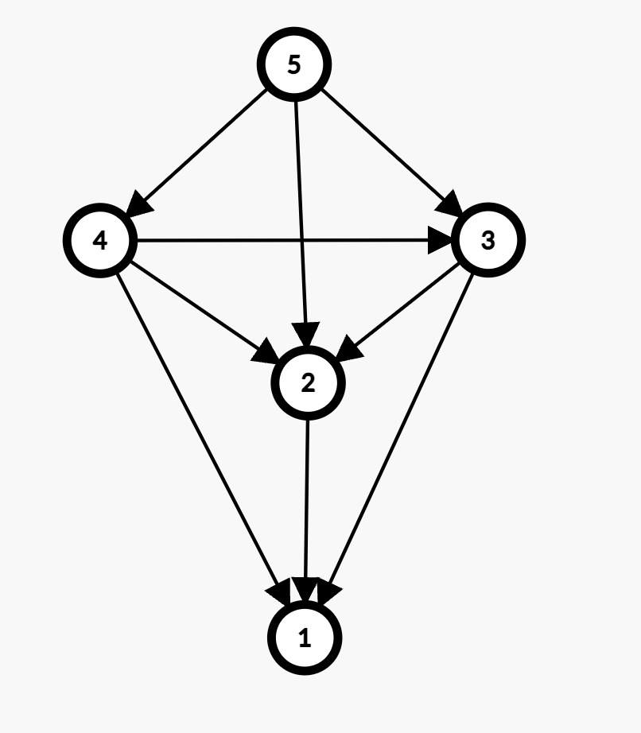
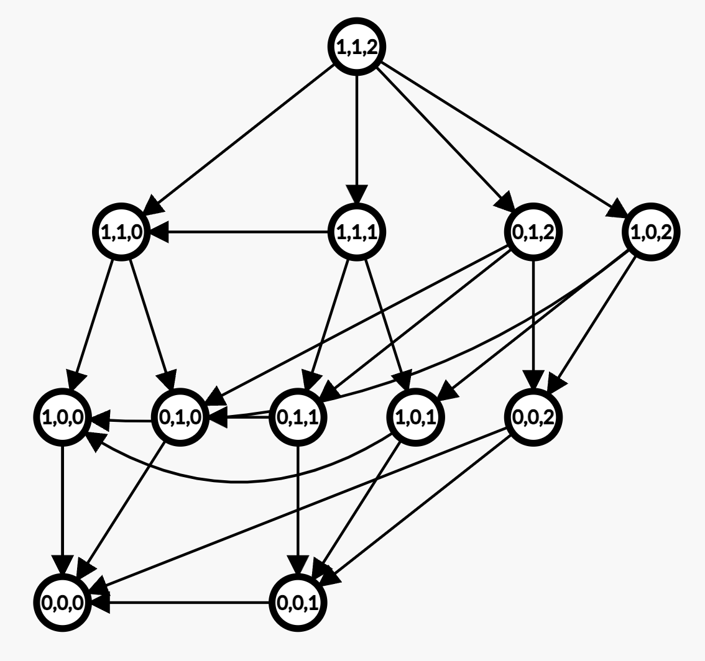

# 浅谈有向无环图游戏

> 在做题的时候，往往能遇到一些有关博弈论的游戏…

**公平组合游戏的解释**

在一般计算机竞赛中，博弈论的题目通常以“公平组合游戏 Impartral Combinatorial Game”的题干呈现给选手。所谓的公平组合游戏，定义如下：

1. 游戏有且仅有两个玩家，且游戏规则对每一位玩家都是绝对公平的。
2. 两个玩家需要轮流对集合的元素进行操作，玩家需要在有限的合法操作中选择一个元素。
3. 在游戏中，任何一种可能的情况被称之为局面Position。合法操作集合只取决于当前局面本身，而不取决于玩家。局面的改变被称之为移动Move。
4. 若轮到某一名玩家时该玩家的操作集合为空($\emptyset$)，则这名玩家被判定为游戏失败。

对于任意一种局面，有且仅存在两种情况。

1. P-Position: 在当前局面下，先手必败。
2. N- Position：在当前局面下，先手必胜。

局面有如下三种性质：

1. 当合法操作集合为空时，当前局面被称之为P-Position，即定义第四条。
2. 若某一种局面可以移动到P-Position，则称该局面一定为N-Position。
3. 若所有移动都只能到达N-Position，则该局面一定为P-Position。

**ICG题目的特点**

在计算机考试中，ICG问题的题目中往往会让选手判断一个局面时N-Position还是P-Position（假设游戏的两位玩家都无比聪明，知道必胜的方法），这时我们就可以通过逻辑分析和逆向的推到来得到最终的结果。

根据ICG问题的定义，如果一个局面时N-Position的话，这位无比聪明的玩家一定会将局面改动到N-Position以至于让对手玩家陷入必败态。此时陷入必败态的玩家无论做什么合法操作，都只会让局面再次改动到N-Position。如此轮回下去。

因此，当两位玩家无比聪明时，游戏每一步的局面一定会是在N-Position和P-Position之间来回转移。

**做ICG题目的常见套路**

在做ICG题目时，常见的做题套路就是通过最终的必败态，即P-Position一步一步地向前推导，在必败态和必胜态之间来回转换，最终得出最终答案。

与此同时，做题者必须要找到一个必胜的技巧来保证“每一位玩家的决策”都是无比聪明的，不会误将原本有优势的局面（N-Position)转换成对对方有优势的局面（N-Position)。

> 练习题一：
>
> 假设原本有n个石子，Macw和Vincent轮流来取石子，每次每人只能取一个石子，拿到最后一个石子的人获胜（等同于最后一个没有石子的人失败）。假如Macw是先手，且双方都无比聪明，请你判断Macw是N-Position还是P-Position。
>
> 在看到题目后我们按照思路做一个简单的分析。假定[arr[i]]表示当初时石子个数为i的时候Macw是否可以赢得游戏。
>
> 根据ICG定义来看，当一开始有零个石子时，Macw必定会输，因为他已经没有了合法操作，因此arr[0] = 0。在知道一开始有零个石子时Macw必输，则可以反向推导出如果一开始有1个石子。则Macw必胜（虽然你不知道当前局面是否必胜，但你知道当前局面作出选择后就会让局面到达P-Position，因此这个局面是N-Position，如定义所述）。继续以此类推，最终可以总结出规律：
>
> 如果当前的棋子数量是奇数，则Macw必胜。若当前棋子的数量是偶数，则Macw必败。

> 练习题二：与第一题类似，但难度增加。
>
> 假设原本有n个石子，Macw和Vincent轮流来取石子，每次每人只能取4个石子，拿到最后一个石子的人获胜（等同于最后一个没有石子的人失败）。假如Macw是先手，且双方都无比聪明，请你判断Macw是N-Position还是P-Position。
>
> 依旧是根据题目定义创建一个arr数组，[arr[i]]表示初时石头的个数为i的时候Macw是否可以赢得游戏。
>
> 根据ICG游戏定义来看，arr[0] = 0表示如果没有石头则Macw必输。接下来就可以通过倒推的方式来得到结论了：当石子的个数为一个时，Macw可以一次拿完，则当前状态为必胜状态。以此类推，当石子的个数为1-4个时，Macw都可以一次拿完，因此arr[1-4] = 0。
>
> 当石子的个数为5个时，此时的Macw有四种选择：拿一个、拿两个、拿三个、拿四个。通过枚举Macw的每一种情况后可以发现不论哪几个之后局面一定是N-Position，所以当前局面一定是P-Position，则先手必败。
>
> 最后我们就可以用递推的方式来写代码了。

以下是递推版本的代码：

```cpp
#include <iostream>
using namespace std;

int main(){
    int n;
    bool arr[10005] = {0, 1, 1, 1, 1};
    cin >> n;
    for (int i=5; i<=n; i++){
        int total = 0;
        // 遍历所有拿的情况。
        for (int j=1; j<=4; j++) total += arr[i-j];
        // 只能变成N-Position，则当前一定是P-Position。
        if (total == 4) arr[i] = 0;
        else arr[i] = 1; // 否则就是N-Position。
    }
    if (arr[n] == 0) cout << "Defeat" << endl;
    else cout << "Victory" << endl;
    return 0;
}
```

事实上，这种博弈类型的题目有一个自己的名字，即巴什博弈。关于巴什博弈还有一个更好的通解，原理与以上代码类似，即总结归纳：只有当arr[i]的前面四个数字都是1的时候，当前情况才是P-Position。因此可以得出结论是当初时的石头数量为(4+1)，即5的时候，先手必败，否则先手必胜。

巴什博弈通解应用于上面那道题，当每个玩家每次取走的石头为m的时候，巴什博弈的通解如下：

```cpp
#include <iostream>
using namespace std;

int main(){
    int n, m;
    cin >> n >> m;
    int position = n % (m + 1);
    if (position == 0) cout << "Defeat" << endl;
    else cout << "Victory" << endl;
    return 0;
}
```

**有向无环图游戏 DG**

任何情况下，一个公平组合游戏可以被一张或多张有向无环图表示出来。若一个ICG能被用有向无环图表示出来，则其可以被称之为有向无环图游戏。

例如上一个板块所提及的巴什博弈问题就是一个有向无环图游戏。具体地，我们用每一个顶点来表示每一种局面（Position），用每一条有向边<v1, v2>表示可以从v1这个局面操作变换到v2这个局面。拿巴什博弈m=3的时候可以画出的有向无环图如下：



可以看到，将巴什博弈转换成一个有向无环图后，可以很明显的看出这是一棵“递推树”或“递归树”的树形结构。这张有向无环图清晰的展示出了每一个局面上所有的合法操作集合。

**在有向图上做游戏 SG函数**

在看这一小节之前，请确保你完全理解了本文前半段所解释的所有概念，并且你需要有一定的前置高中数学知识才可以理解，否则你下面可能看不太懂。

先了解两个定义：

> mex运算 (Minimum Exclusion)
>
> $mex(S)\text{的结果为不属于集合S中的最小的非负整数。}$
> $mex(S) = min\{x\}(x \in N, x \notin S)$
>
> 例如：$mex(\{1, 2, 3\}) = 0, mex(\{0, 1, 2\}) = 3, mex(\{0, 1, 3\}) = 2$。

>SG函数
>
>设状态（节点）x有k个后继状态（子节点）$y_1, y_2, y_3, ..., y_k$。
>$SG(x) = mex(\{SG(y_1), SG(y_2), SG(y_3), ..., SG(y_k)\})$
>
>若x后面没有任何的后继节点，则$SG(x) = 0$。

知道了mex运算和SG函数后有什么用呢？

在一个有向图中（如巴什博弈m=3那张图），若一个节点没有后继节点则代表着个节点一定是一个必败态P-Position。SG函数的作用就是判断一个节点的后继节点是否有P-Position，如果该节点的后继节点有任意一个P-Position，则该节点一定是一个N-Position。（只要可以到达P-Position的局面都是N-Position）。

为什么呢？

因为SG函数的作用就是找到其所有后继节点并对这些节点统一作集合的mex运算。换句话说，如果在图上某一个顶点的SG值为k的话，则这个节点必然可以到达所有局面小于k的局面。如果一个点的SG函数的值为6，则代表其至少有6个子节点，并且者这六个子节点的SG值分别是{0, 1, 2, 3, 4, 5}，则玩家只需要选中SG值为0的节点就可以达到必胜条件N-Position。

总结：==所有可以到达SG(x)=0的节点必定是P-Position，玩家一定可以将当前的P-Position局面扭转到N-Position局面==。

有向无环图游戏的常见题目如下：

> 给定一个有n个节点和m条边的有向无环图，k个棋子所在的节点编号。两名玩家交替移动棋子，每次只能将任意一颗棋子沿有向边移到另一个点，无法移动者视为失败。如果两人都采用最优策略，问先手是否必胜。
>
> 这道题就可以通过SG函数轻松的求解。本题的必胜技巧就是判断起始节点的SG值，如果起始节点的SG函数值大于0，则该节点一定可以到达SG节点为0的点。如果SG函数的值为0，则对方选手只能将棋子转移到SG节点为正整数的节点上，则在第三回合中，先手就可以再次的将棋子挪动到SG函数值为0的节点上。如此往复循环，最终让后手在最后关头无法进行合法操作，先手制胜。
>
> 因此本题的关键点就在于：如果棋子初始节点的SG值为0，则先手必胜，否则先手必败。（具体可以好好想想，确实很难理解）。

**Nim游戏**

> 甲，乙两个人玩 nim 取石子游戏。
>
> nim 游戏的规则是这样的：地上有 $n$ 堆石子（每堆石子数量小于 $10^4$），每人每次可从任意一堆石子里取出任意多枚石子扔掉，可以取完，不能不取。每次只能从一堆里取。最后没石子可取的人就输了。假如甲是先手，且告诉你这 $n$ 堆石子的数量，他想知道是否存在先手必胜的策略。

这道题就是经典的Nim博弈问题，Nim博弈问题在博弈论中是属于一个典型的考点，因此学习Nim博弈是极其有必要的。在学习SG函数之后，就可以很轻松的解决本题了。先看一下样例为1,1,2的时候博弈图（有向无环图DG）的样子：



【这看起来非常头疼，我做起来也很头疼】这题的暴力思路就是枚举出每一种情况，然后自底向上逆向推导，推导出每一个节点的SG值，最后判断初始节点的SG值即可。

---

备注：部分定义内容来源于百度或万维网，解释性内容均为本人自己撰写的。

